解压得到5张图片

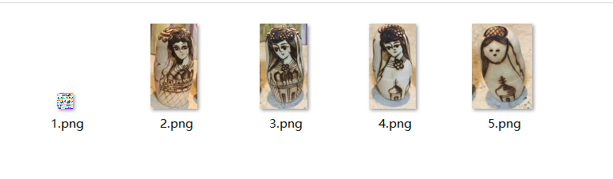

010打开1.png

crc检验报错

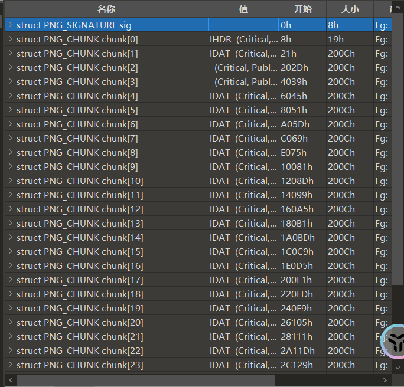

发现右边缺少idat块

进行修复

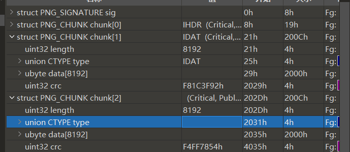

加上 49 44 41 54

利用脚本爆破正确宽高

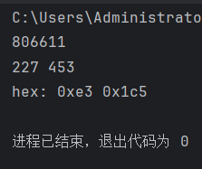

修复后得到完整图像

stegslove进行反色

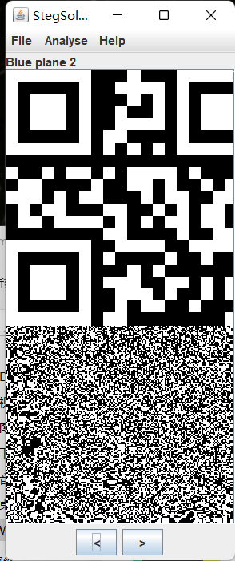

发现其中一处色道隐藏一张二维码

扫码得到

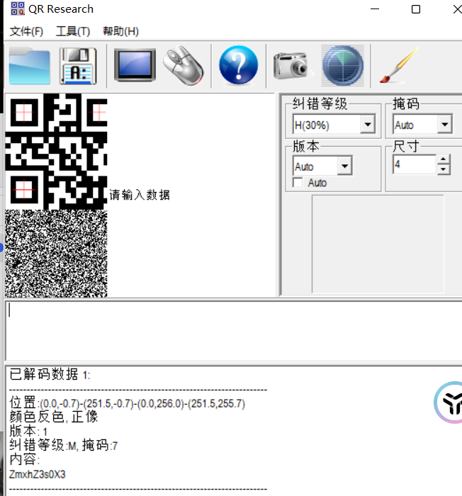

第一处：ZmxhZ3s0X3

Zmxh得知是base 64 加密

 

2.png

010打开后报错文件太长

winhex打开

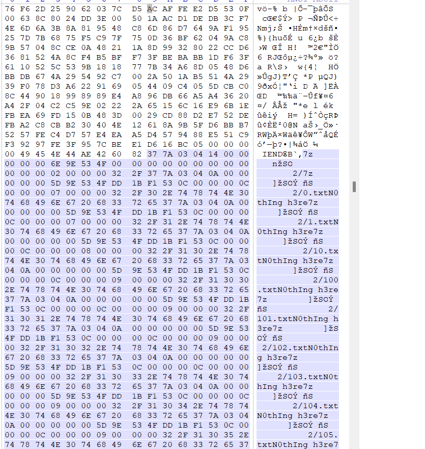

发现尾部附加一个7z文件

foremost分离失败

手动分离

分离后修改后缀名打开后却提示文件损坏

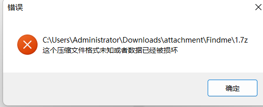

 

仔细观察该文件的十六进制数

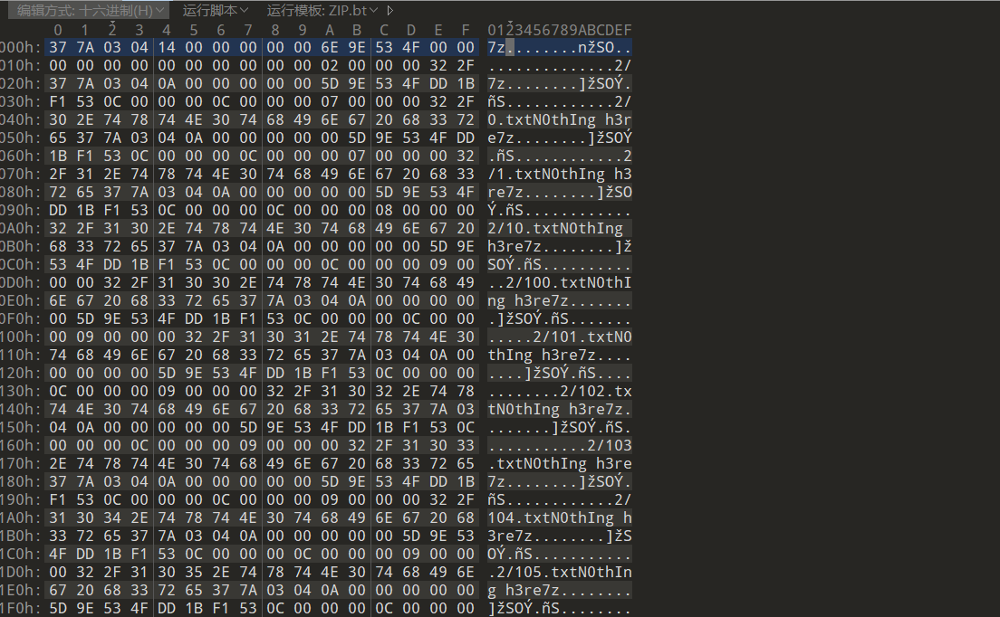

37 7A 03 04

发现其是将pk（50 4B）改为7z

全局替换

 

成功打开压缩包

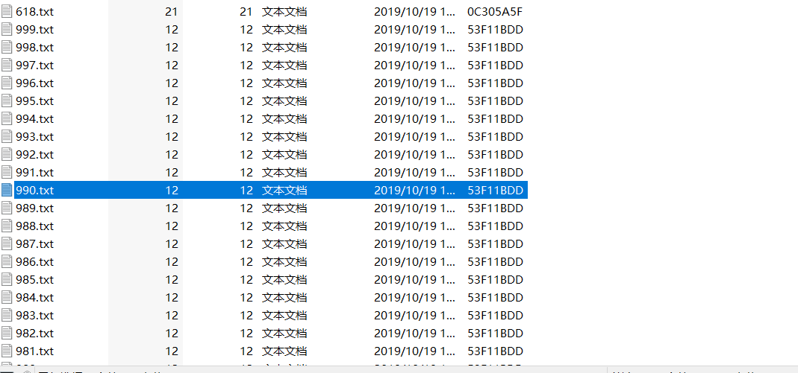

1000个txt文档，但是有一个大小和别的不一样

解压出来

得到

第二处：1RVcmVfc

3.png

010打开后输出提示crc检验全部错误

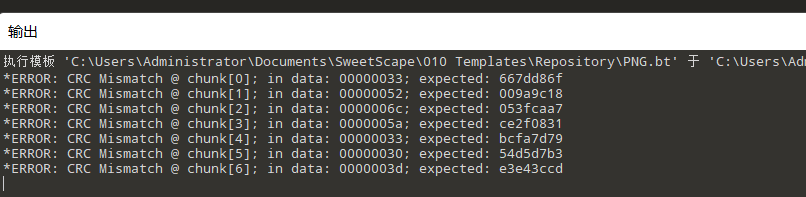

 

观察crc值

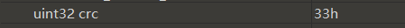

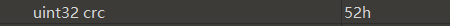

都是以h结尾

wp解释是hex

将crc值提取出来进行十六进制转acsii

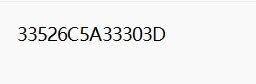

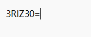

第三处：3RlZ30=

4.png

010打开尾部附加

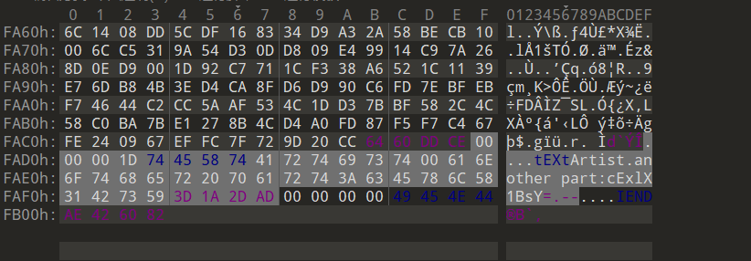

第四处：cExlX1BsY=

 

5.png

010打开

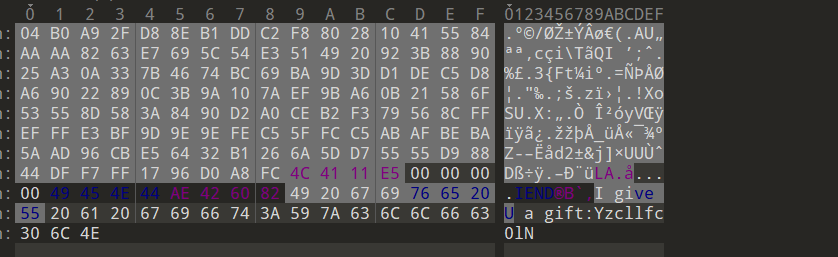

尾部附加

第五处：Yzcllfc0lN

总结：

第一处：ZmxhZ3s0X3

第二处：1RVcmVfc

第三处：3RlZ30

第四处：cExlX1BsY=

第五处：Yzcllfc0lN

进行base 64 转码

正常顺序乱码

调整顺序

1-5-4-2-3

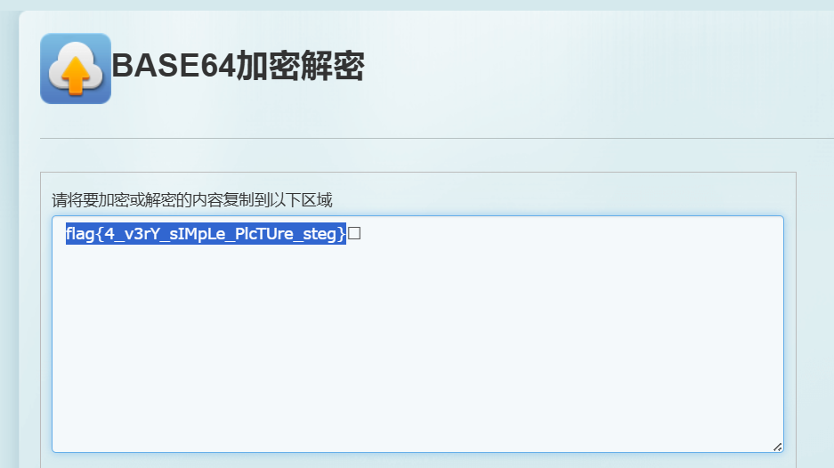

解码得到flag