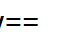
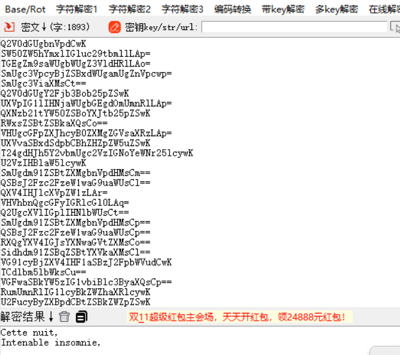

txt文件

根据题目提示



推测为base 64加密




无可用信息

看了wp知道是base 64转ascii码

```
import base64


#  这个函数计算两个 Base64 编码字符串之间的差异。
def get_base64_diff_value(s1, s2):
    #  1.Base64 字符集：base64chars 是包含所有 Base64 字符的字符串。
    base64chars = 'ABCDEFGHIJKLMNOPQRSTUVWXYZabcdefghijklmnopqrstuvwxyz0123456789+/'
    res = 0
    #  2.差异计算：
    #  函数遍历字符串 s1 和 s2 中的字符（假设 s2 至少与 s1 一样长）。
    #  对于每个字符，如果它们不同，计算它们在 Base64 字符集中的索引差值。
    #  如果发现不匹配，则立即返回这个差值。
    for i in range(len(s2)):
        if s1[i] != s2[i]:
            return abs(base64chars.index(s1[i]) - base64chars.index(s2[i]))
    #  3.备用：如果没有发现差异（即两个字符串相同），则返回 0
    return res


# 这个函数读取文件，对其进行一些处理，然后打印结果。


def solve_stego():
    #  1.读取文件：以二进制模式读取 flag.txt 文件。处理文件中的每一行。
    with open("./flag.txt", 'rb') as f:
        file_lines = f.readlines()
        bin_str = ''
        #  2.隐写处理：对每一行，去除换行符。
        for line in file_lines:
            # line是读取出来的字符串，直接使用.replace会出错，可以先解码成字符串后处理。
            de_line = line.decode('ascii').strip()
            steg_line = de_line.replace('\n', '')
            # 将行从 Base64 解码，然后再重新编码为 Base64。这是用来将行标准化，以便与原始行进行比较
            norm_line = base64.b64encode(base64.b64decode(de_line)).decode('ascii')
            #  3.差异计算：调用 get_base64_diff_value 计算原始行和标准化行之间的差异。
            diff = get_base64_diff_value(steg_line, norm_line)
            print(diff)
            #  算原始行中填充字符（=）的数量
            pads_num = steg_line.count('=')
            #  4.构建二进制字符串，将差异转换为二进制形式，根据 = 字符的数量进行填充。将结果附加到 bin_str 中。
            if diff:
                # bin(diff):将整数 diff 转换为其二进制表示形式的字符串。返回的字符串以 '0b' 开头。例如，bin(5) 返回 '0b101'
                # bin(diff)[2:]:去掉 '0b' 前缀，只保留实际的二进制数部分。例如，bin(5)[2:] 返回 '101'。
                # .zfill(pads_num * 2):使用 zfill 方法将二进制字符串填充到指定的长度，pads_num * 2 是目标长度。
                # zfill 用零填充字符串的左侧，以确保它的长度至少为 pads_num * 2。例如，如果 pads_num 是 2，那么 zfill(4) 将把 '101' 填充为 '0101'。
                bin_str += bin(diff)[2:].zfill(pads_num * 2)
            else:
                bin_str += '0' * pads_num * 2
            print(goflag(bin_str))


# 这个函数将二进制字符串转换为 ASCII 字符：
def goflag(bin_str):
    res_str = ''
    #  以每 8 位（1 字节）为单位处理二进制字符串。将每一块二进制字符串转换为字符。
    for i in range(0, len(bin_str), 8):
        res_str += chr(int(bin_str[i:i + 8], 2))
    return res_str


solve_stego()

```

得到flag