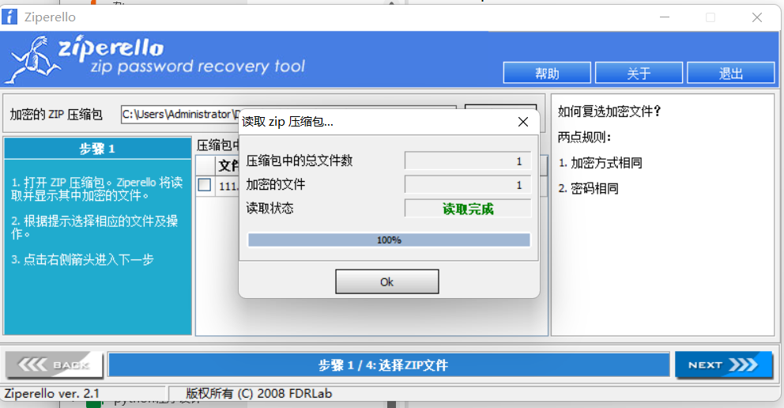
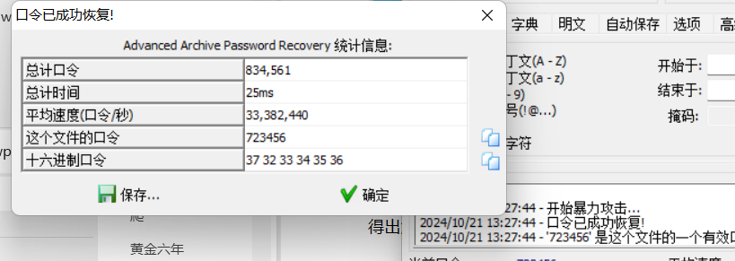
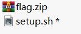
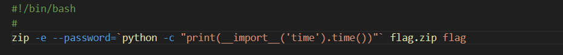
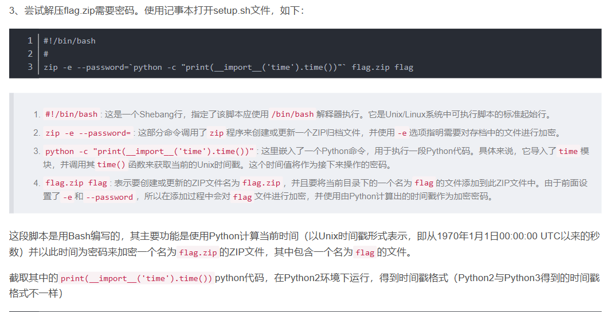
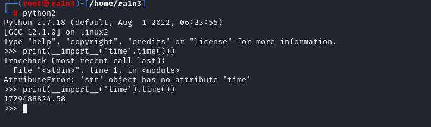
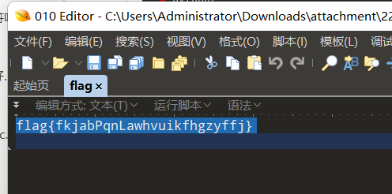

压缩包222.zip

其中压缩了111.zip

解压需要密码

ziperello扫描

为真加密



010查看无关键信息

archpr尝试暴力破解（1-9位数字）

得出解压密码



解压得到111.zip



其中包含两个文件

需要解压密码

 

ziperello扫描

发现是伪加密

010打开修复伪加密

 

打开setup.sh得到关键信息



该密码是通过

```
print(__import__('time'.time())
```





Kali执行

得知密码格式

ziperello根据模板爆破得知密码


成功解压出flag.zip

010打开得到flag

