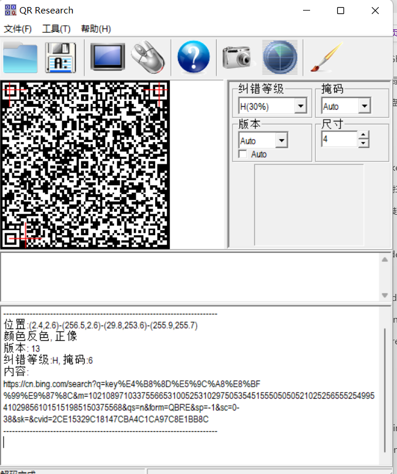
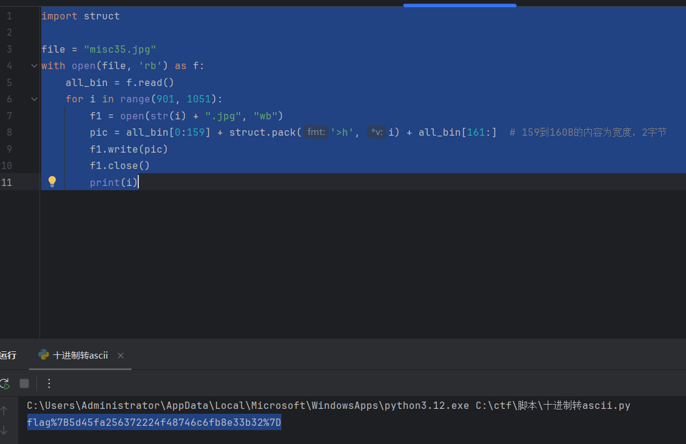
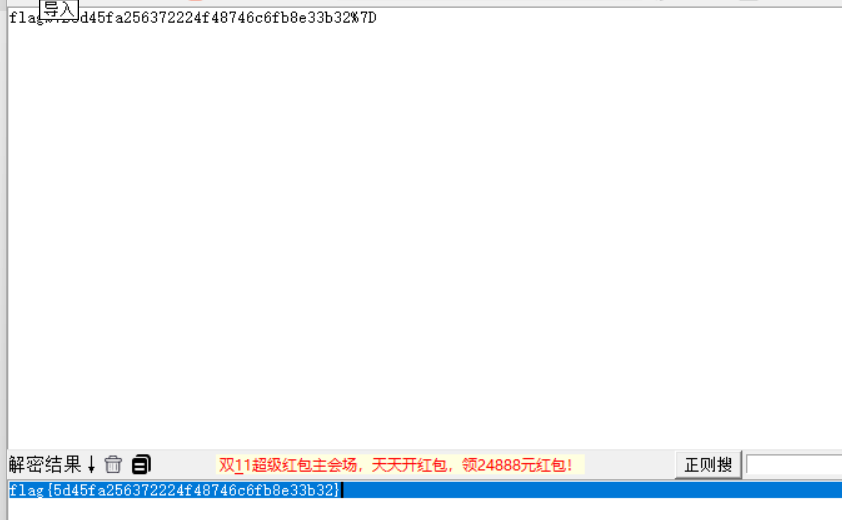

二维码图片

扫码得到

[https://cn.bing.com/search?q=key%E4%B8%8D%E5%9C%A8%E8%BF%99%E9%87%8C&m=10210897103375566531005253102975053545155505050521025256555254995410298561015151985150375568&qs=n&form=QBRE&sp=-1&sc=0-38&sk=&cvid=2CE15329C18147CBA4C1CA97C8E1BB8C](https://cn.bing.com/search?q=key不在这里&m=10210897103375566531005253102975053545155505050521025256555254995410298561015151985150375568&qs=n&form=QBRE&sp=-1&sc=0-38&sk=&cvid=2CE15329C18147CBA4C1CA97C8E1BB8C)

访问该url地址

导向到wp

观察m=xxxx

进行十进制转ascii

再进行url解码

得到flag

