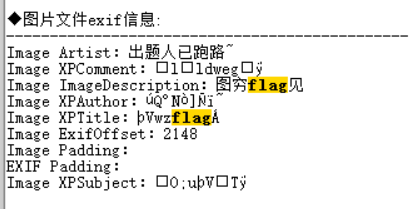
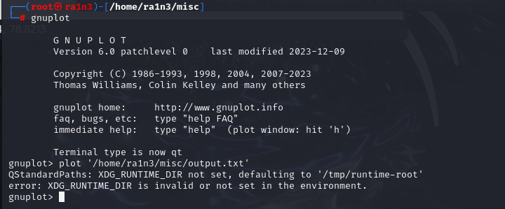
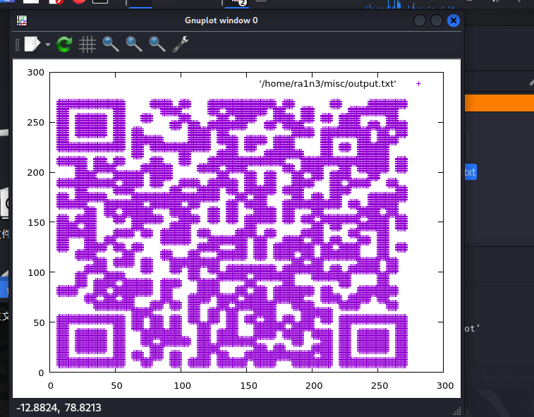
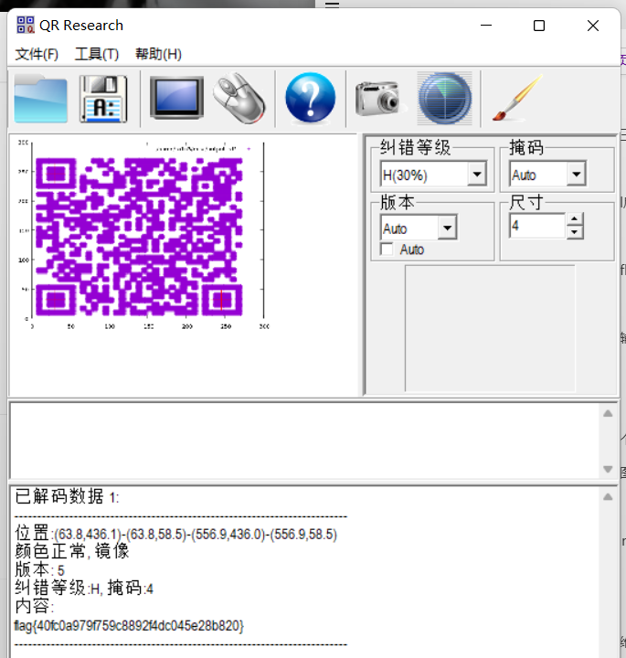

扫描文件



查看详细信息


010打开发现尾部附加十六进制文本


扫描后可以直接得到十六进制转的文件


根据属性中的提示要画图

在kali中用gnuplot

首先利用脚本删除文档中的（）

```
with open('./meihuai_jpend.txt', 'r') as res:  # 坐标格式文件比如(7,7)
    re = res.read()
    res.close()

with open('output.txt', 'w') as gnup:  # 将转换后的坐标写入gnuplotTxt.txt
    re = re.split()
    tem = ''
    for i in range(0, len(re)):
        tem = re[i]
        tem = tem.lstrip('(')
        tem = tem.rstrip(')')
        for j in range(0, len(tem)):
            if tem[j] == ',':
                tem = tem[:j] + ' ' + tem[j + 1:]
        gnup.write(tem + '\n')
    gnup.close()
```

得到output.txt

 

放入kali中



得到二维码文件



扫描得到flag

