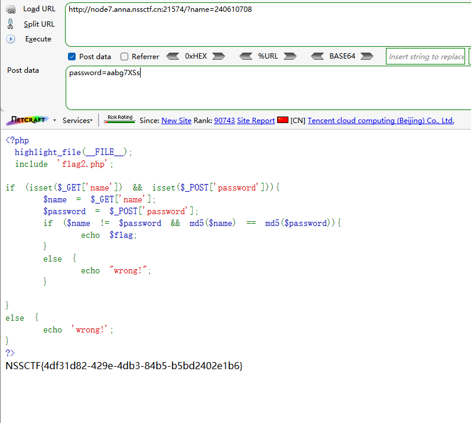

```
 <?php 
 highlight_file(__FILE__);
 include 'flag2.php';
 
if (isset($_GET['name']) && isset($_POST['password'])){
    $name = $_GET['name'];
    $password = $_POST['password'];
    if ($name != $password && md5($name) == md5($password)){
        echo $flag;
    }
    else {
        echo "wrong!";
    }
 
}
else {
    echo 'wrong!';
}
?>
wrong!
```

分析源码

GET提交name

POST提交password

如果name != password并且name的md5与password的md5值弱类型比较相等，则输出flag


构造payload

GET提交

```
?name=240610708
```

POST提交

```
password=aabg7XSs
```

