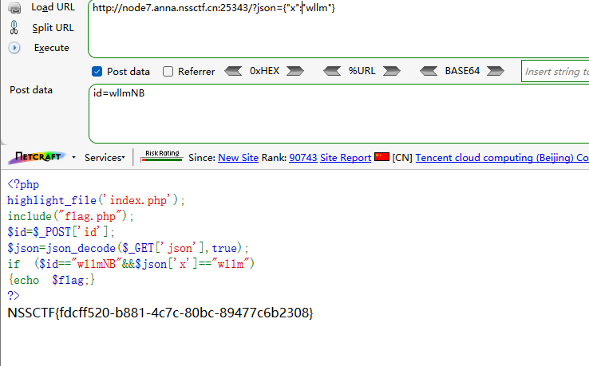

```
<?php
highlight_file('index.php');
include("flag.php");
$id=$_POST['id'];
$json=json_decode($_GET['json'],true);
if ($id=="wllmNB"&&$json['x']=="wllm")
{echo $flag;}
?>
```

分析源码

post提交id

get提交json

如果id==wllmNB

json中的x==wllm

则输出flag


构造payload：

GET

```
?json={"x":"wllm"}
```

POST

```
id=wllmNB
```

