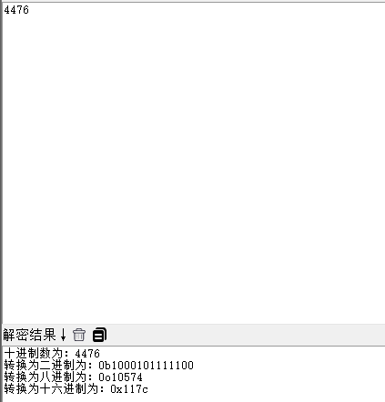
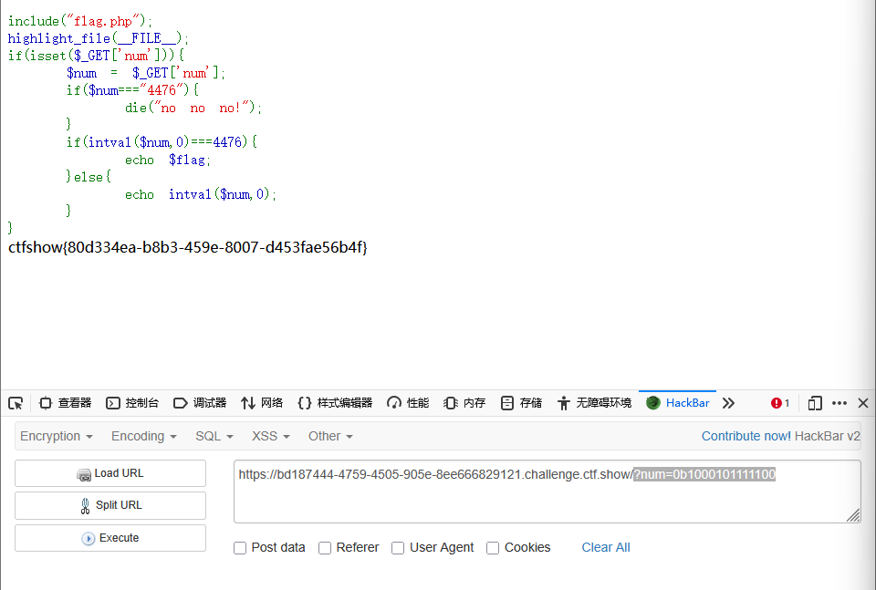
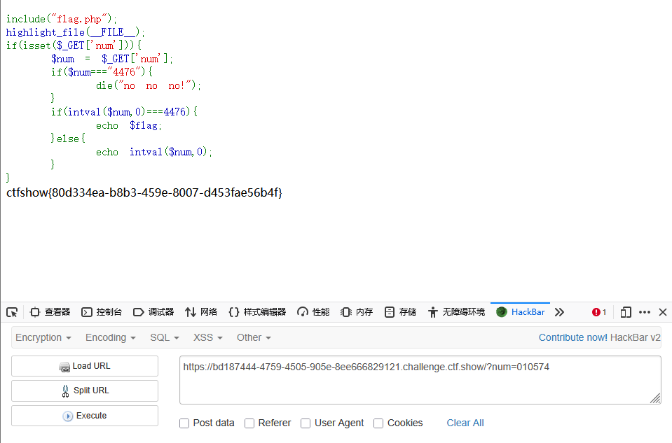
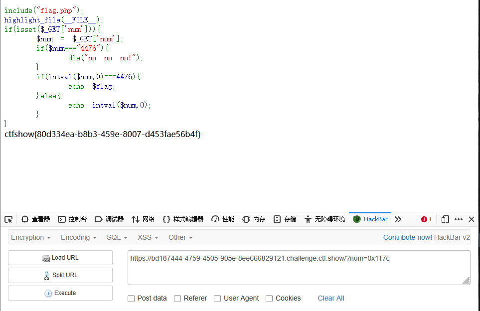
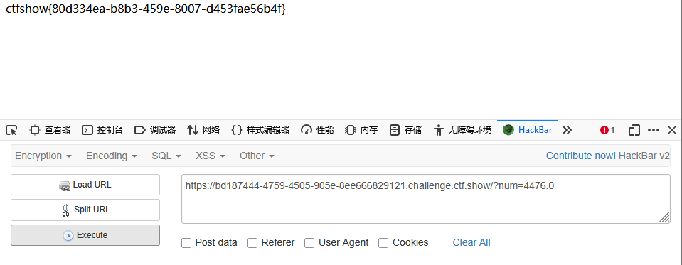
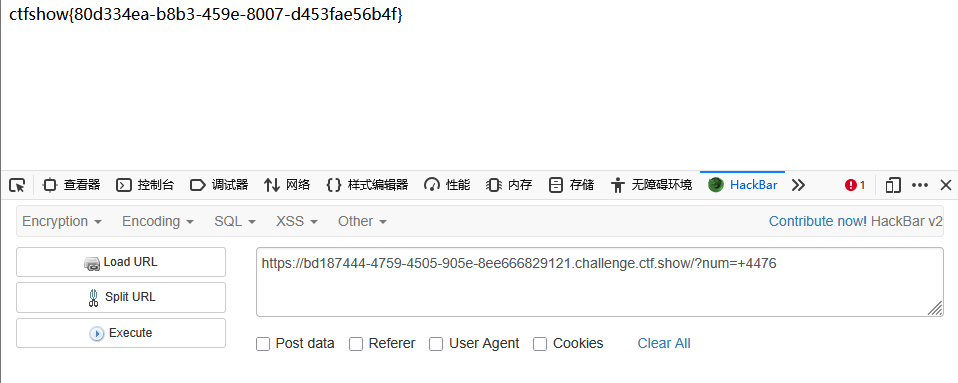

```
 <?php

/*
# -*- coding: utf-8 -*-
# @Author: h1xa
# @Date:   2020-09-16 11:25:09
# @Last Modified by:   h1xa
# @Last Modified time: 2020-09-18 16:06:11
# @email: h1xa@ctfer.com
# @link: https://ctfer.com

*/


include("flag.php");
highlight_file(__FILE__);
if(isset($_GET['num'])){
    $num = $_GET['num'];
    if($num==="4476"){
        die("no no no!");
    }
    if(intval($num,0)===4476){
        echo $flag;
    }else{
        echo intval($num,0);
    }
}

```

分析源码


get传参num

强类型比较是否为4476

是的话报错

利用intval函数判断num是否为4476，是的话返回flag


简单介绍一下intval函数

```
intval($var,$base)
其中var必选，base可选
将$num的值转换成十进制整数
这里base=0，则表示根据开始的数字决定使用的进制
0x或者0X开头表示使用十六进制
0b表示使用二进制
0开头则使用八进制
否则使用十进制
```





### 第一种

进制绕过

二进制

```
?num=0b1000101111100
```




八进制

```
?num=010574
```




十六进制

```
?num=0x117c
```




### 第二种

由于提交的默认参数值为字符串类型，因此我们也可以直接输入

```
?num=4476.0
```



```
?num=+4476
```

