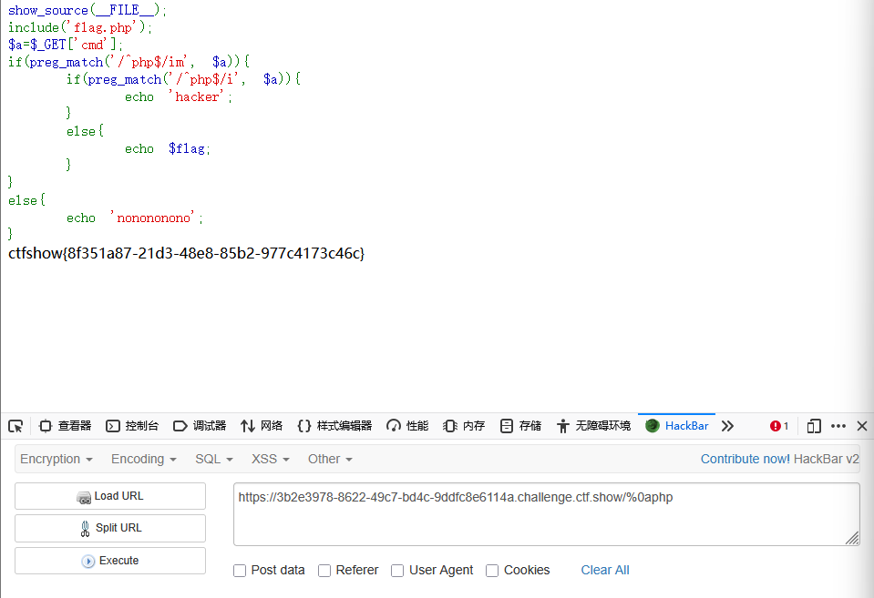

```
 <?php

/*
# -*- coding: utf-8 -*-
# @Author: Firebasky
# @Date:   2020-09-16 11:25:09
# @Last Modified by:   h1xa
# @Last Modified time: 2020-09-18 16:16:09
# @link: https://ctfer.com

*/

show_source(__FILE__);
include('flag.php');
$a=$_GET['cmd'];
if(preg_match('/^php$/im', $a)){
    if(preg_match('/^php$/i', $a)){
        echo 'hacker';
    }
    else{
        echo $flag;
    }
}
else{
    echo 'nonononono';
}

Notice: Undefined index: cmd in /var/www/html/index.php on line 15
nonononono
```


分析源码

get传参cmd

利用preg_match结合正则匹配字符串php

其中/i表示忽略大小写

/m表示换行

而第一次循环和第二次循环的区别就在于是否换行，第一次不换行，第二次换行


即第一次不能匹配到php

但是第二次要匹配到php


利用%0a换行符


```
%0aphp
```

