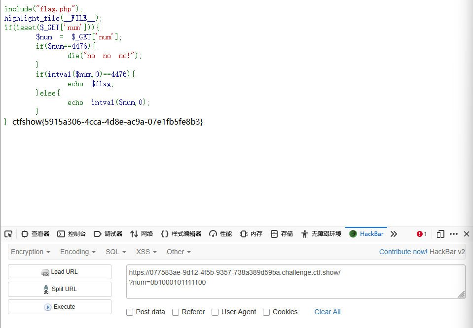
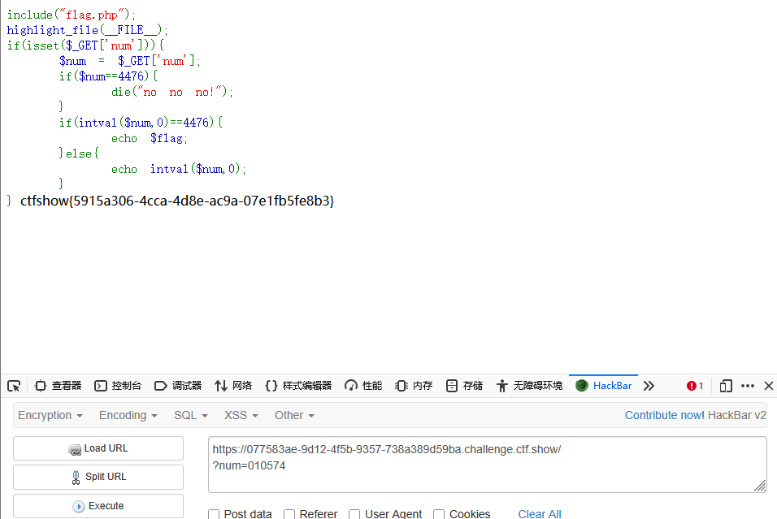
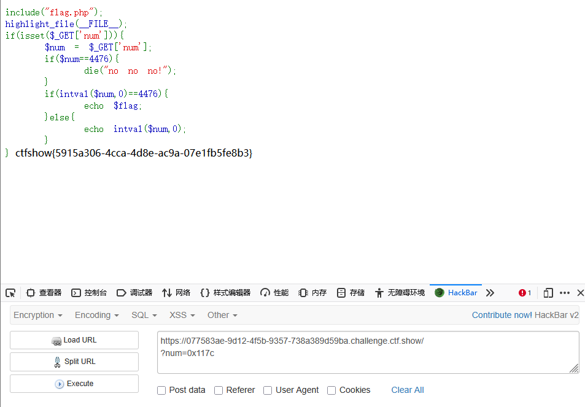

```
 <?php

/*
# -*- coding: utf-8 -*-
# @Author: Firebasky
# @Date:   2020-09-16 11:25:09
# @Last Modified by:   h1xa
# @Last Modified time: 2020-09-18 16:29:30
# @link: https://ctfer.com

*/

include("flag.php");
highlight_file(__FILE__);
if(isset($_GET['num'])){
    $num = $_GET['num'];
    if($num==4476){
        die("no no no!");
    }
    if(intval($num,0)==4476){
        echo $flag;
    }else{
        echo intval($num,0);
    }
} 
```

分析源码


get传参num

弱类型比较，如果为4476，则报错

利用intval函数进行弱类型比较，如果为4476则输出flag


同web 90的intval简单介绍

其中intval的$base设置为0，则其会根据开始的数字使用不同的进制


### 第一种

进制绕过

二进制

```
?num=0b1000101111100
```




八进制

```
?num=010574
```




十六进制

```
?num=0x117c
```


