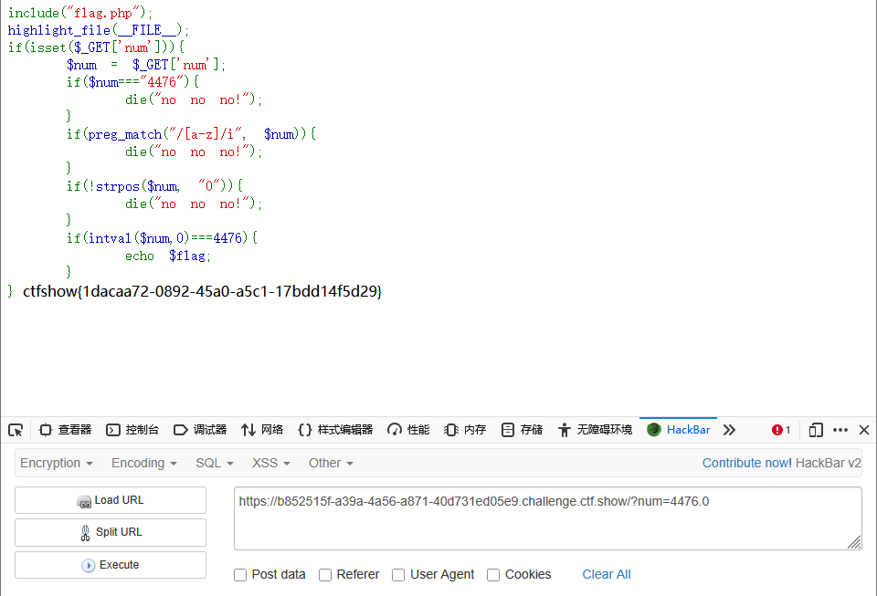
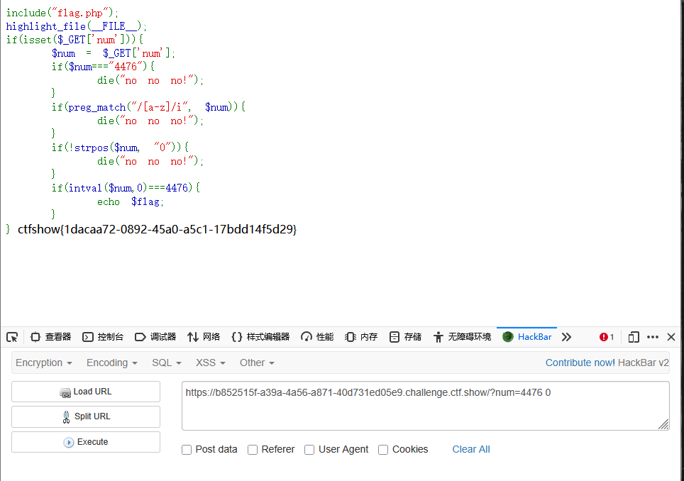
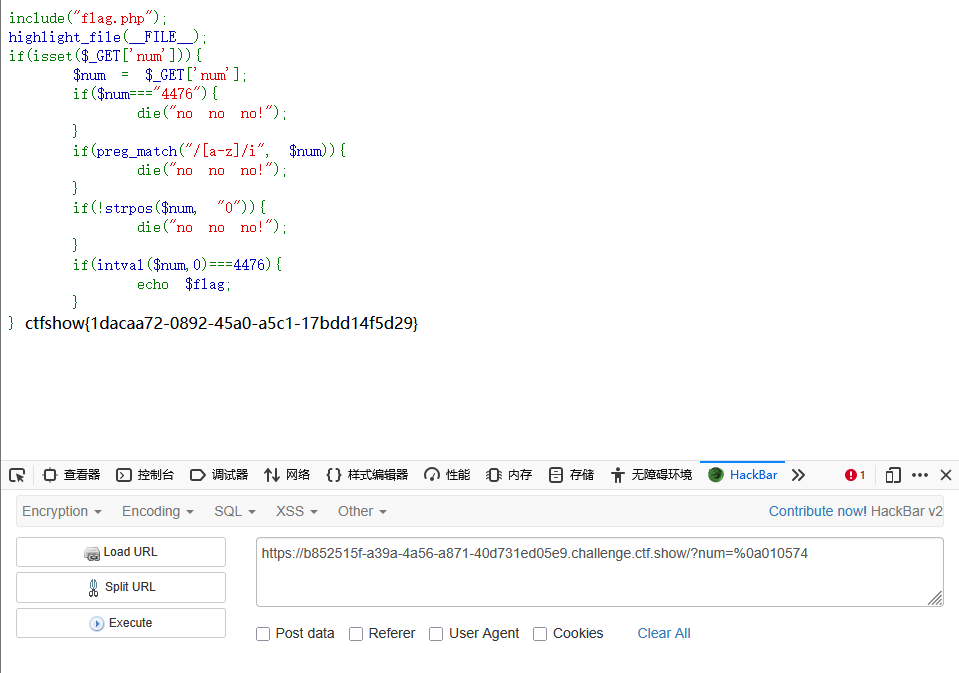

```
 <?php

/*
# -*- coding: utf-8 -*-
# @Author: h1xa
# @Date:   2020-09-16 11:25:09
# @Last Modified by:   h1xa
# @Last Modified time: 2020-09-18 16:46:19
# @link: https://ctfer.com

*/

include("flag.php");
highlight_file(__FILE__);
if(isset($_GET['num'])){
    $num = $_GET['num'];
    if($num==="4476"){
        die("no no no!");
    }
    if(preg_match("/[a-z]/i", $num)){
        die("no no no!");
    }
    if(!strpos($num, "0")){
        die("no no no!");
    }
    if(intval($num,0)===4476){
        echo $flag;
    }
} 
```

分析源码

get传入num

强类型比较，num是否为4476，如果是则报错

利用preg_match判断num中是否存在字母，如果存在则报错

利用strops检查num中是否含有0，而！表示取反，即num中必须要有0


### 第一种

依旧可以利用小数点，将4476.0利用intval函数将其解析成整数4476，从而实现绕过

```
?num=4476.0
```




### 第二种

由于intaval解析到空格停止，因此4476 0 会被解析成4476

```
?num=4476 0
```




### 第三种

利用%0a换行实现绕过strops

然后实现进制绕过

```
?num=%0a010574
```


