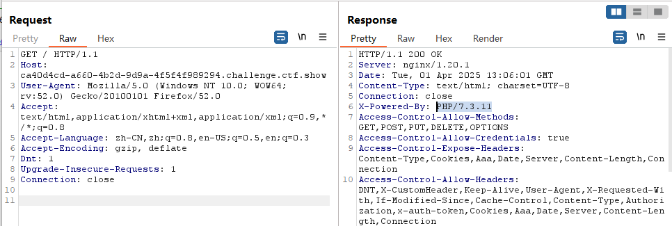
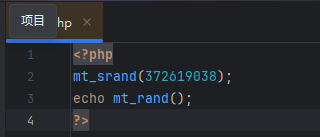
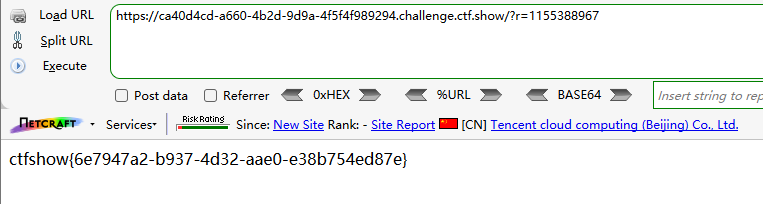

```
 <?php

/*
# -*- coding: utf-8 -*-
# @Author: h1xa
# @Date:   2020-09-03 13:26:39
# @Last Modified by:   h1xa
# @Last Modified time: 2020-09-03 13:53:31
# @email: h1xa@ctfer.com
# @link: https://ctfer.com

*/

error_reporting(0);
include("flag.php");
if(isset($_GET['r'])){
    $r = $_GET['r'];
    mt_srand(372619038);
    if(intval($r)===intval(mt_rand())){
        echo $flag;
    }
}else{
    highlight_file(__FILE__);
    echo system('cat /proc/version');
}

?> Linux version 5.4.0-163-generic (buildd@lcy02-amd64-067) (gcc version 9.4.0 (Ubuntu 9.4.0-1ubuntu1~20.04.2)) #180-Ubuntu SMP Tue Sep 5 13:21:23 UTC 2023 Linux version 5.4.0-163-generic (buildd@lcy02-amd64-067) (gcc version 9.4.0 (Ubuntu 9.4.0-1ubuntu1~20.04.2)) #180-Ubuntu SMP Tue Sep 5 13:21:23 UTC 2023
```

源码分析：

mt_srand(372619038)

播种了一个随机数种子，然后比较用户穿的GET参数r是否与mt_rand生成的随机数一样，若一样则输出flag

即只要要发送的GET请求中的参数与后台生成的随机数一样即可获取flag

这里存在一个伪随机数漏洞，当php中每一次调用mr_rand()函数，都会检查一些系统有没有播种。

播种为mt_srand()函数完成，当随机种子生成后，后面生成的随机数都会根据这个随机种子生成。

所以用一个种子下，随机数的序列是相同的

由于上面已经用一个固定数字播种了随机数，因此只要在同一版本的php下面用mt_srand(372619038)播种随机数种子，再用mt_rand()生成随机数，那么得到的随机数都是一样的

因此只要我们能够获取php版本信息，就能尝试在本地搭建相同环境然后生成随机数


Wappalyzer查看


php版本7.3.11


抓包也可以得到php版本






构造payload

```
?r=1155388967
```

