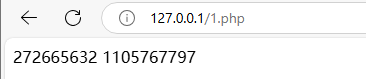
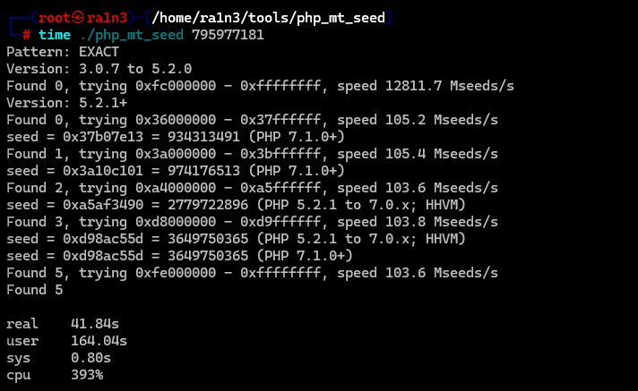
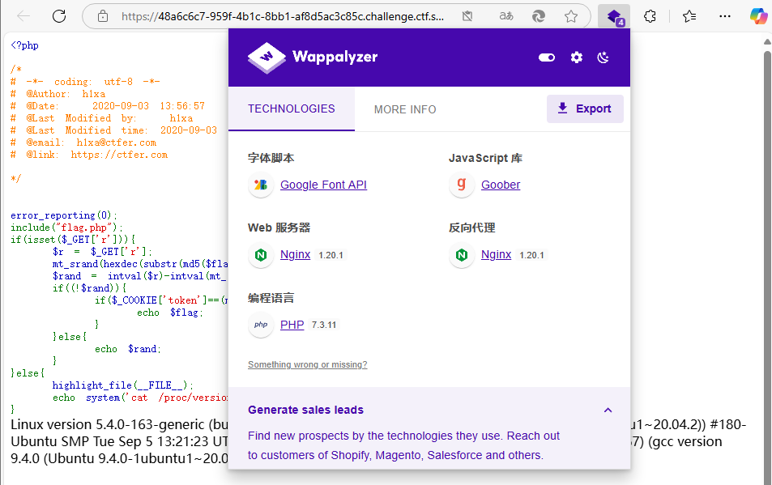
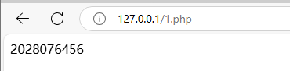
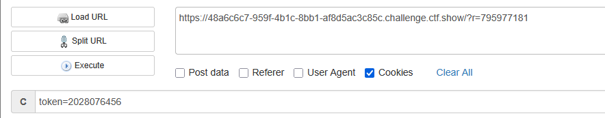
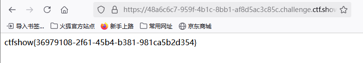

```
<?php

/*
# -*- coding: utf-8 -*-
# @Author: h1xa
# @Date:   2020-09-03 13:56:57
# @Last Modified by:   h1xa
# @Last Modified time: 2020-09-03 15:47:33
# @email: h1xa@ctfer.com
# @link: https://ctfer.com

*/


error_reporting(0);
include("flag.php");
if(isset($_GET['r'])){
    $r = $_GET['r'];
    mt_srand(hexdec(substr(md5($flag), 0,8)));
    $rand = intval($r)-intval(mt_rand());
    if((!$rand)){
        if($_COOKIE['token']==(mt_rand()+mt_rand())){
            echo $flag;
        }
    }else{
        echo $rand;
    }
}else{
    highlight_file(__FILE__);
    echo system('cat /proc/version');
}
Linux version 5.4.0-163-generic (buildd@lcy02-amd64-067) (gcc version 9.4.0 (Ubuntu 9.4.0-1ubuntu1~20.04.2)) #180-Ubuntu SMP Tue Sep 5 13:21:23 UTC 2023 Linux version 5.4.0-163-generic (buildd@lcy02-amd64-067) (gcc version 9.4.0 (Ubuntu 9.4.0-1ubuntu1~20.04.2)) #180-Ubuntu SMP Tue Sep 5 13:21:23 UTC 2023

```

分析源码

hexdec函数用于将十六进制字符串转换为十进制数

mt_srand(hexdec(substr(md5($flag), 0,8)));

将flag整体进行MD5加密后取前八位转为十进制之后，作为随机数种子

当传入r=0时，可以得到mt_rand，即随机数


即随机数为795977181

而当$rand为0，为真时才能得到flag

而$rand=intval($r)-intval(mt_rand) 

即intval($r)==intval(mt_rand)

而此时我们已经得到了mt_rand==795977181

下面的

$_COOKIE['token']==(mt_rand()+mt_rand())

看似token为mt_rand()的两倍，但是不能单纯将token=2*mt_rand()

```
<?php
mt_srand(123456);
$rand1 = mt_rand();
$rand2 = mt_rand();
echo $rand1,"\n",$rand2;;
?>
```



都是一样的种子，但是第一次和第二次生成的随机数结果是不同的

利用php_mt_seed通过随机数逆推种子



确定php版本



7.3.11


974176513这个随机数种子成功执行

```
<?php
mt_srand(974176513);
$rand=mt_rand();
$rand1=mt_rand();
$rand2=mt_rand();
echo $rand1+$rand2;
?>
```




由于源码中已经使用过一次$rand，因此mt_rand()+mt_rand()应该是第二次和第三次生成的随机数的和


构造payload

```
?r=795977181
cookie:token=2028076456
```




得到flag

