# 第一章 应急响应-Linux日志分析

```
1.有多少IP在爆破主机ssh的root帐号，如果有多个使用","分割
2.ssh爆破成功登陆的IP是多少，如果有多个使用","分割
3.爆破用户名字典是什么？如果有多个使用","分割
4.登陆成功的IP共爆破了多少次
5.黑客登陆主机后新建了一个后门用户，用户名是多少
```


```
ssh root@52.83.138.159
linuxrz
```

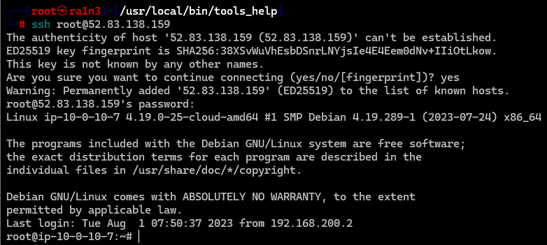

ssh登录


## 第一题

有多少IP在爆破主机ssh的root帐号，如果有多个使用","分割

```
cd /var/log
ls -al
```

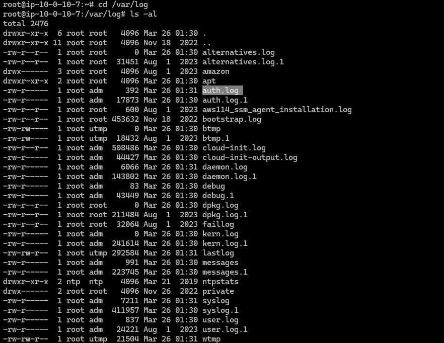


查看auth.log和auth.log.1

```
cat auth.log auth.log.1
```

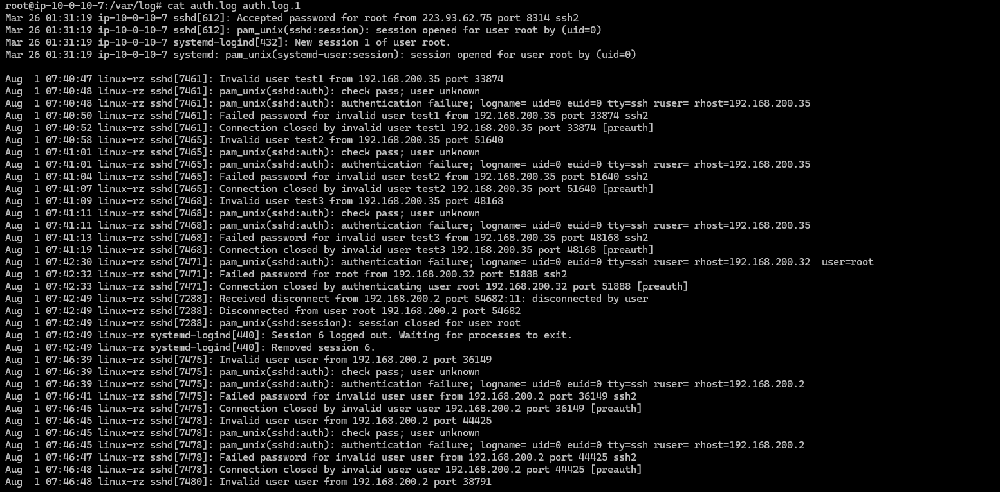

题目要求：爆破root账户

找出关键字段


首先过滤出存在“password for root”的字段信息

```
cat auth.log auth.log.1 | grep -a 'password for root'
```

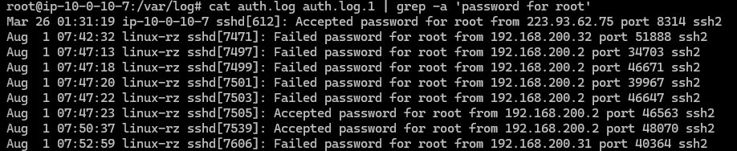

然后利用awk提取ip信息

```
cat auth.log auth.log.1 | grep -a 'password for root' | awk '{print $11}'
```

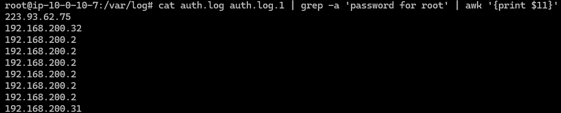

接着uniq -c去重

```
cat auth.log auth.log.1 | grep -a 'password for root' | awk '{print $11}'|sort -nr|uniq -c
```

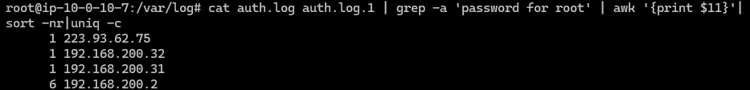

其中223.93.62.75是本机ip

因此共三个ip

```
flag{192.168.200.2,192.168.200.31,192.168.200.32}
```


## 第二题

ssh爆破成功登陆的IP是多少，如果有多个使用","分割

继续分析日志

```
cat auth.log auth.log.1 | grep -a 'password for root'
```

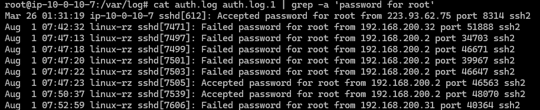

可以看到，成功是Accept，失败是Failed

grep过滤关键字

```
cat auth.log auth.log.1 | grep -a 'Accept'
```

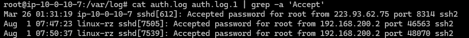

awk提取ip信息

```
cat auth.log auth.log.1 | grep -a 'Accept'|awk '{print $11}'
```

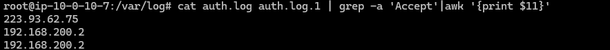

去重

```
cat auth.log auth.log.1 | grep -a 'Accept'|awk '{print $11}'|uniq -c
```

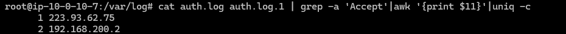

```
flag{192.168.200.2}
```


## 第三题

爆破用户名字典是什么？如果有多个使用","分割

首先过滤出与ssh服务相关的内容

```
cat auth.log auth.log.1 | grep -a "sshd"
```

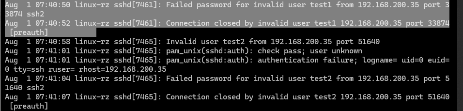

即字典内容在这一部分

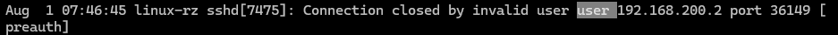

那么我们就可以利用sed提取关键部分


首先利用Failed password关键字过滤内容

```
cat auth.log auth.log.1 | grep -a "Failed password"
```

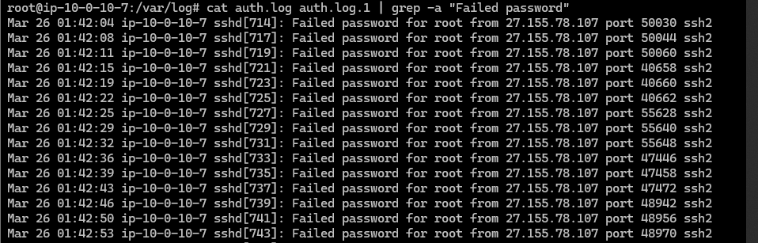

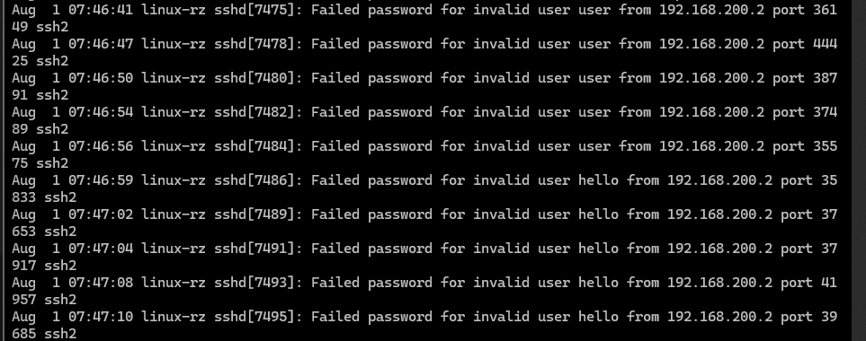

接着利用sed提取

```
cat auth.log auth.log.1 | grep -a "Failed password"|sed -n 's/.*for\(.*\)f
rom.*/\1/p'
```


去重

```
cat auth.log auth.log.1 | grep -a "Failed password"|sed -n 's/.*for\(.*\)from.*/\1/p'|sort -nr|uniq -c
```

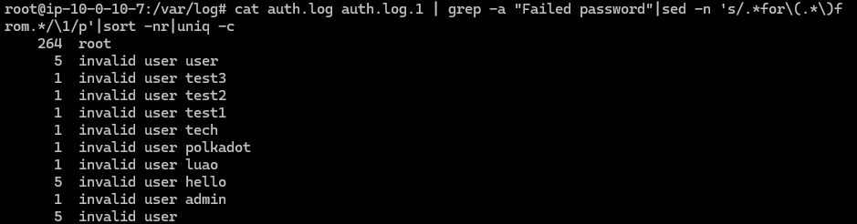


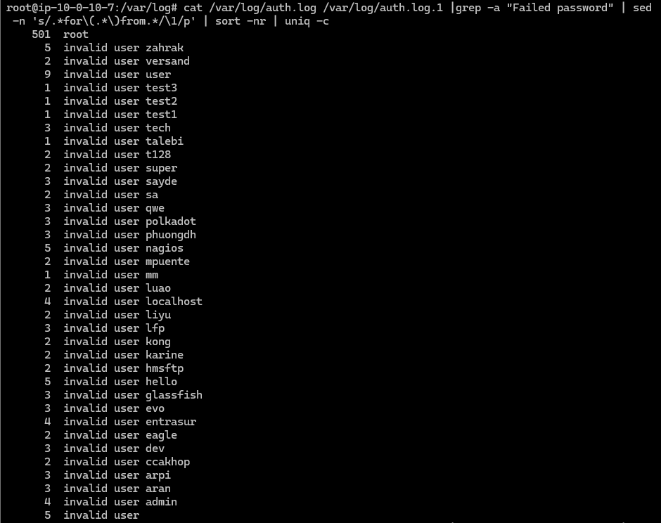

闹麻了，刚看了