# 第一章 应急响应-webshell查杀

```
1.黑客webshell里面的flag flag{xxxxx-xxxx-xxxx-xxxx-xxxx}
2.黑客使用的什么工具的shell github地址的md5 flag{md5}
3.黑客隐藏shell的完整路径的md5 flag{md5} 注 : /xxx/xxx/xxx/xxx/xxx.xxx
4.黑客免杀马完整路径 md5 flag{md5}
```


ssh登录

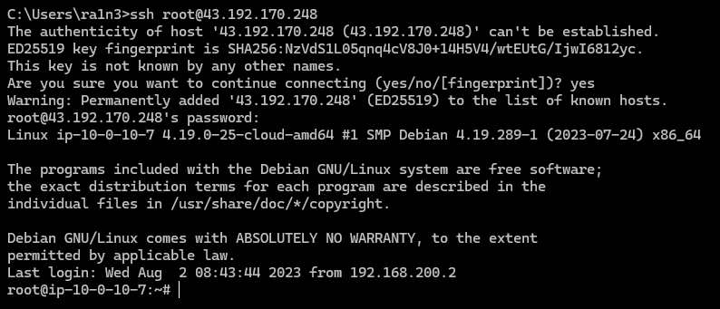


## 第一题

黑客webshell里面的flag flag{xxxxx-xxxx-xxxx-xxxx-xxxx}

```
cd /var/www/html
ls -al
```

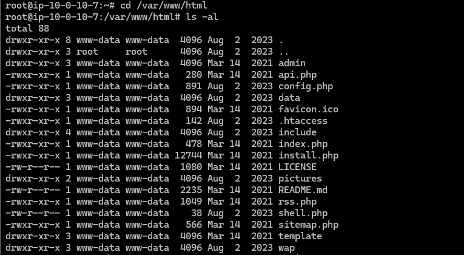

php文件

过滤可能的木马文件

```
find . -name "*.php"|xargs grep "eval"
```

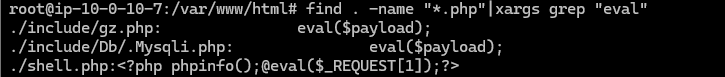

三个文件

- include/gz.php
- include/Db/.Mysqli.php
- shell.php

挨个查看

```
cat include/gz.php
```

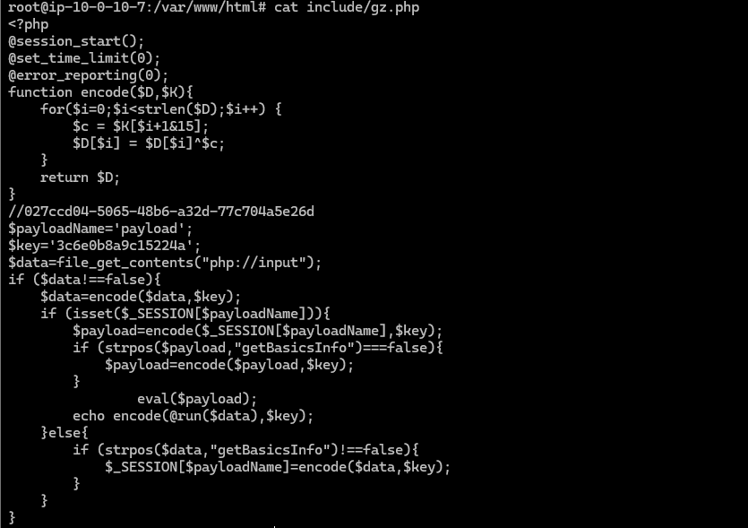

```
flag{027ccd04-5065-48b6-a32d-77c704a5e26d}
```


## 第二题

黑客使用的什么工具的shell github地址的md5 flag{md5}
根据gz.php的木马内容


满足哥斯拉webshell流量特征


利用哥斯拉生成webshell

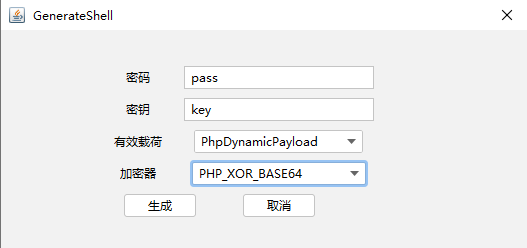

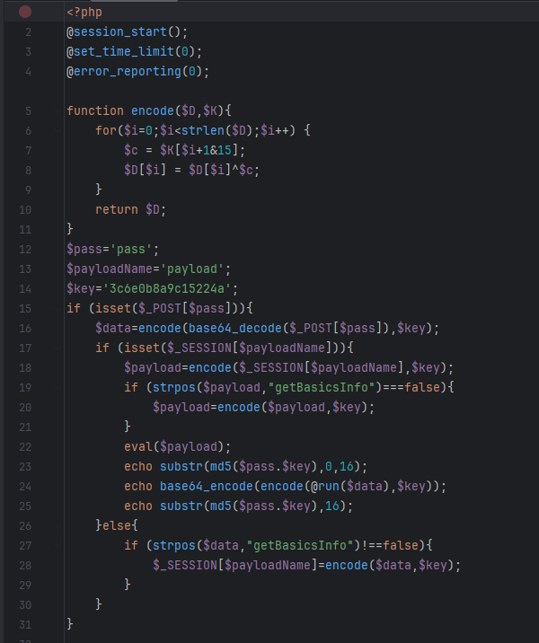

只能说一模一样


github项目地址

[BeichenDream/Godzilla: 哥斯拉](https://github.com/BeichenDream/Godzilla)


md5加密

```
echo -n "https://github.com/BeichenDream/Godzilla" | md5sum
```


-n选项用于避免在文本末尾添加换行符

```
flag{39392de3218c333f794befef07ac9257}
```


## 第三题

黑客隐藏shell的完整路径的md5 flag{md5} 注 : /xxx/xxx/xxx/xxx/xxx.xxx

隐藏shell，即隐藏文件


.Mysqli.php是一个隐藏文件

```
cd /var/www/html/include/Db
cat .Mysqli.php
```

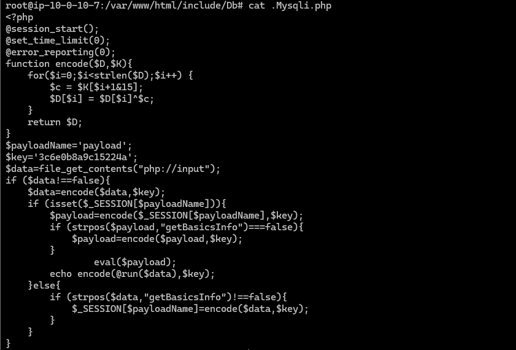

依旧是哥斯拉木马

路径为

```
/var/www/html/include/Db/.Mysqli.php
```

md5加密

```
echo -n "/var/www/html/include/Db/.Mysqli.php" | md5sum
```

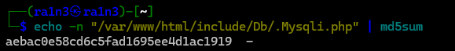

```
flag{aebac0e58cd6c5fad1695ee4d1ac1919}
```


## 第四题

黑客免杀马完整路径 md5 flag{md5}


所谓免杀马免杀马，就是绕过安全检测，使木马正常工作的方式，PHP 免杀马通常字符串异或加密、Base 家族加密、rot13加密、字符串拼接等方式实现

尝试搜索存在base64加密的文件

```
find . -name "*.php" |xargs grep "base64"
```

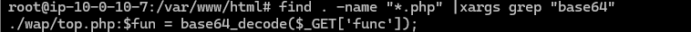

/wap/top.php文件

```
cat ./wap/top.php
```

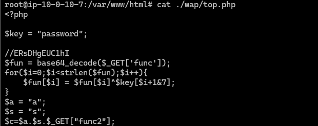

确定是木马文件

路径

```
/var/www/html/wap/top.php
```

```
echo -n "/var/www/html/wap/top.php" | md5sum
```

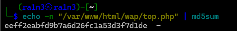


```
flag{eeff2eabfd9b7a6d26fc1a53d3f7d1de}
```


## 另外

/var/log/apache2/access.log日志文件中也存在rce

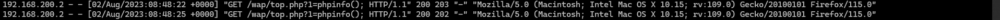

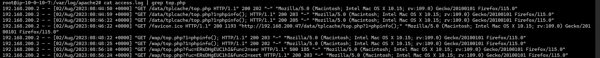