# 第二章日志分析-apache日志分析

```
1、提交当天访问次数最多的IP，即黑客IP：
2、黑客使用的浏览器指纹是什么，提交指纹的md5：
3、查看包含index.php页面被访问的次数，提交次数：
4、查看黑客IP访问了多少次，提交次数：
5、查看2023年8月03日8时这一个小时内有多少IP访问，提交次数
```


ssh登录

```
ssh root@52.82.101.102
apacherizhi
```

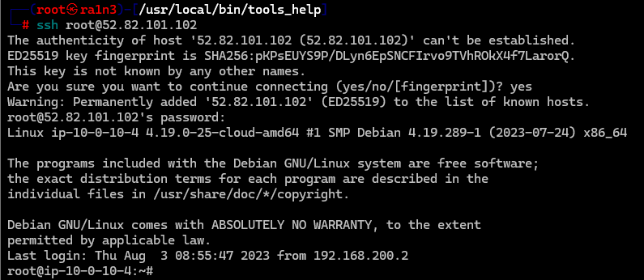


## 第一题

提交当天访问次数最多的IP，即黑客IP

查看日志

```
cd /var/log
```

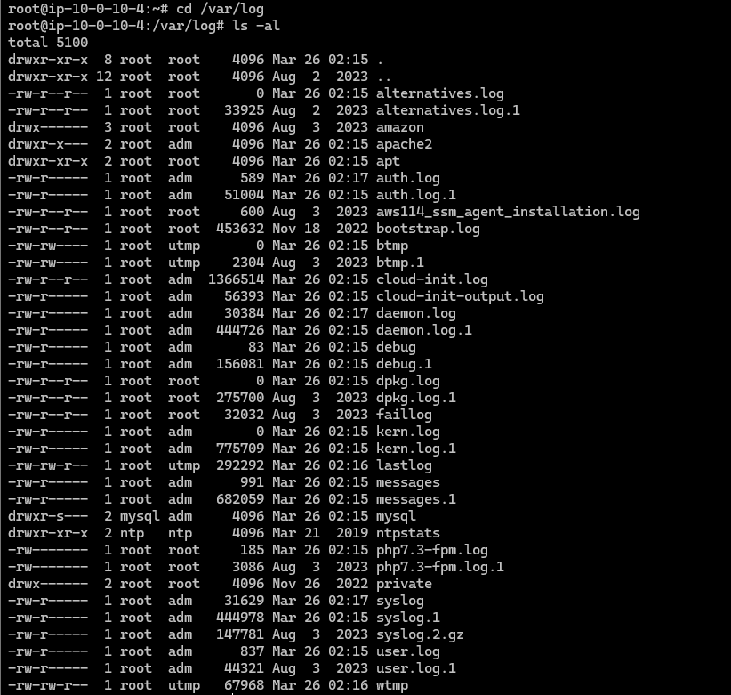

```
cd apache2
ls -al
```

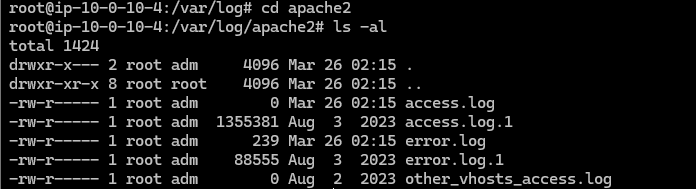

查看access.log和access.log.1

```
cat access.log access.log.1
```

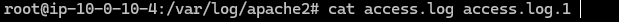

分析：

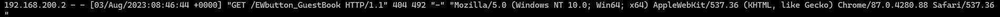

ip在第一个字段，awk提取

```
cat access.log access.log.1 | awk '{print $1}'
```

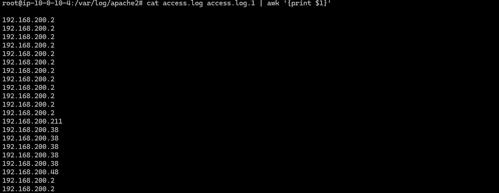

去重

```
cat access.log access.log.1 | awk '{print $1}'|sort|uniq -c
```

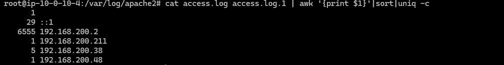

```
flag{192.168.200.2}
```


## 第二题

黑客使用的浏览器指纹是什么，提交指纹的md5

提取黑客的访问

```
cat access.log access.log.1 | grep -a "192.168.200.2"
```

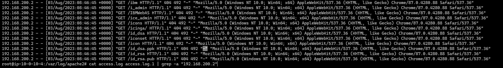

得到

```
Mozilla/5.0 (Windows NT 10.0; Win64; x64) AppleWebKit/537.36 (KHTML, like Gecko) Chrome/87.0.4280.88 Safari/537.36
```

MD5加密

```
echo -n "Mozilla/5.0 (Windows NT 10.0; Win64; x64) AppleWebKit/537.36 (KHTML, like Gecko) Chrome/87.0.4280.88 Safari/537.36" | md5sum
```

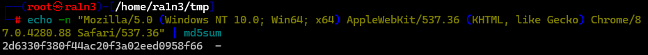

```
flag{2d6330f380f44ac20f3a02eed0958f66}
```


## 第三题

```
查看包含index.php页面被访问的次数，提交次数
```

即过滤出包含index.php的字段，并统计行数

```
cat access.log access.log.1 |grep -a '/index.php'| wc -l
```

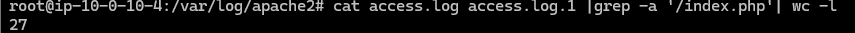

```
flag{27}
```


## 第四题

查看黑客IP访问了多少次，提交次数

过滤出黑客ip，并统计出现次数就好

```
cat access.log access.log.1 | awk '{if ($1=="192.168.200.2") print $1}'|uniq -c
```

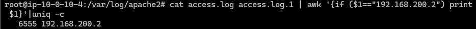

```
flag{6555}
```


但是如果我们用grep匹配ip的话

```
cat access.log access.log.1 | grep -a '192.168.200.2'|wc -l
```

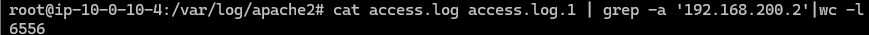

是6556

因为grep会匹配搭配192.168.200.211这个ip，造成错误

```
cat access.log access.log.1 | grep -a '192.168.200.2'|awk '{print $1}'|sort|uniq -c
```

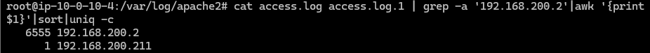

我们可以使用-w参数进行全匹配

```
cat access.log access.log.1 | grep -w '192.168.200.2'|wc -l
```

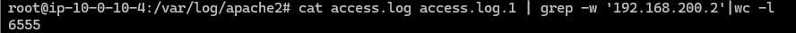


## 第五题

```
查看2023年8月03日8时这一个小时内有多少IP访问，提交次数
```

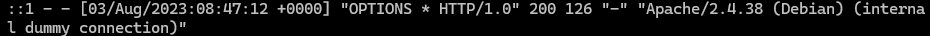

过滤时间，提取ip并统计行数

```
cat access.log access.log.1 | grep -a "03/Aug/2023:08"|awk '{print
 $1}'|sort |uniq -c
```

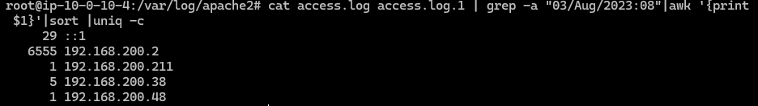

因此共有5个ip访问

```
flag{5}
```

