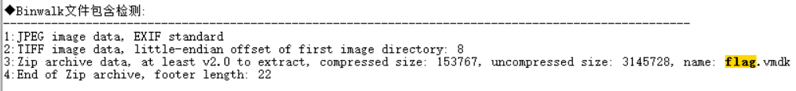
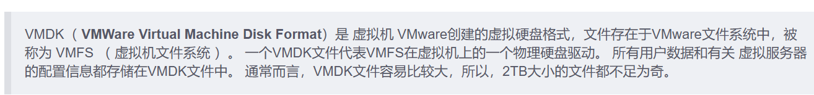
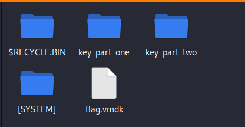
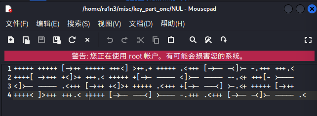
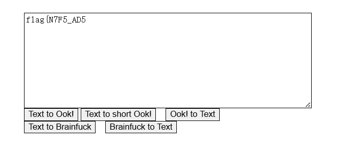
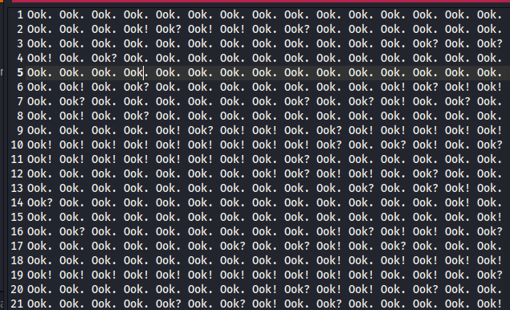
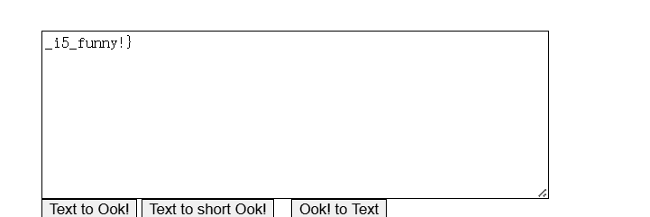

扫描mianju.jpg

foremost分离

得到zip文件

需要解压密码

010打开后发现是伪加密

修复后得到

虚拟机打开该文件报错

查阅资料后发现：

vmdk文件可以解压

kali中运行7z x

分割VMDK文件

得到四个文件

打开key_part_one

Brainfuck加密

解密得到flag

打开key_part_two

0ok！加密

解密后得到flag

拼接得到完整flag

 

flag{N7F5_AD5_i5_funny!}