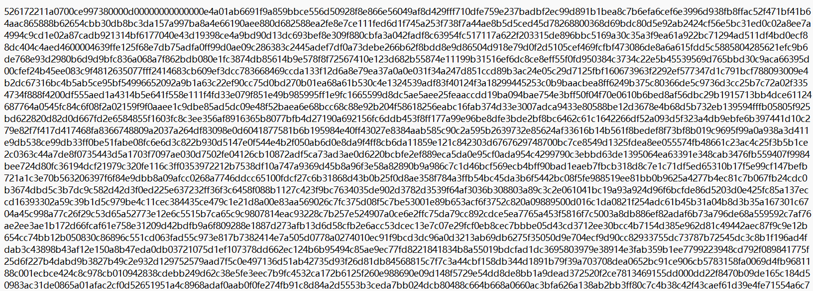
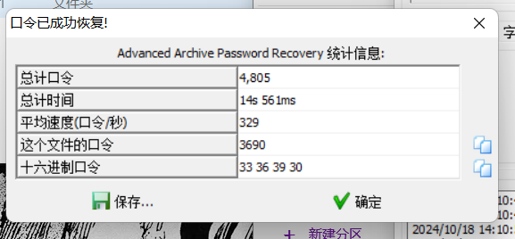
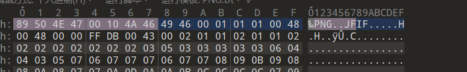
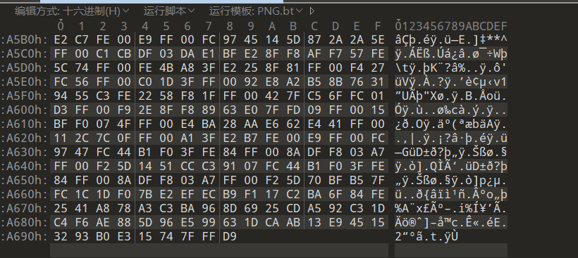

txt文本

打开发现



52 61 72 21

rar文件头

 

运行脚本将文本转为十六进制

```
import binascii
 
hex_data='这里写文本数据'
with open('这里可以改为你想要输出的文件的路径','wb') as r:  #加后缀名
    r.write(binascii.unhexlify(hex_data))


```

保存为rar文件


需要解压密码

四位数字爆破



解压后得到png图片

打开提示损坏

010打开

发现是png的头

jpg的尾

修改文件头为jpg





得到flag

