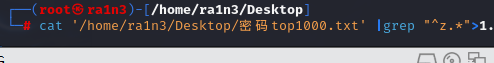
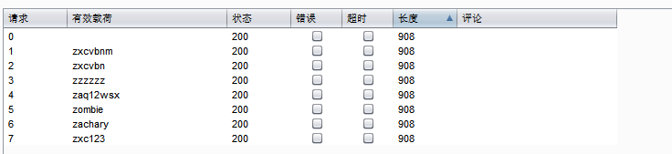
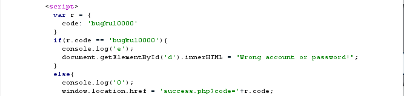
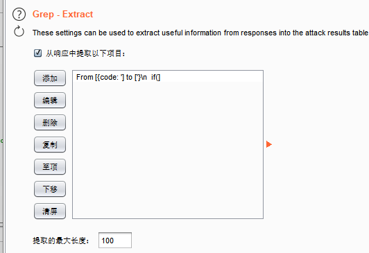
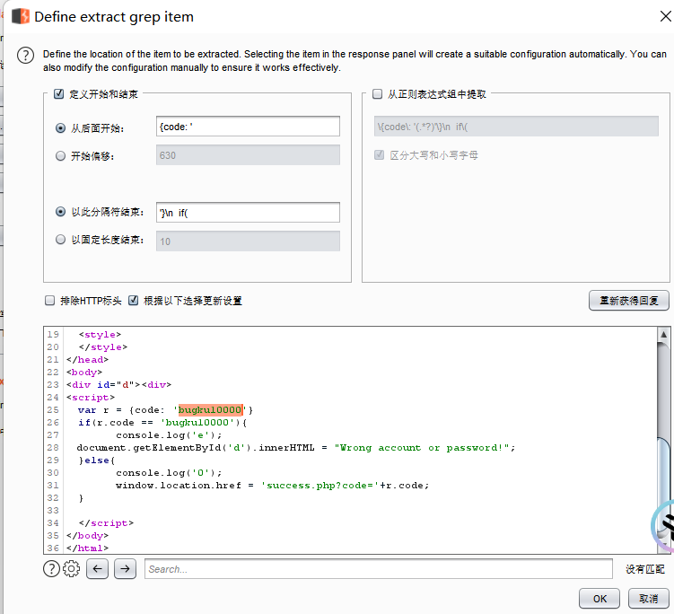
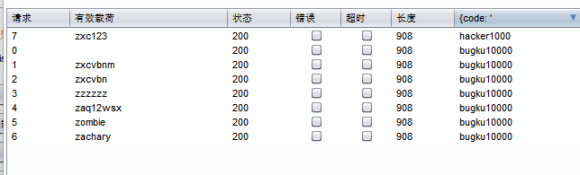

根据题目提示，弱密码top1000，同时是z????

 

github下载密码，linux中进行过滤（只保留z开头的密码）

cat top1000|grep "^z.*" > 1.txt

得到密码表

zxcvbnm

zxcvbn

zzzzzz

zaq12wsx

zombie

zachary

zxc123

 

 

爆破

发现长度相同，且状态码都是200

即成功响应

 

随便点开一个

发现其重定向到新的页面，且设置了code

 

过滤code的值

 

得到正确密码

