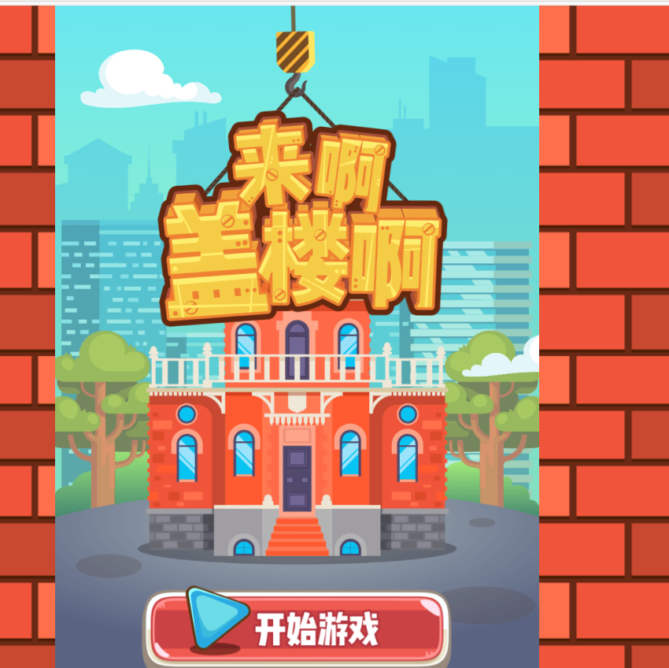
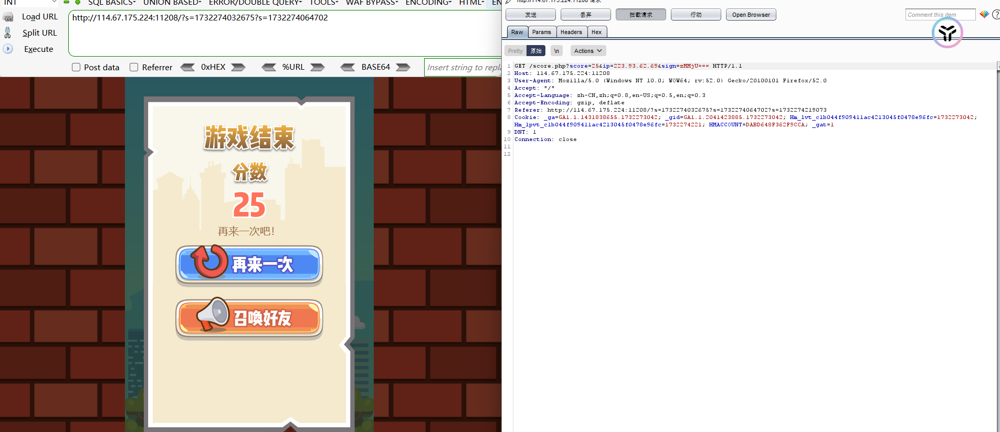
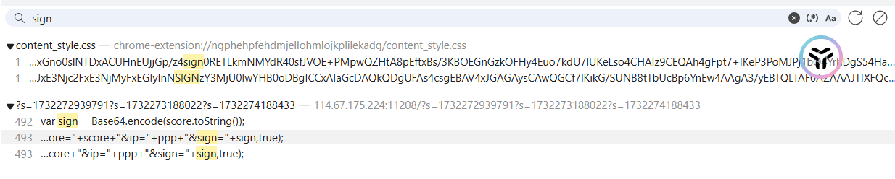
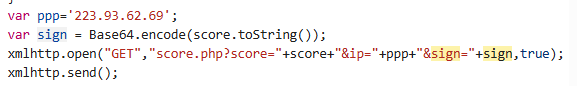
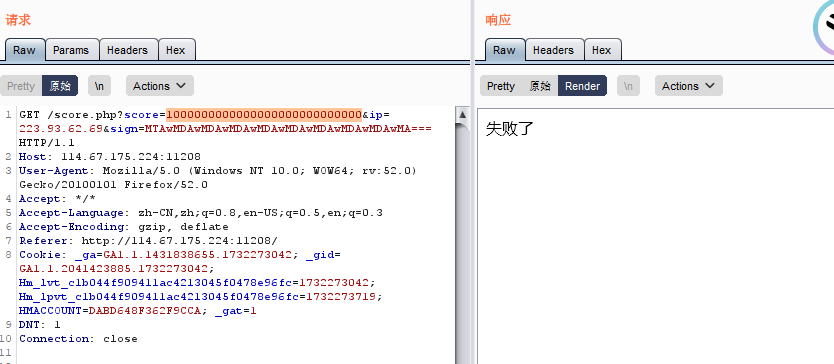
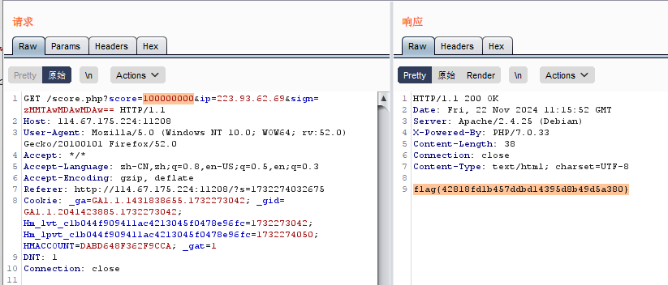

查看源码

搜索alert，无关键信息

 

 

 

游戏结束后抓包

提交score ip sign等参数

score和ip可以理解

sign像是base64编码

解码后报错

 

 

搜索sign

发现一处定义sign

sign值为Base64.encode（score）

 

修改分数为1000000000000000000000000000

并将其base64加密

bp抓包修改

报错

 

尝试利用控制台加密

设置分数为100000000

成功得到flag