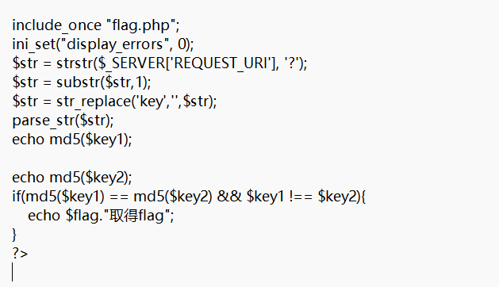
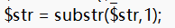
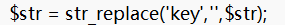
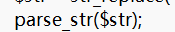
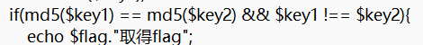
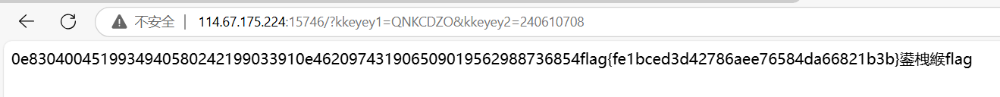

dirsearch 扫描目录得到index.php.bak备份文件

尝试访问

Index.php.bak

得到源码文件

分析源码

获取url中参数部分，从？开始

从第1位开始去，即去掉？

将参数中的key替换为“”

将剩余的字符串解析成变量

==弱类型判断

双写绕过str_replace函数

构造payload？

?kkeyey1=QNKCDZO&kkeyey2=240610708

得到flag

