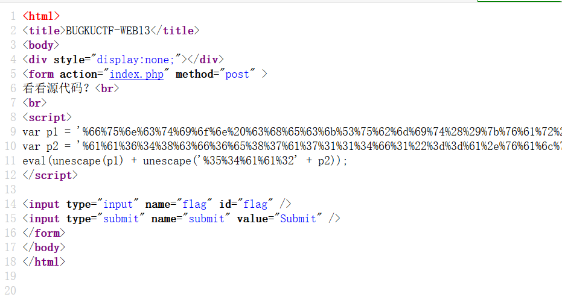
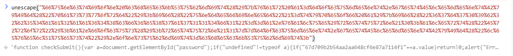
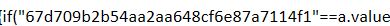
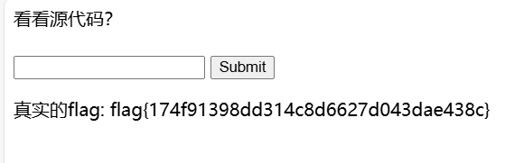

将三段加密的url拼接后，放入控制台解密

得到

'function checkSubmit(){var a=document.getElementById("password");if("undefined"!=typeof a){if("67d709b2b54aa2aa648cf6e87a7114f1"==a.value)return!0;alert("Error");a.focus();return!1}}document.getElementById("levelQuest").onsubmit=checkSubmit;'

关键部分

将值输入

得到flag

