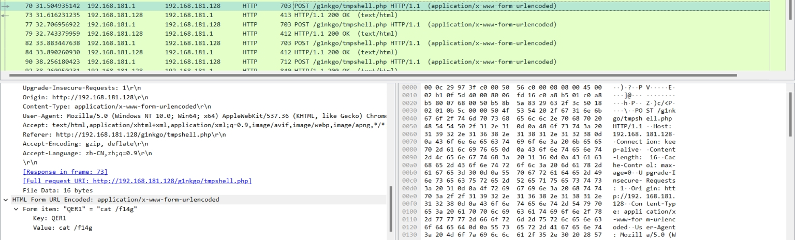
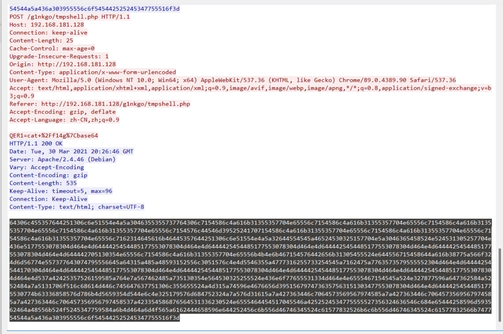
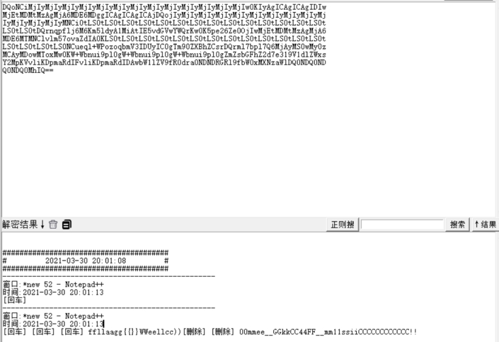
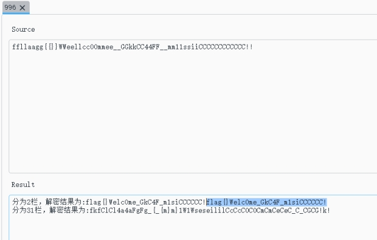

wireshark打开文件

追踪http流

发现 cat /f14g

 

 

追踪该流

 

十六进制转ascii

 

d0lESWdBQ0lnQUNJZ0F5SUswd0lqTXlJak15SWpNeUlqTXlJak15SWpNeUlqTXlJak15SWpNeUlqTXlJak15SWpNeUlqTWlDTm9RRApqTXlJak15SWpNeUlqTXlJak15SWpNeUlqTXlJak15SWpNeUlqb1FEakFDSWdBQ0lnQUNJZ2dETTZFRE02QWpNZ0F6TXRNRE10RWpNCnQwU0x0MFNMdDBTTHQwU0x0MFNMdDBTTHQwU0x0MFNMdDBTTHQwU0x0MFNMdDBTTHQwU0x0MFNMdDBpQ05NeUlqTXlJak15SWpNeUkKNkFqTWdBek10TURNdEVqTXdJak8wZVo2MmVwNUswd0tyUVdZd1ZHZHY1RUl0QWlNMUF5ZGw1bUs2TTZqbGZwcW5yUUR0MFNMdDBTTAp0MFNMdDBTTHQwU0x0MFNMdDBTTHQwU0x0MFNMdDBTTHQwU0x0MFNMdDBTTHQwU0x0MFNMSzBBSWRaYXZvNzVtbHZsQ05NVE02RURNCnoweU13MFNNeUFqTTZRN2xwYjdsbXJRRHJzQ1poQlhaMDltVGcwQ0l5VURJM1ZtYnFvem9QVytscWV1Q04wU0x0MFNMdDBTTHQwU0wKc3hXWmxkMVY5MTNlN2QyWmhGR2JzWm1aZzBscDlpdW5iVytXZzBscDlpdW5iVytXZzBscDlpdW5iVytXSzB3TXhvVE13b0RNeUFDTQpETjBRRE4wUURsV2F6TlhNeDBXYmY5bFJHUkRORE4wYXJkMFJmOVZabDFXYndBRElkUmFtcERLaWx2RklkUmFtcERLaWx2VktwTTJZCj09UUloTTBRRE4wUQo=

 

得到base 64

解码得到

wIDIgACIgACIgAyIK0wIjMyIjMyIjMyIjMyIjMyIjMyIjMyIjMyIjMyIjMyIjMyIjMyIjMiCNoQD

jMyIjMyIjMyIjMyIjMyIjMyIjMyIjMyIjMyIjoQDjACIgACIgACIggDM6EDM6AjMgAzMtMDMtEjM

t0SLt0SLt0SLt0SLt0SLt0SLt0SLt0SLt0SLt0SLt0SLt0SLt0SLt0SLt0iCNMyIjMyIjMyIjMyI

6AjMgAzMtMDMtEjMwIjO0eZ62ep5K0wKrQWYwVGdv5EItAiM1Aydl5mK6M6jlfpqnrQDt0SLt0SL

t0SLt0SLt0SLt0SLt0SLt0SLt0SLt0SLt0SLt0SLt0SLt0SLt0SLK0AIdZavo75mlvlCNMTM6EDM

z0yMw0SMyAjM6Q7lpb7lmrQDrsCZhBXZ09mTg0CIyUDI3VmbqozoPW+lqeuCN0SLt0SLt0SLt0SL

sxWZld1V913e7d2ZhFGbsZmZg0lp9iunbW+Wg0lp9iunbW+Wg0lp9iunbW+WK0wMxoTMwoDMyACM

DN0QDN0QDlWazNXMx0Wbf9lRGRDNDN0ard0Rf9VZl1WbwADIdRampDKilvFIdRampDKilvVKpM2Y

==QIhM0QDN0Q

 

有 == 推测是base编码

但是== 应该在后面

进行逆序

a="wIDIgACIgACIgAyIK0wIjMyIjMyIjMyIjMyIjMyIjMyIjMyIjMyIjMyIjMyIjMyIjMyIjMiCNoQD"

b="jMyIjMyIjMyIjMyIjMyIjMyIjMyIjMyIjMyIjoQDjACIgACIgACIggDM6EDM6AjMgAzMtMDMtEjM"

c="t0SLt0SLt0SLt0SLt0SLt0SLt0SLt0SLt0SLt0SLt0SLt0SLt0SLt0SLt0iCNMyIjMyIjMyIjMyI"

d="6AjMgAzMtMDMtEjMwIjO0eZ62ep5K0wKrQWYwVGdv5EItAiM1Aydl5mK6M6jlfpqnrQDt0SLt0SL"

e="t0SLt0SLt0SLt0SLt0SLt0SLt0SLt0SLt0SLt0SLt0SLt0SLt0SLK0AIdZavo75mlvlCNMTM6EDM"

f="z0yMw0SMyAjM6Q7lpb7lmrQDrsCZhBXZ09mTg0CIyUDI3VmbqozoPW+lqeuCN0SLt0SLt0SLt0SL"

g="sxWZld1V913e7d2ZhFGbsZmZg0lp9iunbW+Wg0lp9iunbW+Wg0lp9iunbW+WK0wMxoTMwoDMyACM"

h="DN0QDN0QDlWazNXMx0Wbf9lRGRDNDN0ard0Rf9VZl1WbwADIdRampDKilvFIdRampDKilvVKpM2Y"

i="==QIhM0QDN0Q"

print(a[::-1])

print(b[::-1])

print(c[::-1])

print(d[::-1])

print(e[::-1])

print(f[::-1])

print(g[::-1])

print(h[::-1])

print(i[::-1])

 

得到

 

DQoNCiMjIyMjIyMjIyMjIyMjIyMjIyMjIyMjIyMjIyMjIyMjIyMjIyMjIw0KIyAgICAgICAgIDIw

MjEtMDMtMzAgMjA6MDE6MDggICAgICAgICAjDQojIyMjIyMjIyMjIyMjIyMjIyMjIyMjIyMjIyMj

IyMjIyMjIyMjIyMNCi0tLS0tLS0tLS0tLS0tLS0tLS0tLS0tLS0tLS0tLS0tLS0tLS0tLS0tLS0t

LS0tLS0tDQrnqpflj6M6Km5ldyA1MiAtIE5vdGVwYWQrKw0K5pe26Ze0OjIwMjEtMDMtMzAgMjA6

MDE6MTMNClvlm57ovaZdIA0KLS0tLS0tLS0tLS0tLS0tLS0tLS0tLS0tLS0tLS0tLS0tLS0tLS0t

LS0tLS0tLS0tLS0NCueql+WPozoqbmV3IDUyIC0gTm90ZXBhZCsrDQrml7bpl7Q6MjAyMS0wMy0z

MCAyMDowMToxMw0KW+Wbnui9pl0gW+Wbnui9pl0gW+Wbnui9pl0gZmZsbGFhZ2d7e319V1dlZWxs

Y2MpKVvliKDpmaRdIFvliKDpmaRdIDAwbW1lZV9fR0dra0NDNDRGRl9fbW0xMXNzaWlDQ0NDQ0ND

Q0NDQ0MhIQ==

 

进行base 64解码得到

 

最后栅栏密码解密

删除汉字和两个））

 

 

得到flag

 

 