题目给出答案：jwt

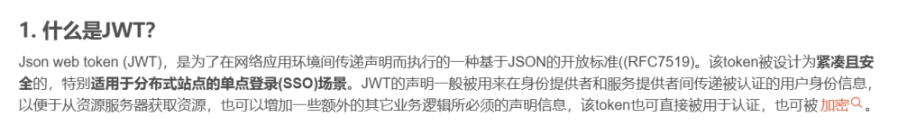 

 

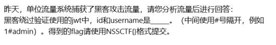 

过滤http POST提交包

http.request.method==POST

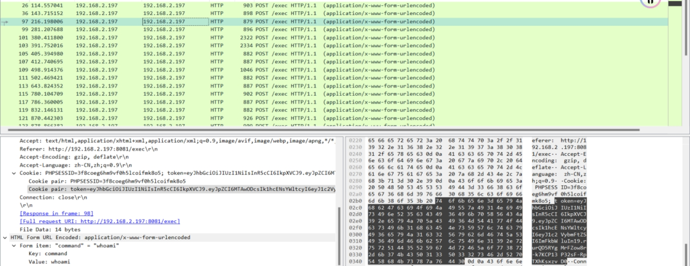 

三个 whoami请求

前两个报错 提示权限不足

最后一个成功返回 root

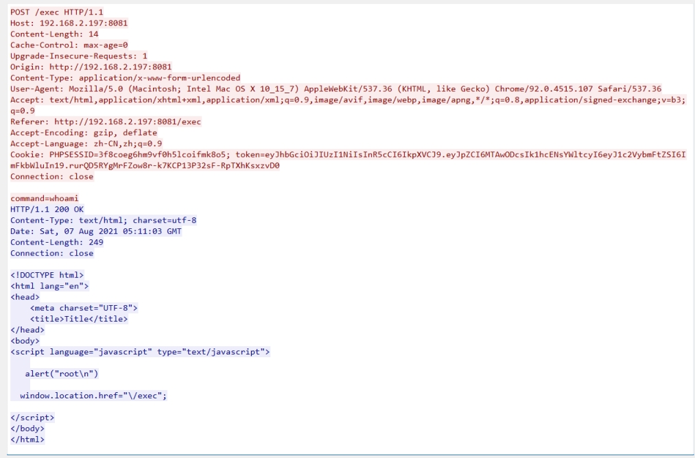 

 

复制token值进行base 64解密

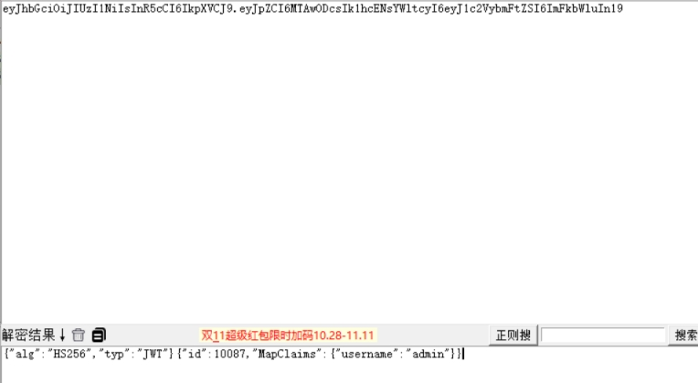 

得到

id：10087

username：admin

 

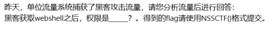 

同上 root

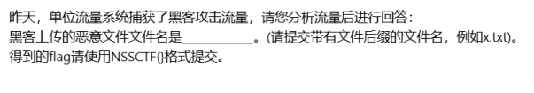 

 

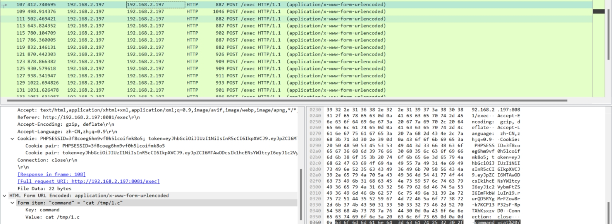 

 

1.c

 

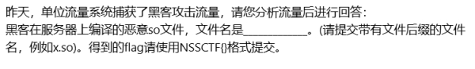 

 

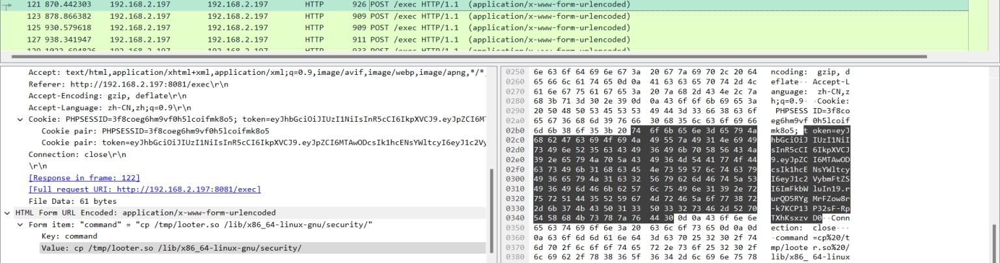 

 

 

looter.so

 

 

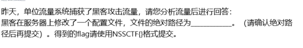 

 

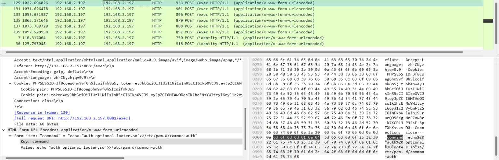 

将编译好的 .so 写入

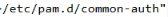 

 

 