 

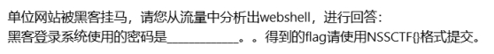 

 

 

过滤 http.request.method == POST

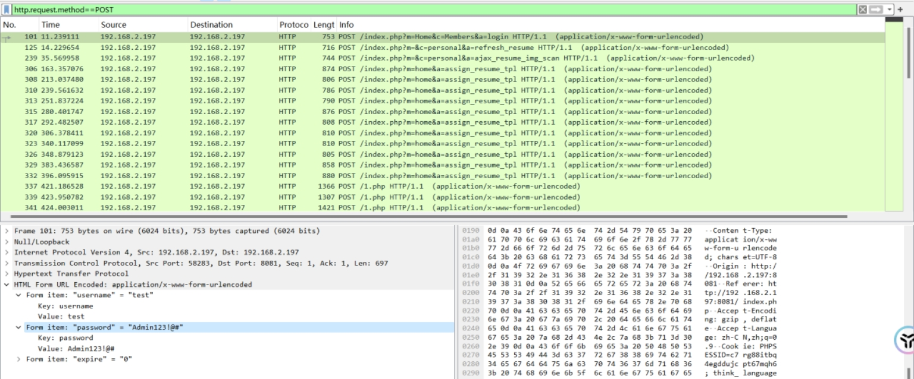 

得到登录密码 Admin23!@#

 

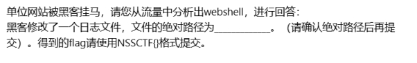 

 

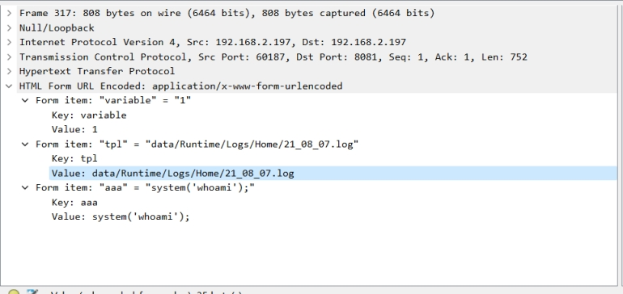 

 

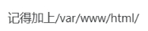 

 

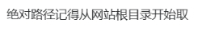 

 

 

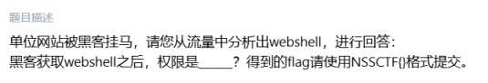 

有个最后一个whoami命令

追踪该http流

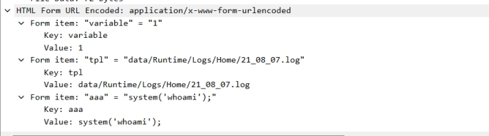 

 

 

 

 

 

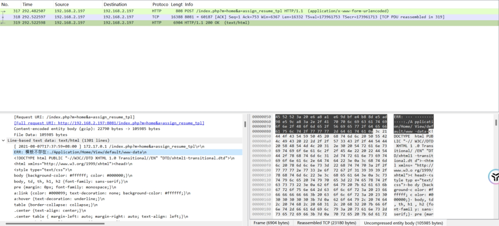 

 

 

[www.data](http://www.data) Linux系统下的低权限用户

 

 

 

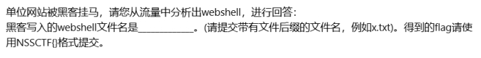 

将base 64 编码信息写入1.php

 

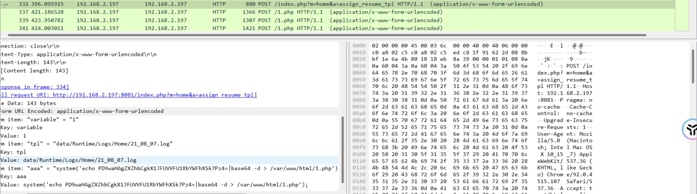 

 

解码该base 64 发现是一句话木马

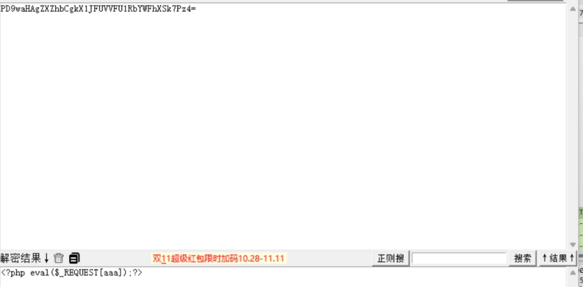 

 

 